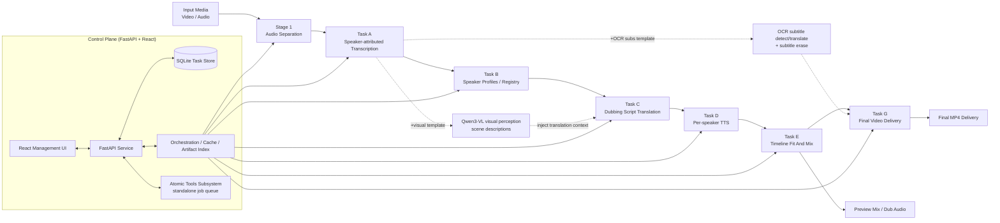

<div align="center">
  
  <h1>translip</h1>
  <p><strong>Local-first, speaker-aware dubbing pipeline for video workflows</strong></p>
  <p>`translip` connects source separation, speaker-attributed transcription, translation, per-speaker TTS, timeline fitting, and final video delivery into a reusable end-to-end pipeline — and exposes each stage as a standalone "atomic tool" you can run on its own, with a FastAPI + React management UI included.</p>
  <p>
    
    
    
    
    
  </p>
  <p>
    <a href="#quick-start"><strong>Quick Start</strong></a> ·
    <a href="#system-architecture"><strong>Architecture</strong></a> ·
    <a href="#web-management-ui"><strong>Management UI</strong></a> ·
    <a href="docs/README.md"><strong>Docs Index</strong></a> ·
    <a href="README.md"><strong>中文 README</strong></a>
  </p>
</div>

> **Status: Beta / Early Access**
>
> `translip` is currently best suited for research workflows, internal demos, self-hosted iteration, and pipeline exploration. It already provides an end-to-end path, a visual dubbing review surface, and a management UI, but it is intentionally positioned as fast-moving beta software rather than a production-ready product claim.

## Why `translip`

- **Pipeline + atomic tools, both ways**: run the full "separate → transcribe → translate → dub → re-fit → deliver" chain in one click, or invoke separation, transcription, translation, synthesis, mixing, muxing, and subtitle detect/erase as independent tools.
- **Speaker-aware by default**: outputs are built around speaker profiles and a reusable registry, with a character library that records the "character → speaker" mapping across tasks.
- **Visual dubbing review**: the built-in Dubbing Editor drives segment-by-segment review from an issue queue, with live duration prediction, preview playback rate, and per-segment re-synthesis.
- **Cache-aware, re-runnable orchestration**: each stage is an isolated subprocess that writes artifacts + a manifest; changing one backend/model only recomputes what is needed, and you can re-run from any stage.
- **Local-first with built-in model management**: models run locally by default; the UI configures a HuggingFace token (for gated models) and detects/downloads missing models — all at once, or one at a time (subtitle-erase and vision weights included).

## UI Preview

| Dashboard · pipeline & atomic tasks overview | New pipeline task · stepped wizard + grouped advanced config |
| --- | --- |
|  |  |

| Pipeline task detail · stage DAG and rerun controls | Atomic tools · grouped by audio/speech/video |
| --- | --- |
|  |  |

| A single atomic tool · dialogue/background separation | Dubbing editor · issue queue + inspector |
| --- | --- |
|  |  |

| Settings · HuggingFace token & one-click model download | Works library · works/episode assets |
| --- | --- |
|  |  |

## System Architecture



The orchestrator holds no task logic: it resolves a node DAG, checks a cache, and shells out to each stage as an **isolated subprocess** (the same code path as the CLI subcommands). Heavy ML models are freed on exit and a single stage crash cannot poison the orchestrator. The atomic-tools subsystem is orthogonal to the pipeline: a standalone single-tool job queue that handles uploads, concurrency, cancellation, and artifact registration.

## Core Capabilities

**A. End-to-end dubbing pipeline**

- Separate dialogue and background audio from video or audio inputs.
- Generate transcripts with `FunASR / Paraformer-zh` (default) or `faster-whisper`; speaker diarization is optional (off by default, enable explicitly) via `ECAPA` or `pyannote 3.1`.
- Build reusable speaker profiles and registries for later tasks.
- Produce dubbing scripts with local `M2M100` or the `DeepSeek API`; the optional `asr-dub+visual` template attaches a per-segment scene description from a local `Qwen3-VL` model, cutting pronoun/honorific/tone mistranslations.
- Synthesize target-language speech locally with `MOSS-TTS-Nano ONNX` by default, with `Qwen3-TTS` and `VoxCPM2` also available.
- Fit speech back to the original timeline (atempo / rubberband), sidechain-mix, and export preview/final outputs.

**B. Standalone atomic tools** (upload → process → download independently; results can flow into the next tool in one click)

- Dialogue/background separation, audio mixing, speech-to-text, transcript correction, text translation, text-to-speech, audio/video muxing, subtitle detection, subtitle erase, video content analysis (scene description / on-screen text triage / erase QC / free-form Q&A), and media probe.

**C. Collaboration & assets**

- **Dubbing Editor**: an issue queue (silence, voice mismatch, duration stretch, low translation confidence, etc.) + inspector + live duration prediction + per-segment re-synthesis.
- **Dub evaluation / experiment analysis**: per-segment QC of a finished dub — automatically flags missing dub / voice mismatch / dropped words / off-rhythm / unintelligible / poor translation, with an overall score and a quality gate; the "Dub Evaluation" page compares source vs dub segment by segment, highlights dropped words in the translation, and can optionally score translations with a DeepSeek LLM.
- **Works / Character libraries**: attach tasks to a "work → episode" and maintain a "character → speaker" ledger, with reusable global personas.
- **Model & token management**: configure the HuggingFace token (to unlock gated models such as pyannote), inspect model status, and download all missing models at once or one at a time (subtitle-erase `sttn`/`big-lama` and vision `Qwen3-VL` weights are included in the panel).

## Workflow Templates

`run-pipeline` selects which nodes run via a template:

| Template | Description |
| --- | --- |
| `asr-dub-basic` | Basic dubbing chain: Stage 1 → Task A/B/C/D/E → Task G. The default template. |
| `asr-dub+visual` | Inserts a visual-perception node (local Qwen3-VL) into the basic chain: per-span scene descriptions are injected as translation context, reducing pronoun/honorific/tone mistranslations. Needs `--extra vision` or a local Ollama (see "Video content perception" below). |
| `asr-dub+ocr-subs` | Adds OCR subtitle detection/translation on top of the basic chain and corrects the ASR transcript with the OCR result. |
| `asr-dub+ocr-subs+erase` | Adds hard-subtitle erasure of the source video on top of the above. |

## Web Management UI

The UI is the primary day-to-day entry point. The left navigation is grouped into:

- **Dashboard**: unified counts and recent activity across pipeline tasks and atomic jobs (total / running / completed / failed).
- **Task Center**: pipeline task list, new pipeline task (stepped wizard + grouped advanced config), task detail (stage DAG / progress / artifacts / rerun from any stage), the **Dubbing Editor**, and the speaker-review harness.
- **Atomic Tools**: 11 standalone single-tool jobs (separation, mixing, transcription, correction, translation, synthesis, muxing, subtitle detect/erase, video content analysis, probe), each with its own upload + parameter panel; outputs can flow straight into the next tool.
- **Works / Character libraries**: cross-task works-and-episodes assets and the character→speaker ledger.
- **Settings**: system info & cache cleanup, TMDB API, HuggingFace token, model status & download (all missing / one at a time), and task default parameters.

### Development Mode

Start the backend API first:

```bash
uv run uvicorn translip.server.app:app --host 127.0.0.1 --port 8765
```

Then start the frontend:

```bash
cd frontend
npm install
npm run dev
```

- Frontend: `http://127.0.0.1:5173`
- Backend API: `http://127.0.0.1:8765`
- `frontend/vite.config.ts` already proxies `/api` to `127.0.0.1:8765`; the frontend uses relative API paths and needs no extra env vars.

Or use the built-in dev control script (logs and PIDs land in `.dev-runtime/`):

```bash
./scripts/dev.sh start     # boots backend :8765 + frontend :5173 (detached)
./scripts/dev.sh status    # check status
./scripts/dev.sh stop       # stop
./scripts/dev.sh restart    # restart
```

### Serve The Built Frontend Through The Backend (production-style)

```bash
cd frontend && npm install && npm run build && cd ..
uv run translip-server
```

If `frontend/dist` exists, the backend mounts and serves the static frontend from `http://127.0.0.1:8765`. `translip-server` listens on `127.0.0.1:8765` by default; for a custom host/port use `uvicorn translip.server.app:app ...` directly.

## Pipeline Stages

Every stage is both a node in `run-pipeline` orchestration and a CLI subcommand you can run on its own.

| Stage | Command | Purpose | Main Outputs |
| --- | --- | --- | --- |
| Stage 1 | `translip run` | Audio separation (demucs / cdx23; `--enhance-voice` is a no-op placeholder, no real denoise yet) | `voice.*`, `background.*` |
| Task A | `translip transcribe` | Speaker-attributed transcription (FunASR/faster-whisper + diarization) | `segments.zh.json`, `segments.zh.srt` |
| Task B | `translip build-speaker-registry` | Speaker profile / registry | `speaker_profiles.json`, `speaker_registry.json` |
| Task C | `translip translate-script` | Script translation | `translation.<lang>.json`, `translation.<lang>.srt` |
| Task D | `translip synthesize-speaker` | Single-speaker dubbing synthesis | `speaker_segments.<lang>.json`, `speaker_demo.<lang>.wav` |
| Task E | `translip render-dub` | Timeline fitting and mixdown | `dub_voice.<lang>.wav`, `preview_mix.<lang>.wav` |
| Task F | `translip run-pipeline` | Orchestrate Stage 1 to Task E | `pipeline-manifest.json`, `pipeline-status.json` |
| Task G | `translip export-video` | Final video export | `final_preview.<lang>.mp4`, `final_dub.<lang>.mp4` |

> Default backends: ASR `funasr` (model `paraformer-zh`), separation `cdx23`, translation `local-m2m100`, TTS `moss-tts-nano-onnx`.

### Video content perception (Qwen3-VL, optional)

`translip analyze-video` analyzes video frames with a local vision-language model. It powers both the `visual-context` node of the `asr-dub+visual` template and the "Video Content Analysis" atomic tool:

```bash
# Scene descriptions (fixed-interval spans without --segments; the pipeline feeds the ASR timeline)
uv run translip analyze-video --input video.mp4 --task scene-context --output-dir out-vision

# Free-form Q&A
uv run translip analyze-video --input video.mp4 --task freeform --question "What car appears in the video?"

# On-screen text triage (subtitle vs scene text vs watermark vs title card; needs subtitle detection first)
uv run translip analyze-video --input video.mp4 --task ocr-classify --detection ocr-detect/ocr_events.json
```

- **Tasks**: `scene-context` | `erase-qc` | `ocr-classify` | `speaker-visual` | `freeform`.
- **Backends**: Apple Silicon defaults to MLX (`mlx-community/Qwen3-VL-4B-Instruct-4bit`, ~3.3 GB, auto-downloaded to `<cache>/vision_models/hf`; install with `uv sync --extra vision`); other platforms can point at a local Ollama (`ollama pull qwen3-vl:4b-instruct`) with zero extra dependencies. Controlled via `--backend auto|mlx|ollama`.
- **Fully local**: like OCR/erase, no cloud calls; translation degrades gracefully when the visual artifact is missing.

### Hard-subtitle erasure (optional)

The `asr-dub+ocr-subs+erase` template and the "Subtitle Erase" atomic tool reuse the OCR detection boxes to inpaint the source video's hard subtitles frame by frame, then re-mux the original audio — no second detector, and erasure is bounded by the detection boxes:

- **Backends**: `sttn` (default — spatial-temporal transformer video inpainting, better temporal coherence) | `lama` (big-LaMa single-frame, sharper for stills/animation).
- **Install**: `uv sync --extra erase` (cv2 / pydantic-settings; torch is a base dependency, no separate install).
- **Weights**: `sttn.pth` (~63 MB) and `big-lama.pt` (~196 MB) auto-download from the upstream GitHub tree and are sha256-verified on first use, cached under `<cache>/erase_models` (override with `SUBTITLE_ERASE_MODELS_DIR`; `SUBTITLE_ERASE_LOCAL_MODELS_ONLY=1` forbids downloads — weights must be pre-placed). They can also be downloaded per-model from Settings → Model status.
- **Fully local**: only subtitle frames are inpainted before re-muxing the original audio; no cloud calls.

## Requirements

- Python `3.11` to `3.12`
- [uv](https://docs.astral.sh/uv/)
- FFmpeg available on `PATH`
- Node.js + npm (only for frontend development or building the UI)
- macOS or Linux; CPU works, Apple Silicon uses MPS automatically, and TTS is more practical with `CUDA` or `MPS`

## Installation

```bash
git clone https://github.com/MasamiYui/translip.git
cd translip
uv sync                 # runtime deps
uv sync --extra dev     # add pytest etc. for tests / development
uv sync --extra ocr     # in-tree PaddleOCR hard-subtitle detection
uv sync --extra erase   # hard-subtitle erasure (STTN / big-LaMa inpainting; ~63MB / ~196MB weights auto-download on first use)
uv sync --extra vision  # video content perception (Qwen3-VL; only needed on Apple Silicon — other platforms can use Ollama with no extra)
```

> `uv sync --extra X` syncs the environment to *exactly* X, dropping other extras — combine flags to keep several, e.g. `uv sync --extra dev --extra ocr --extra erase --extra vision`.

Recommended: preload the separation model (or use the UI: Settings → Model status → one-click download):

```bash
uv run translip download-models --backend cdx23 --quality balanced
```

> `--backend` also accepts other downloadable keys, e.g. `erase_sttn` / `erase_lama` / `vision_qwen3vl_mlx` / `faster_whisper_small` / `funasr_*`; `translip doctor` lists what is currently missing along with the matching download command.

For gated models (e.g. `pyannote` diarization), accept the model license on HuggingFace, then provide a read-scoped access token — either in the Settings page or via `HF_TOKEN` / `HUGGINGFACE_HUB_TOKEN` / `PYANNOTE_AUTH_TOKEN`. The DeepSeek translation backend, transcript-correction LLM arbitration, and translation quality scoring need `DEEPSEEK_API_KEY`.

After installing, run the environment self-check to confirm FFmpeg, the inference device (CUDA/MPS/CPU), optional extras, external CLIs, API keys, and model weights are all ready:

```bash
uv run translip doctor          # human-readable report (missing items include a download command); add --json for CI / scripts
```

## Quick Start

`run-pipeline` stops at `task-e` by default (dub audio + preview mix); final video delivery is a separate `export-video` step.

```bash
uv run translip run-pipeline \
  --input ./test_video/example.mp4 \
  --output-root ./output-pipeline \
  --target-lang en \
  --write-status

uv run translip export-video \
  --pipeline-root ./output-pipeline
```

Typical output layout:

```text
output-pipeline/
├── pipeline-manifest.json
├── pipeline-report.json
├── pipeline-status.json
├── logs/
├── stage1/example/
├── task-a/voice/
├── task-b/voice/
├── task-c/voice/
├── task-d/voice/<speaker-id>/
├── task-e/voice/
└── task-g/delivery/
```

Final videos are typically written to:

- `output-pipeline/task-g/delivery/final-preview/final_preview.en.mp4`
- `output-pipeline/task-g/delivery/final-dub/final_dub.en.mp4`

### Running stages individually

Each stage can be invoked on its own for debugging or swapping out a single step. The most common ones are below; see the per-stage docs for the full flag set.

```bash
# Stage 1: audio separation
uv run translip run --input ./test_video/example.mp4 --mode auto --quality balanced --output-dir ./output-stage1

# Task A: transcription
uv run translip transcribe --input ./output-stage1/example/voice.wav --output-dir ./output-task-a

# Task C: translation (local M2M100 / DeepSeek)
uv run translip translate-script --segments ./output-task-a/voice/segments.zh.json \
  --profiles ./output-task-b/voice/speaker_profiles.json --target-lang en \
  --backend local-m2m100 --output-dir ./output-task-c

# Task D: single-speaker synthesis (default moss-tts-nano-onnx; switch to qwen3tts / voxcpm2)
uv run translip synthesize-speaker --translation ./output-task-c/voice/translation.en.json \
  --profiles ./output-task-b/voice/speaker_profiles.json --speaker-id spk_0000 \
  --backend moss-tts-nano-onnx --output-dir ./output-task-d --device auto

# Dub evaluation: per-segment QC of finished pipeline output (missing dub / voice / dropped words / rhythm / translation)
uv run translip evaluate-dub --pipeline-root ./output-pipeline/<task_id> --target-lang en \
  --output-dir ./output-pipeline/<task_id>/analysis/dub-qa
#   add --translation-judge to score translations with a DeepSeek LLM (needs DEEPSEEK_API_KEY)

# Misc: doctor (environment self-check), probe (media info), download-models (preload models)
uv run translip doctor
uv run translip probe --input ./test_video/example.mp4
uv run translip --help    # list all subcommands
```

> `moss-tts-nano-onnx` is the default TTS backend and requires the `moss-tts-nano` CLI from OpenMOSS/MOSS-TTS-Nano installed first; Task D reports a clear dependency error when it is missing. `voxcpm2` uses `openbmb/VoxCPM2` and falls back to CPU on Apple Silicon — set `VOXCPM_ALLOW_MPS=1` to attempt MPS.

## Configuration And Environment Variables

| Variable | Default | Purpose |
| --- | --- | --- |
| `TRANSLIP_CACHE_DIR` | `~/.cache/translip` | Root for model cache, pipeline output, and atomic-tools storage |
| `TRANSLIP_DB_PATH` | `<cache>/data.db` | SQLite database path for the web UI |
| `HF_TOKEN` / `HUGGINGFACE_HUB_TOKEN` / `PYANNOTE_AUTH_TOKEN` | none | HuggingFace token to download/use gated models (e.g. pyannote); can also be set in Settings |
| `TMDB_API_KEY` / `TMDB_BEARER_TOKEN` | none | Fetch works/episode metadata and posters for the Works library |
| `DEEPSEEK_API_KEY` | none | Required for the `deepseek` translation backend, transcript-correction LLM arbitration, and translation quality scoring |
| `DEEPSEEK_BASE_URL` | `https://api.deepseek.com` | Override the DeepSeek API endpoint |
| `DEEPSEEK_MODEL` | `deepseek-v4-pro` | Override the default DeepSeek model |
| `MOSS_TTS_NANO_CLI` | `moss-tts-nano` | CLI executable used by the `moss-tts-nano-onnx` backend |
| `MOSS_TTS_NANO_MODEL_DIR` | `<cache>/models` | MOSS ONNX model directory passed to `--onnx-model-dir` |
| `MOSS_TTS_NANO_CPU_THREADS` | `4` | CPU thread count for MOSS ONNX inference |
| `QWEN_TTS_MODEL` | — | Override the model loaded by the `qwen3tts` backend |
| `VOXCPM_MODEL` | `openbmb/VoxCPM2` | Override the model loaded by the `voxcpm2` backend |
| `VOXCPM_ALLOW_MPS` | `0` | Allow `voxcpm2` to run on Apple Silicon MPS; defaults to CPU fallback |
| `VOXCPM_INFERENCE_TIMESTEPS` | `10` | Inference steps for `voxcpm2` |
| `VOXCPM_RETRY_BADCASE` | `1` | Enable VoxCPM internal bad-case retry |
| `VISION_BACKEND` | `auto` | Video perception backend: `auto` / `mlx` / `ollama` |
| `VISION_MODEL` | `mlx-community/Qwen3-VL-4B-Instruct-4bit` | HF model loaded by the MLX backend |
| `VISION_OLLAMA_MODEL` | `qwen3-vl:4b-instruct` | Ollama model tag (avoid the bare `:4b` tag — it may resolve to the thinking variant) |
| `VISION_OLLAMA_HOST` | `http://127.0.0.1:11434` | Ollama server address |
| `VISION_HF_CACHE` | `<cache>/vision_models/hf` | Vision model weight cache (injected as `HF_HUB_CACHE`) |
| `VISION_LOCAL_MODELS_ONLY` | `0` | Set `1` to forbid downloads; weights must be pre-placed |
| `SUBTITLE_ERASE_MODELS_DIR` | `<cache>/erase_models` | Cache for subtitle-erase weights (`sttn.pth` / `big-lama.pt`) |
| `SUBTITLE_ERASE_LOCAL_MODELS_ONLY` | `0` | Set `1` to forbid downloading erase weights; must be pre-placed |
| `PADDLEOCR_MODELS_BASE_DIR` | `<cache>/paddleocr_models` | Local PP-OCRv5 subtitle-OCR model directory |
| `TRANSLIP_NO_BANNER` | none | Set to any value to suppress the startup banner + env summary (same as `--no-banner`) |

For more defaults, see [src/translip/config.py](src/translip/config.py); the remaining `VISION_*` knobs (frames/resolution/temperature) live in [src/translip/vision/config.py](src/translip/vision/config.py), and `ERASE_*` / `PADDLEOCR_*` in [src/translip/erase/config.py](src/translip/erase/config.py) and [src/translip/ocr/config.py](src/translip/ocr/config.py).

## Development

```bash
# Backend
uv sync --extra dev
uv run pytest

# Frontend
cd frontend
npm install
npm run lint
npm run build
npm run test       # Vitest unit/component tests
```

End-to-end Playwright tests live at the repo root (`tests/e2e/*.spec.ts`); start the dev stack first with `./scripts/dev.sh start`, then run `npx playwright test`.

## Related Documentation

- [docs/README.md](docs/README.md): documentation index
- [docs/speaker-aware-dubbing-plan.md](docs/speaker-aware-dubbing-plan.md): high-level plan and technical route
- [docs/task-f-pipeline-and-engineering-orchestration.md](docs/task-f-pipeline-and-engineering-orchestration.md): orchestration and cache design
- [docs/task-g-final-video-delivery.md](docs/task-g-final-video-delivery.md): final video delivery design
- [docs/frontend-management-system-design.md](docs/frontend-management-system-design.md): management UI design
- [frontend/README.md](frontend/README.md): frontend directory guide

## Chinese README

- [README.md](README.md): full Chinese version
