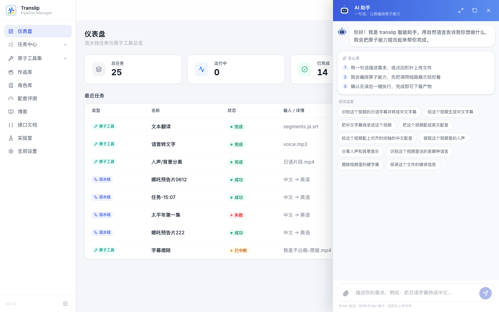
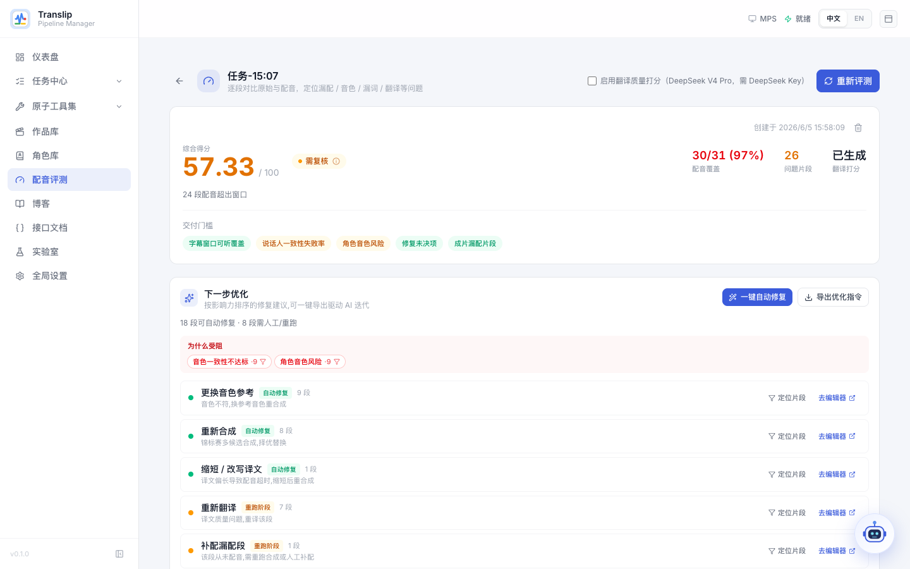
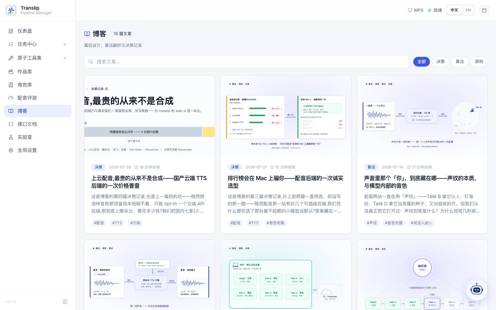
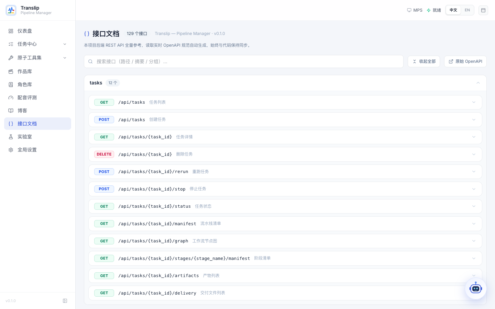
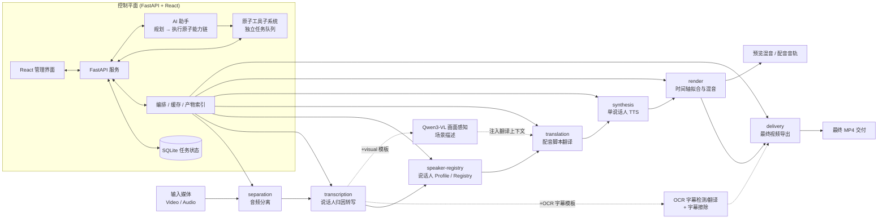
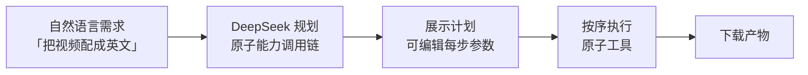

<div align="center">
  
  <h1>translip</h1>
  <p><strong>本地优先、多说话人感知的视频配音流水线</strong></p>
  <p>把音频分离、说话人归因转写、翻译、单说话人 TTS、时间轴回贴和视频交付串成一条可复用的端到端流程；既能跑完整流水线，也能把每个环节当作独立的「原子工具」单独使用，并配有 FastAPI + React 管理界面。</p>
  <p>
    
    
    
    
    
  </p>
  <p>
    <a href="#快速开始"><strong>快速开始</strong></a> ·
    <a href="#系统架构"><strong>架构图</strong></a> ·
    <a href="#web-管理界面"><strong>管理界面</strong></a> ·
    <a href="docs/README.md"><strong>文档索引</strong></a> ·
    <a href="README.en.md"><strong>English README</strong></a>
  </p>
</div>

> **当前状态：Beta / Early Access**
>
> `translip` 当前适合研究、实验验证、内部演示、自托管迭代和流程探索。它已经具备端到端链路、可视化配音校对和管理界面，但定位仍然是快速演进中的 Beta 系统，而不是对外宣称的生产级商业产品。

<details>
<summary><strong>目录</strong></summary>

- [为什么是 translip](#为什么是-translip)
- [界面预览](#界面预览)
- [系统架构](#系统架构)
- [核心能力](#核心能力)
- [工作流模板](#工作流模板)
- [AI 助手](#ai-助手)
- [Web 管理界面](#web-管理界面)
- [流水线阶段](#流水线阶段)
- [环境要求](#环境要求) · [安装](#安装) · [快速开始](#快速开始)
- [配置与环境变量](#配置与环境变量)
- [技术栈](#技术栈)
- [路线图与状态](#路线图与状态)
- [开发](#开发) · [相关文档](#相关文档) · [联系方式](#联系方式)

</details>

## 为什么是 `translip`

- **流水线 + 原子工具双形态**：既能一键跑完「分离 → 转写 → 翻译 → 配音 → 回贴 → 交付」的完整链路，也能把分离、转写、翻译、合成、混音、合并、字幕识别/擦除等环节作为独立工具单独调用。
- **AI 助手编排原子能力**：用一句自然语言描述目标，助手（DeepSeek 规划）自动把多个原子工具串成调用链，先展示计划再一键执行、下载产物。
- **多说话人感知**：不仅输出文本，还围绕说话人 profile / registry 建立可复用资产，并通过角色库把「角色 → 说话人」沉淀为跨任务台账。
- **可视化配音校对**：内置「配音编辑台」，以问题队列驱动逐段复核，支持实时时长预测、试听倍速、单段重新合成。
- **缓存感知的可重跑编排**：每个阶段是独立子进程，产物落盘 + manifest，改一个后端/模型只会选择性重算，可从任意阶段重跑。
- **本地优先 + 模型管理**：模型默认在本地运行；管理界面可配置 HuggingFace 令牌（门控模型），检测并下载缺失模型——既能一键下载全部，也能逐个下载（含字幕擦除、视觉模型权重）。

## 界面预览

| 仪表盘 · 流水线与原子任务总览 | 新建流水线任务 · 分步向导 + 分组高级配置 |
| --- | --- |
|  |  |

| 流水线任务详情 · 阶段 DAG 与重跑控制 | 配音编辑台 · 问题队列 + 检视面板 |
| --- | --- |
|  |  |

| AI 助手 · 一句话编排原子能力 | 配音评测 · 逐段质检 + 一键自动修复 |
| --- | --- |
|  |  |

| 原子工具集 · 按音频/语音/视频分类 | 单个原子工具 · 人声/背景分离 |
| --- | --- |
|  |  |

| 幕后博客 · 架构 / 算法 / 决策 | 接口文档 · 实时 OpenAPI 自动生成 |
| --- | --- |
|  |  |

| 作品库 · 作品/剧集资产 | 全局设置 · HuggingFace 令牌与一键模型下载 |
| --- | --- |
|  |  |

## 系统架构



编排器本身不含业务逻辑，它解析节点 DAG、检查缓存，再把每个阶段以**独立子进程**形式 shell 出去执行（与 CLI 子命令是同一套代码）；这样重型 ML 模型在退出时即被释放，单阶段崩溃也不会污染编排器。原子工具子系统与流水线正交：它是一套独立的单工具任务队列，处理上传、并发、取消和产物注册。

## 核心能力

**A. 端到端配音流水线**

- 输入视频或音频，自动分离人声与背景音。
- 基于 `FunASR / Paraformer-zh`（默认）或 `faster-whisper` 生成转写结果；说话人分离（diarization）为可选项（默认关闭，需显式开启），支持 `ECAPA` 与 `pyannote 3.1`。
- 为说话人建立 profile / registry，支持跨任务复用。
- 使用本地 `M2M100` 或 `DeepSeek API` 生成目标语言配音脚本；可选 `asr-dub+visual` 模板用本地 `Qwen3-VL` 给每段台词附带画面描述，显著减少称谓/指代/语气误译。
- 默认基于 `MOSS-TTS-Nano ONNX` 在本地合成目标语言语音，也可切换到 `Qwen3-TTS` 或 `VoxCPM2`。
- 将配音按原始时间轴回贴（atempo / rubberband），侧链混音，并导出预览版与最终成片。

**B. 独立原子工具**（可单独上传 → 处理 → 下载，结果可一键转入下一个工具）

- **音频**：人声/背景分离、音频混合。
- **语音**：语音转文字、语种识别、台词校正、文本翻译、语音合成、配音渲染（时间轴对齐）。
- **视频**：字幕识别、字幕烧录/封装、字幕擦除、水印压制、视频内容分析（场景描述/画面文字分类/擦除质检/自由问答）、音视频合并、M3U8 转 MP4、媒体信息探测。

**C. 协作与资产**

- **AI 助手**：用自然语言描述目标，助手自动规划并执行原子能力调用链，运行记录沉淀为「AI 任务」（需 `DEEPSEEK_API_KEY`）。
- **配音编辑台**：问题队列（静音、音色不匹配、时长拉伸、翻译可信度等）+ 检视面板 + 实时时长预测 + 单段重新合成。
- **配音评测 + 一键自动修复**：对完成的配音任务做逐段质检——自动定位「漏配 / 音色不符 / 漏词吞字 / 节奏异常 / 听不清 / 翻译差」，给出综合评分与质量门；「配音评测」页可逐段对比原声 vs 配音、查看译文漏词高亮，可选用 DeepSeek LLM 给译文打分，并据问题清单**一键自动修复**（重译 / 重合成 / 重贴失败段）。
- **说话人复核工作台**：可视化复核 diarization 结果——诊断、人工合并 / 指派说话人，并把决策回灌下游阶段。
- **作品库 / 角色库**：把任务挂到「作品 → 剧集」，并维护「角色 → 说话人」台账，支持全局 persona 复用。
- **模型与令牌管理**：在设置页配置 HuggingFace 令牌（解锁 pyannote 等门控模型）、查看模型状态，一键下载全部缺失模型或逐个下载（字幕擦除 `sttn`/`big-lama`、视觉 `Qwen3-VL` 等权重均已纳入模型面板）。

## 工作流模板

`run-pipeline` 通过模板决定运行哪些节点：

| 模板 | 说明 |
| --- | --- |
| `asr-dub-basic` | 基础配音链路：separation → transcription → speaker-registry → translation → synthesis → render → delivery。默认模板。 |
| `asr-dub+visual` | 在基础链路上插入「画面感知」节点（本地 Qwen3-VL）：按时间段生成场景描述并注入翻译上下文，减少称谓/指代/语气误译。需 `--extra vision` 或本地 Ollama（见下文「视频画面感知」）。 |
| `asr-dub+ocr-subs` | 在基础链路上增加 OCR 字幕检测/翻译，并用 OCR 结果校正 ASR 文稿。 |
| `asr-dub+ocr-subs+erase` | 在上面的基础上再增加原片硬字幕擦除。 |

## AI 助手

`translip` 内置一位「会编排原子能力」的 AI 助手：在管理界面任意页面右下角都能唤起的对话式抽屉，用一句自然语言描述目标，它就把目标拆解成原子工具调用链，先把计划展示给你，确认后一键串行执行并产出可下载的成片。


**它能做什么**

- **自然语言入口**：直接说「把这个视频配成英文配音」「擦除视频里的硬字幕」「识别视频里的日语字幕并转成中文字幕」，无需选择工具或调参数。
- **DeepSeek 规划 + 可编辑计划**：助手用 DeepSeek 把需求拆成一条「原子能力调用链」，以可视化卡片展示每一步的工具、输入与参数；执行前可逐步编辑参数、调整顺序或追加/删除步骤。
- **一键执行 + 实时进度**：确认计划后按序调度原子工具子系统，前端通过 SSE 实时回放每个步骤的进度与日志。
- **产物链路传递**：上一步的输出会自动作为下一步的输入（如 `分离 → 转写 → 翻译 → 合成 → 回贴`），完成后所有中间产物与最终成片都可一键下载。
- **多轮对话与上下文记忆**：支持继续追问、改主意、补充约束（例如「再加上字幕烧录」「目标语言改成日语」），助手会基于历史对话重新规划。
- **运行记录沉淀**：每次对话都会落库为「AI 任务」，可在任务中心 → AI 任务列表中回看、复制计划、再次执行或导出审计日志。

**典型用法（来自截图中的「试试这些」快捷气泡）**

- 识别这个视频的日语字幕并转成中文字幕
- 给这个视频生成中文字幕
- 把中文字幕烧录进这个视频
- 给这个视频配成英文配音
- 给这个视频配上对齐时间轴的中文配音
- 提取这个视频里的人声
- 分离人声和背景音乐
- 识别这个视频说的是哪种语言
- 擦除视频里的硬字幕
- 探测这个文件的媒体信息



**启用条件**

- 在「全局设置」配置 `DEEPSEEK_API_KEY`（或通过环境变量提供）即可启用规划。
- 助手调用的所有原子能力（分离 / 转写 / 翻译 / 合成 / 渲染 / OCR / 擦除 / 视觉感知等）都是仓库内既有的本地能力，除规划本身外不会把媒体内容发送到云端。

## Web 管理界面

管理界面是日常使用的主入口，左侧导航分为以下功能区：

- **仪表盘**：统一展示流水线任务与原子任务的总数、运行中/完成/失败统计与最近任务。
- **任务中心**：三类任务列表 + 新建入口——**流水线任务**、**原子任务**、**AI 任务**（AI 助手的运行记录）、新建流水线任务（分步向导 + 分组高级配置）。点进流水线任务可查看阶段 DAG / 进度 / 产物、从任意阶段重跑，并进入**配音编辑台**与**说话人复核工作台**。
- **原子工具集**：16 个独立单工具，按音频 / 语音 / 视频分类（分离、混合 ｜ 转写、语种识别、校正、翻译、合成、配音渲染 ｜ 字幕识别、字幕烧录/封装、字幕擦除、水印压制、视频内容分析、合并、M3U8 转 MP4、探测）。各自有上传与参数面板，处理完成后产物可一键转入下一个工具。
- **作品库**：跨任务的「作品 → 剧集」资产，可拉取 TMDB 元数据与海报。
- **角色库**：「角色 → 说话人」台账，支持全局 persona 复用。
- **配音评测**：选择已完成任务逐段对比原声 vs 配音，定位漏配 / 音色 / 漏词 / 翻译问题并给出综合评分，可选 DeepSeek LLM 给译文打分。
- **博客**：「幕后」系列文章（架构 / 算法 / 决策），支持搜索与 PDF 导出。
- **接口文档**：读取实时 OpenAPI 规范自动生成的后端 REST API 全量参考，始终与代码同步。
- **实验室**：跳转到独立的评测实验台（`translip-lab`，默认 `:8799`），用真值数据集对各项能力做基准评测。
- **全局设置**：系统信息与缓存清理、TMDB API、HuggingFace 令牌、模型状态与一键下载、任务默认参数。

> **AI 助手**：任意页面右下角都可唤起的对话式抽屉，用一句自然语言把需求规划成原子能力调用链，确认后一键执行并下载产物。运行记录沉淀为「AI 任务」，详见上文 [AI 助手](#ai-助手) 章节。需在设置页配置 `DEEPSEEK_API_KEY`。

### 开发模式

先启动后端 API：

```bash
uv run uvicorn translip.server.app:app --host 127.0.0.1 --port 8765
```

再启动前端：

```bash
cd frontend
npm install
npm run dev
```

- 前端：`http://127.0.0.1:5173`
- 后端 API：`http://127.0.0.1:8765`
- `frontend/vite.config.ts` 已将 `/api` 代理到 `127.0.0.1:8765`，前端使用相对路径访问 API，无需额外环境变量。

也可以使用仓库内置的开发控制脚本（日志和 PID 写入 `.dev-runtime/`）：

```bash
./scripts/dev.sh start     # 同时启动后端 :8765 与前端 :5173（后台运行）
./scripts/dev.sh status    # 查看状态
./scripts/dev.sh stop       # 停止
./scripts/dev.sh restart    # 重启
```

### 构建后由后端托管（生产风格）

```bash
cd frontend && npm install && npm run build && cd ..
uv run translip-server
```

如果 `frontend/dist` 存在，后端会自动挂载静态文件，统一从 `http://127.0.0.1:8765` 提供管理界面。`translip-server` 默认监听 `127.0.0.1:8765`；需要自定义 host/port 时直接使用 `uvicorn translip.server.app:app ...`。

## 流水线阶段

每个阶段既是 `run-pipeline` 编排中的一个节点，也是一个可单独运行的 CLI 子命令。

| 阶段 | 命令 | 作用 | 主要产物 |
| --- | --- | --- | --- |
| separation | `translip run` | 音频分离（demucs / cdx23；`--enhance-voice` 暂为空操作占位，无真实降噪） | `voice.*`、`background.*` |
| transcription | `translip transcribe` | 说话人归因转写（FunASR/faster-whisper + diarization） | `segments.zh.json`、`segments.zh.srt` |
| speaker-registry | `translip build-speaker-registry` | 说话人 profile / registry | `speaker_profiles.json`、`speaker_registry.json` |
| translation | `translip translate-script` | 配音脚本翻译 | `translation.<lang>.json`、`translation.<lang>.srt` |
| synthesis | `translip synthesize-speaker` | 单说话人配音合成 | `speaker_segments.<lang>.json`、`speaker_demo.<lang>.wav` |
| render | `translip render-dub` | 时间轴拟合与混音 | `dub_voice.<lang>.wav`、`preview_mix.<lang>.wav` |
| (orchestration) | `translip run-pipeline` | 编排 separation 到 render | `pipeline-manifest.json`、`pipeline-status.json` |
| delivery | `translip export-video` | 导出最终视频 | `final_preview.<lang>.mp4`、`final_dub.<lang>.mp4` |

> 默认后端：ASR `funasr`（模型 `paraformer-zh`）、分离 `cdx23`、翻译 `local-m2m100`、TTS `moss-tts-nano-onnx`。

### 视频画面感知（Qwen3-VL，可选）

`translip analyze-video` 用本地视觉语言模型分析视频画面，是 `asr-dub+visual` 模板中 `visual-context` 节点与「视频内容分析」原子工具的共同底座：

```bash
# 场景描述（无 --segments 时按固定间隔切段；管线内自动用 ASR 时间轴）
uv run translip analyze-video --input video.mp4 --task scene-context --output-dir out-vision

# 自由问答
uv run translip analyze-video --input video.mp4 --task freeform --question "视频里出现了什么车？"

# 画面文字分类（区分对白字幕/场景文字/水印/标题，需先跑字幕识别）
uv run translip analyze-video --input video.mp4 --task ocr-classify --detection ocr-detect/ocr_events.json
```

- **任务**：`scene-context`（场景描述）｜ `erase-qc`（擦除质检）｜ `ocr-classify`（画面文字分类）｜ `speaker-visual`（说话人视觉线索）｜ `freeform`（自由问答）。
- **后端**：Apple Silicon 默认 MLX（`mlx-community/Qwen3-VL-4B-Instruct-4bit`，约 3.3 GB，首次自动下载到 `<缓存目录>/vision_models/hf`，需 `uv sync --extra vision`）；其余平台可指向本地 Ollama（`ollama pull qwen3-vl:4b-instruct`），无需安装任何 extra。`--backend auto|mlx|ollama` 控制。
- **完全本地**：与 OCR/擦除一致，不调用云端服务；翻译阶段在视觉产物缺失时静默降级，不会因此失败。

### 硬字幕擦除（可选）

`asr-dub+ocr-subs+erase` 模板与「字幕擦除」原子工具会复用 OCR 的检测框，对原片硬字幕逐帧修复后重新封装音轨——不另跑检测器，擦除范围以检测框为界：

- **后端**：`sttn`（默认，时空 Transformer 视频修复，时间一致性更好）｜ `lama`（big-LaMa 单帧修复，静帧/动画更锐利）。
- **安装**：`uv sync --extra erase`（cv2 / pydantic-settings；torch 为基础依赖，无需单独装）。
- **权重**：`sttn.pth`（约 63 MB）与 `big-lama.pt`（约 196 MB）首次使用时从上游 GitHub 自动下载并校验 sha256，缓存于 `<缓存目录>/erase_models`（`SUBTITLE_ERASE_MODELS_DIR` 可覆盖；`SUBTITLE_ERASE_LOCAL_MODELS_ONLY=1` 禁止下载，需预先放好权重）。也可在设置页「模型状态」逐个下载。
- **完全本地**：仅修复字幕帧后重新封装原始音轨，不调用云端服务。

## 环境要求

- Python `3.11` 到 `3.12`
- [uv](https://docs.astral.sh/uv/)
- FFmpeg，且已加入 `PATH`
- Node.js + npm（仅前端开发或构建管理界面时需要）
- macOS 或 Linux；CPU 可运行，Apple Silicon 自动使用 MPS，TTS 更推荐 `CUDA` 或 `MPS`

## 安装

```bash
git clone https://github.com/MasamiYui/translip.git
cd translip
uv sync                 # 安装运行时依赖
uv sync --extra dev     # 如需运行测试 / 参与开发
uv sync --extra ocr     # 如需 OCR 硬字幕识别（内置 PaddleOCR，约数百 MB）
uv sync --extra erase   # 如需硬字幕擦除（STTN / big-LaMa 视频修复；权重约 63MB / 196MB 首次自动下载）
uv sync --extra vision  # 如需视频画面感知（Qwen3-VL，仅 Apple Silicon 需要装；其余平台可用 Ollama 零依赖）
uv sync --extra lab     # 如需评测实验台（translip-lab，仅新增 Pillow）
```

> `uv sync --extra X` 会把环境**精确**同步到 X 并移除其它 extra；要同时保留多个能力，请组合使用，如 `uv sync --extra dev --extra ocr --extra erase --extra vision`。OCR 字幕识别为**完全本地**实现（内置 PaddleOCR，不调用任何外部服务）；PP-OCRv5 模型权重默认放在 `<缓存目录>/paddleocr_models`，可用 `PADDLEOCR_MODELS_BASE_DIR` 覆盖。

推荐提前下载分离模型（也可在管理界面「全局设置 → 模型状态」一键下载）：

```bash
uv run translip download-models --backend cdx23 --quality balanced
```

> `--backend` 也接受其它可下载键，如 `erase_sttn` / `erase_lama` / `vision_qwen3vl_mlx` / `faster_whisper_small` / `funasr_*`；`translip doctor` 会列出当前缺失项及对应下载命令。

如需使用门控模型（如 `pyannote` 说话人分离），先在 HuggingFace 接受模型许可，再提供 read 权限的访问令牌——可在设置页填写，或通过环境变量 `HF_TOKEN` / `HUGGINGFACE_HUB_TOKEN` / `PYANNOTE_AUTH_TOKEN` 提供。DeepSeek 翻译后端、台词校正 LLM 仲裁、翻译质量打分与 AI 助手规划则需要 `DEEPSEEK_API_KEY`。

安装完成后可运行环境自检，一眼确认 FFmpeg、推理设备（CUDA/MPS/CPU）、可选 extra、外部 CLI、API 密钥与各模型权重是否就绪：

```bash
uv run translip doctor          # 人类可读报告（缺失项附下载命令）；加 --json 供 CI / 脚本
```

## 快速开始

`run-pipeline` 默认执行到 `render`（生成配音音轨与预览混音）；最终视频导出再执行一次 `export-video`。

```bash
uv run translip run-pipeline \
  --input ./test_video/example.mp4 \
  --output-root ./output-pipeline \
  --target-lang en \
  --write-status

uv run translip export-video \
  --pipeline-root ./output-pipeline
```

典型输出目录：

```text
output-pipeline/
├── pipeline-manifest.json
├── pipeline-report.json
├── pipeline-status.json
├── logs/
├── separation/example/
├── transcription/voice/
├── speaker-registry/voice/
├── translation/voice/
├── synthesis/voice/<speaker-id>/
├── render/voice/
└── delivery/delivery/
```

最终成片默认位于：

- `output-pipeline/delivery/delivery/final-preview/final_preview.en.mp4`
- `output-pipeline/delivery/delivery/final-dub/final_dub.en.mp4`

### 逐阶段单独运行

每个阶段也可单独调用，便于调试或替换某一环节。下面是最常用的几条；更细的参数见对应阶段文档。

```bash
# separation：音频分离
uv run translip run --input ./test_video/example.mp4 --mode auto --quality balanced --output-dir ./output-separation

# transcription：语音转写
uv run translip transcribe --input ./output-separation/example/voice.wav --output-dir ./output-transcription

# translation：翻译（本地 M2M100 / DeepSeek）
uv run translip translate-script --segments ./output-transcription/voice/segments.zh.json \
  --profiles ./output-speaker-registry/voice/speaker_profiles.json --target-lang en \
  --backend local-m2m100 --output-dir ./output-translation

# synthesis：单说话人合成（默认 moss-tts-nano-onnx，可切换 qwen3tts / voxcpm2）
uv run translip synthesize-speaker --translation ./output-translation/voice/translation.en.json \
  --profiles ./output-speaker-registry/voice/speaker_profiles.json --speaker-id spk_0000 \
  --backend moss-tts-nano-onnx --output-dir ./output-synthesis --device auto

# 配音评测：对已完成的流水线产物做逐段质检（漏配/音色/漏词/节奏/翻译）
uv run translip evaluate-dub --pipeline-root ./output-pipeline/<task_id> --target-lang en \
  --output-dir ./output-pipeline/<task_id>/analysis/dub-qa
#   加 --translation-judge 用 DeepSeek LLM 给译文打分（需 DEEPSEEK_API_KEY）

# 其它：doctor（环境自检）、probe（媒体信息）、download-models（预下载模型）
uv run translip doctor
uv run translip probe --input ./test_video/example.mp4
uv run translip --help    # 查看全部子命令
```

> `moss-tts-nano-onnx` 是默认 TTS 后端，需要先按 OpenMOSS/MOSS-TTS-Nano 文档安装 `moss-tts-nano` CLI，未安装时 synthesis 会给出明确的依赖错误。`voxcpm2` 使用 `openbmb/VoxCPM2`，Apple Silicon 上默认回退 CPU，可设 `VOXCPM_ALLOW_MPS=1` 尝试 MPS。

## 配置与环境变量

| 变量 | 默认值 | 用途 |
| --- | --- | --- |
| `TRANSLIP_CACHE_DIR` | `~/.cache/translip` | 模型缓存、流水线产物、原子工具存储的根目录 |
| `TRANSLIP_DB_PATH` | `<cache>/data.db` | Web 管理界面的 SQLite 数据库位置 |
| `HF_TOKEN` / `HUGGINGFACE_HUB_TOKEN` / `PYANNOTE_AUTH_TOKEN` | 无 | 下载/使用门控模型（如 pyannote）所需的 HuggingFace 令牌，也可在设置页填写 |
| `TMDB_API_KEY` / `TMDB_BEARER_TOKEN` | 无 | 作品库拉取作品/剧集元数据与海报 |
| `DEEPSEEK_API_KEY` | 无 | 启用 `deepseek` 翻译后端、台词校正 LLM 仲裁、翻译质量打分、AI 助手规划时必需 |
| `DEEPSEEK_BASE_URL` | `https://api.deepseek.com` | 覆盖 DeepSeek API 地址 |
| `DEEPSEEK_MODEL` | `deepseek-v4-pro` | 覆盖默认 DeepSeek 模型 |
| `MOSS_TTS_NANO_CLI` | `moss-tts-nano` | `moss-tts-nano-onnx` 后端调用的 CLI 路径 |
| `MOSS_TTS_NANO_MODEL_DIR` | `<cache>/models` | MOSS ONNX 模型目录，传给 `--onnx-model-dir` |
| `MOSS_TTS_NANO_CPU_THREADS` | `4` | MOSS ONNX CPU 推理线程数 |
| `QWEN_TTS_MODEL` | — | 覆盖 `qwen3tts` 后端加载的模型 |
| `VOXCPM_MODEL` | `openbmb/VoxCPM2` | 覆盖 `voxcpm2` 后端加载的模型 |
| `VOXCPM_ALLOW_MPS` | `0` | 允许 `voxcpm2` 在 Apple Silicon MPS 上运行；默认回退 CPU |
| `VOXCPM_INFERENCE_TIMESTEPS` | `10` | `voxcpm2` 推理步数 |
| `VOXCPM_RETRY_BADCASE` | `1` | 是否启用 VoxCPM 内部坏例重试 |
| `VISION_BACKEND` | `auto` | 画面感知后端：`auto` / `mlx` / `ollama` |
| `VISION_MODEL` | `mlx-community/Qwen3-VL-4B-Instruct-4bit` | MLX 后端加载的 HF 模型 |
| `VISION_OLLAMA_MODEL` | `qwen3-vl:4b-instruct` | Ollama 后端模型 tag（勿用裸 `:4b`，可能解析到 thinking 变体） |
| `VISION_OLLAMA_HOST` | `http://127.0.0.1:11434` | Ollama 服务地址 |
| `VISION_HF_CACHE` | `<cache>/vision_models/hf` | 视觉模型权重缓存目录（注入 `HF_HUB_CACHE`） |
| `VISION_LOCAL_MODELS_ONLY` | `0` | 置 `1` 禁止下载，权重必须已在本地 |
| `SUBTITLE_ERASE_MODELS_DIR` | `<cache>/erase_models` | 字幕擦除权重（`sttn.pth` / `big-lama.pt`）缓存目录 |
| `SUBTITLE_ERASE_LOCAL_MODELS_ONLY` | `0` | 置 `1` 禁止下载擦除权重，权重必须已在本地 |
| `PADDLEOCR_MODELS_BASE_DIR` | `<cache>/paddleocr_models` | 本地 PP-OCRv5 字幕识别模型目录 |
| `TRANSLIP_NO_BANNER` | 无 | 置任意值禁用启动 banner 与环境摘要（等价于 `--no-banner`） |

更细的默认参数见 [src/translip/config.py](src/translip/config.py)；其余 `VISION_*` 旋钮（帧数/分辨率/温度等）见 [src/translip/vision/config.py](src/translip/vision/config.py)，`ERASE_*` / `PADDLEOCR_*` 见 [src/translip/erase/config.py](src/translip/erase/config.py) 与 [src/translip/ocr/config.py](src/translip/ocr/config.py)。

## 技术栈

| 层 | 选型 |
| --- | --- |
| 编排 / CLI | Python 3.11–3.12 · 缓存感知 DAG 编排器 · 隔离子进程执行（崩溃不污染、模型按需释放） |
| 控制平面 | FastAPI · SQLModel（SQLite + WAL）· SSE 实时进度 · 原子工具并发任务队列 |
| 管理界面 | React 19 · TypeScript · Vite · Tailwind 4 · TanStack Query · Zustand · React Router · 中英双语 i18n |
| 语音 / 视觉模型 | demucs · CDX23 · faster-whisper · FunASR/Paraformer · ECAPA / pyannote · M2M100 / DeepSeek · MOSS-TTS-Nano / Qwen3-TTS / VoxCPM2 · PaddleOCR · STTN / big-LaMa · Qwen3-VL（MLX / Ollama） |
| 媒体 | FFmpeg（atempo / rubberband 变速 · 侧链混音 · mux / 字幕烧录） |

## 开发

```bash
# 后端
uv sync --extra dev
uv run pytest

# 前端
cd frontend
npm install
npm run lint
npm run build
npm run test       # Vitest 单元/组件测试
```

仓库根目录还有 Playwright 端到端测试（`tests/e2e/*.spec.ts`），需要先 `./scripts/dev.sh start` 启动开发栈，再 `npx playwright test`。

## 路线图与状态

translip 是快速演进中的 Beta。下面是**诚实的能力边界**——已落地的、占位待补的、以及接下来的方向：

**已经可用**

- 端到端配音流水线（分离 → 转写 → 翻译 → 合成 → 回贴 → 交付），缓存感知、可从任意阶段重跑。
- 16 个原子工具 + AI 助手编排；配音编辑台、配音评测、一键自动修复、说话人复核。
- OCR 硬字幕识别 / 翻译 / 擦除；Qwen3-VL 画面感知注入翻译上下文。
- 说话人 profile / registry、作品库 / 角色库、模型与令牌管理、中英双语界面。

**占位 / 受限**

- `--enhance-voice` 目前是**空操作占位**（`NoOpVoiceEnhancer`），尚无真实降噪 / 去混响后端。
- 默认 TTS（MOSS-TTS-Nano）音色受限；更高质量音色克隆建议在 GPU 上用 `voxcpm2`。
- 擦除范围以 OCR 检测框为界——检测漏框处不会被修复。

**接下来**

- 真实人声增强后端；更强的本地 TTS 音色；erase-qc / ocr-classify 的视觉集成深化（见 [docs/qwen3-vl-integration-plan.md](docs/qwen3-vl-integration-plan.md) Phase 3）。

## 相关文档

- [docs/README.md](docs/README.md)：文档总索引
- [docs/speaker-aware-dubbing-plan.md](docs/speaker-aware-dubbing-plan.md)：整体方案与技术路线
- [docs/pipeline-and-engineering-orchestration.md](docs/pipeline-and-engineering-orchestration.md)：编排与缓存设计
- [docs/final-video-delivery.md](docs/final-video-delivery.md)：最终视频交付设计
- [docs/qwen3-vl-integration-plan.md](docs/qwen3-vl-integration-plan.md)：视频画面感知（Qwen3-VL）集成方案
- [docs/frontend-management-system-design.md](docs/frontend-management-system-design.md)：管理界面设计
- [frontend/README.md](frontend/README.md)：前端目录与开发说明

## 联系方式

有问题、建议或合作意向，欢迎联系：

- 📧 Email：[sherlock.yin1994@gmail.com](mailto:sherlock.yin1994@gmail.com)
- 🐧 QQ：546253846

## English README

- [README.en.md](README.en.md)：完整英文版说明
