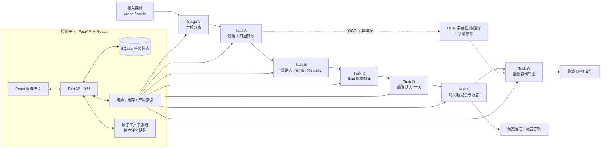

<div align="center">
  
  <h1>translip</h1>
  <p><strong>本地优先、多说话人感知的视频配音流水线</strong></p>
  <p>把音频分离、说话人归因转写、翻译、单说话人 TTS、时间轴回贴和视频交付串成一条可复用的端到端流程；既能跑完整流水线，也能把每个环节当作独立的「原子工具」单独使用，并配有 FastAPI + React 管理界面。</p>
  <p>
    
    
    
    
    
  </p>
  <p>
    <a href="#快速开始"><strong>快速开始</strong></a> ·
    <a href="#系统架构"><strong>架构图</strong></a> ·
    <a href="#web-管理界面"><strong>管理界面</strong></a> ·
    <a href="docs/README.md"><strong>文档索引</strong></a> ·
    <a href="README.en.md"><strong>English README</strong></a>
  </p>
</div>

> **当前状态：Beta / Early Access**
>
> `translip` 当前适合研究、实验验证、内部演示、自托管迭代和流程探索。它已经具备端到端链路、可视化配音校对和管理界面，但定位仍然是快速演进中的 Beta 系统，而不是对外宣称的生产级商业产品。

## 为什么是 `translip`

- **流水线 + 原子工具双形态**：既能一键跑完「分离 → 转写 → 翻译 → 配音 → 回贴 → 交付」的完整链路，也能把分离、转写、翻译、合成、混音、合并、字幕识别/擦除等环节作为独立工具单独调用。
- **多说话人感知**：不仅输出文本，还围绕说话人 profile / registry 建立可复用资产，并通过角色库把「角色 → 说话人」沉淀为跨任务台账。
- **可视化配音校对**：内置「配音编辑台」，以问题队列驱动逐段复核，支持实时时长预测、试听倍速、单段重新合成。
- **缓存感知的可重跑编排**：每个阶段是独立子进程，产物落盘 + manifest，改一个后端/模型只会选择性重算，可从任意阶段重跑。
- **本地优先 + 一键模型管理**：模型默认在本地运行，管理界面可配置 HuggingFace 令牌（门控模型）并一键检测、下载缺失模型。

## 界面预览

| 仪表盘 · 流水线与原子任务总览 | 新建流水线任务 · 分步向导 + 分组高级配置 |
| --- | --- |
|  |  |

| 流水线任务详情 · 阶段 DAG 与重跑控制 | 原子工具集 · 按音频/语音/视频分类 |
| --- | --- |
|  |  |

| 单个原子工具 · 人声/背景分离 | 配音编辑台 · 问题队列 + 检视面板 |
| --- | --- |
|  |  |

| 全局设置 · HuggingFace 令牌与一键模型下载 | 作品库 · 作品/剧集资产 |
| --- | --- |
|  |  |

## 系统架构



编排器本身不含业务逻辑，它解析节点 DAG、检查缓存，再把每个阶段以**独立子进程**形式 shell 出去执行（与 CLI 子命令是同一套代码）；这样重型 ML 模型在退出时即被释放，单阶段崩溃也不会污染编排器。原子工具子系统与流水线正交：它是一套独立的单工具任务队列，处理上传、并发、取消和产物注册。

## 核心能力

**A. 端到端配音流水线**

- 输入视频或音频，自动分离人声与背景音。
- 基于 `FunASR / Paraformer-zh`（默认）或 `faster-whisper` 生成带说话人标签的转写结果，diarization 支持 `ECAPA` 与 `pyannote 3.1`。
- 为说话人建立 profile / registry，支持跨任务复用。
- 使用本地 `M2M100` 或 `DeepSeek API` 生成目标语言配音脚本。
- 默认基于 `MOSS-TTS-Nano ONNX` 在本地合成目标语言语音，也可切换到 `Qwen3-TTS` 或 `VoxCPM2`。
- 将配音按原始时间轴回贴（atempo / rubberband），侧链混音，并导出预览版与最终成片。

**B. 独立原子工具**（可单独上传 → 处理 → 下载，结果可一键转入下一个工具）

- 人声/背景分离、音频混合、语音转文字、台词校正、文本翻译、语音合成、音视频合并、字幕识别、字幕擦除、媒体信息探测。

**C. 协作与资产**

- **配音编辑台**：问题队列（静音、音色不匹配、时长拉伸、翻译可信度等）+ 检视面板 + 实时时长预测 + 单段重新合成。
- **配音评测 / 实验分析**：对完成的配音任务做逐段质检——自动定位「漏配 / 音色不符 / 漏词吞字 / 节奏异常 / 听不清 / 翻译差」，给出综合评分与质量门；菜单栏「配音评测」页可逐段对比原声 vs 配音、查看译文漏词高亮，并可选用 DeepSeek LLM 给译文打分。
- **作品库 / 角色库**：把任务挂到「作品 → 剧集」，并维护「角色 → 说话人」台账，支持全局 persona 复用。
- **模型与令牌管理**：在设置页配置 HuggingFace 令牌（解锁 pyannote 等门控模型）、查看模型状态并一键下载缺失模型。

## 工作流模板

`run-pipeline` 通过模板决定运行哪些节点：

| 模板 | 说明 |
| --- | --- |
| `asr-dub-basic` | 基础配音链路：Stage 1 → Task A/B/C/D/E → Task G。默认模板。 |
| `asr-dub+ocr-subs` | 在基础链路上增加 OCR 字幕检测/翻译，并用 OCR 结果校正 ASR 文稿。 |
| `asr-dub+ocr-subs+erase` | 在上面的基础上再增加原片硬字幕擦除。 |

## Web 管理界面

管理界面是日常使用的主入口，左侧导航分为以下功能区：

- **仪表盘**：统一展示流水线任务与原子任务的总数、运行中/完成/失败统计与最近任务。
- **任务中心**：流水线任务列表、新建流水线任务（分步向导 + 分组高级配置）、任务详情（阶段 DAG / 进度 / 产物 / 从任意阶段重跑）、**配音编辑台**、说话人复核工作台。
- **原子工具集**：10 个独立单工具任务（分离、混合、转写、校正、翻译、合成、合并、字幕识别/擦除、探测），各自有上传与参数面板，处理完成后产物可一键转入下一个工具。
- **作品库 / 角色库**：跨任务的作品-剧集资产与角色→说话人台账。
- **全局设置**：系统信息与缓存清理、TMDB API、HuggingFace 令牌、模型状态与一键下载、任务默认参数。

### 开发模式

先启动后端 API：

```bash
uv run uvicorn translip.server.app:app --host 127.0.0.1 --port 8765
```

再启动前端：

```bash
cd frontend
npm install
npm run dev
```

- 前端：`http://127.0.0.1:5173`
- 后端 API：`http://127.0.0.1:8765`
- `frontend/vite.config.ts` 已将 `/api` 代理到 `127.0.0.1:8765`，前端使用相对路径访问 API，无需额外环境变量。

也可以使用仓库内置的开发控制脚本（日志和 PID 写入 `.dev-runtime/`）：

```bash
./scripts/dev.sh start     # 同时启动后端 :8765 与前端 :5173（后台运行）
./scripts/dev.sh status    # 查看状态
./scripts/dev.sh stop       # 停止
./scripts/dev.sh restart    # 重启
```

### 构建后由后端托管（生产风格）

```bash
cd frontend && npm install && npm run build && cd ..
uv run translip-server
```

如果 `frontend/dist` 存在，后端会自动挂载静态文件，统一从 `http://127.0.0.1:8765` 提供管理界面。`translip-server` 默认监听 `127.0.0.1:8765`；需要自定义 host/port 时直接使用 `uvicorn translip.server.app:app ...`。

## 流水线阶段

每个阶段既是 `run-pipeline` 编排中的一个节点，也是一个可单独运行的 CLI 子命令。

| 阶段 | 命令 | 作用 | 主要产物 |
| --- | --- | --- | --- |
| Stage 1 | `translip run` | 音频分离（demucs / cdx23 / clearervoice） | `voice.*`、`background.*` |
| Task A | `translip transcribe` | 说话人归因转写（FunASR/faster-whisper + diarization） | `segments.zh.json`、`segments.zh.srt` |
| Task B | `translip build-speaker-registry` | 说话人 profile / registry | `speaker_profiles.json`、`speaker_registry.json` |
| Task C | `translip translate-script` | 配音脚本翻译 | `translation.<lang>.json`、`translation.<lang>.srt` |
| Task D | `translip synthesize-speaker` | 单说话人配音合成 | `speaker_segments.<lang>.json`、`speaker_demo.<lang>.wav` |
| Task E | `translip render-dub` | 时间轴拟合与混音 | `dub_voice.<lang>.wav`、`preview_mix.<lang>.wav` |
| Task F | `translip run-pipeline` | 编排 Stage 1 到 Task E | `pipeline-manifest.json`、`pipeline-status.json` |
| Task G | `translip export-video` | 导出最终视频 | `final_preview.<lang>.mp4`、`final_dub.<lang>.mp4` |

> 默认后端：ASR `funasr`（模型 `paraformer-zh`）、分离 `cdx23`、翻译 `local-m2m100`、TTS `moss-tts-nano-onnx`。

## 环境要求

- Python `3.11` 到 `3.12`
- [uv](https://docs.astral.sh/uv/)
- FFmpeg，且已加入 `PATH`
- Node.js + npm（仅前端开发或构建管理界面时需要）
- macOS 或 Linux；CPU 可运行，Apple Silicon 自动使用 MPS，TTS 更推荐 `CUDA` 或 `MPS`

## 安装

```bash
git clone https://github.com/MasamiYui/translip.git
cd translip
uv sync                 # 安装运行时依赖
uv sync --extra dev     # 如需运行测试 / 参与开发
uv sync --extra ocr     # 如需 OCR 硬字幕识别（内置 PaddleOCR，约数百 MB）
```

> `uv sync --extra X` 会把环境**精确**同步到 X 并移除其它 extra；要同时保留测试与 OCR，请用 `uv sync --extra dev --extra ocr`。OCR 字幕识别为**完全本地**实现（内置 PaddleOCR，不调用任何外部服务）；PP-OCRv5 模型权重默认放在 `<缓存目录>/paddleocr_models`，可用 `PADDLEOCR_MODELS_BASE_DIR` 覆盖。

推荐提前下载分离模型（也可在管理界面「全局设置 → 模型状态」一键下载）：

```bash
uv run translip download-models --backend cdx23 --quality balanced
```

如需使用门控模型（如 `pyannote` 说话人分离），先在 HuggingFace 接受模型许可，再提供 read 权限的访问令牌——可在设置页填写，或通过环境变量 `HF_TOKEN` / `HUGGINGFACE_HUB_TOKEN` / `PYANNOTE_AUTH_TOKEN` 提供。DeepSeek 翻译后端、台词校正 LLM 仲裁、翻译质量打分则需要 `DEEPSEEK_API_KEY`。

## 快速开始

`run-pipeline` 默认执行到 `task-e`（生成配音音轨与预览混音）；最终视频导出再执行一次 `export-video`。

```bash
uv run translip run-pipeline \
  --input ./test_video/example.mp4 \
  --output-root ./output-pipeline \
  --target-lang en \
  --write-status

uv run translip export-video \
  --pipeline-root ./output-pipeline
```

典型输出目录：

```text
output-pipeline/
├── pipeline-manifest.json
├── pipeline-report.json
├── pipeline-status.json
├── logs/
├── stage1/example/
├── task-a/voice/
├── task-b/voice/
├── task-c/voice/
├── task-d/voice/<speaker-id>/
├── task-e/voice/
└── task-g/delivery/
```

最终成片默认位于：

- `output-pipeline/task-g/delivery/final-preview/final_preview.en.mp4`
- `output-pipeline/task-g/delivery/final-dub/final_dub.en.mp4`

### 逐阶段单独运行

每个阶段也可单独调用，便于调试或替换某一环节。下面是最常用的几条；更细的参数见对应阶段文档。

```bash
# Stage 1：音频分离
uv run translip run --input ./test_video/example.mp4 --mode auto --quality balanced --output-dir ./output-stage1

# Task A：语音转写
uv run translip transcribe --input ./output-stage1/example/voice.wav --output-dir ./output-task-a

# Task C：翻译（本地 M2M100 / DeepSeek）
uv run translip translate-script --segments ./output-task-a/voice/segments.zh.json \
  --profiles ./output-task-b/voice/speaker_profiles.json --target-lang en \
  --backend local-m2m100 --output-dir ./output-task-c

# Task D：单说话人合成（默认 moss-tts-nano-onnx，可切换 qwen3tts / voxcpm2）
uv run translip synthesize-speaker --translation ./output-task-c/voice/translation.en.json \
  --profiles ./output-task-b/voice/speaker_profiles.json --speaker-id spk_0000 \
  --backend moss-tts-nano-onnx --output-dir ./output-task-d --device auto

# 配音评测：对已完成的流水线产物做逐段质检（漏配/音色/漏词/节奏/翻译）
uv run translip evaluate-dub --pipeline-root ./output-pipeline/<task_id> --target-lang en \
  --output-dir ./output-pipeline/<task_id>/analysis/dub-qa
#   加 --translation-judge 用 DeepSeek LLM 给译文打分（需 DEEPSEEK_API_KEY）

# 其它：probe（媒体信息）、download-models（预下载模型）
uv run translip probe --input ./test_video/example.mp4
uv run translip --help    # 查看全部子命令
```

> `moss-tts-nano-onnx` 是默认 TTS 后端，需要先按 OpenMOSS/MOSS-TTS-Nano 文档安装 `moss-tts-nano` CLI，未安装时 Task D 会给出明确的依赖错误。`voxcpm2` 使用 `openbmb/VoxCPM2`，Apple Silicon 上默认回退 CPU，可设 `VOXCPM_ALLOW_MPS=1` 尝试 MPS。

## 配置与环境变量

| 变量 | 默认值 | 用途 |
| --- | --- | --- |
| `TRANSLIP_CACHE_DIR` | `~/.cache/translip` | 模型缓存、流水线产物、原子工具存储的根目录 |
| `TRANSLIP_DB_PATH` | `<cache>/data.db` | Web 管理界面的 SQLite 数据库位置 |
| `HF_TOKEN` / `HUGGINGFACE_HUB_TOKEN` / `PYANNOTE_AUTH_TOKEN` | 无 | 下载/使用门控模型（如 pyannote）所需的 HuggingFace 令牌，也可在设置页填写 |
| `TMDB_API_KEY` / `TMDB_BEARER_TOKEN` | 无 | 作品库拉取作品/剧集元数据与海报 |
| `DEEPSEEK_API_KEY` | 无 | 启用 `deepseek` 翻译后端、台词校正 LLM 仲裁、翻译质量打分时必需 |
| `DEEPSEEK_BASE_URL` | `https://api.deepseek.com` | 覆盖 DeepSeek API 地址 |
| `DEEPSEEK_MODEL` | `deepseek-v4-pro` | 覆盖默认 DeepSeek 模型 |
| `MOSS_TTS_NANO_CLI` | `moss-tts-nano` | `moss-tts-nano-onnx` 后端调用的 CLI 路径 |
| `MOSS_TTS_NANO_MODEL_DIR` | `<cache>/models` | MOSS ONNX 模型目录，传给 `--onnx-model-dir` |
| `MOSS_TTS_NANO_CPU_THREADS` | `4` | MOSS ONNX CPU 推理线程数 |
| `QWEN_TTS_MODEL` | — | 覆盖 `qwen3tts` 后端加载的模型 |
| `VOXCPM_MODEL` | `openbmb/VoxCPM2` | 覆盖 `voxcpm2` 后端加载的模型 |
| `VOXCPM_ALLOW_MPS` | `0` | 允许 `voxcpm2` 在 Apple Silicon MPS 上运行；默认回退 CPU |
| `VOXCPM_INFERENCE_TIMESTEPS` | `10` | `voxcpm2` 推理步数 |
| `VOXCPM_RETRY_BADCASE` | `1` | 是否启用 VoxCPM 内部坏例重试 |

更细的默认参数见 [src/translip/config.py](src/translip/config.py)。

## 开发

```bash
# 后端
uv sync --extra dev
uv run pytest

# 前端
cd frontend
npm install
npm run lint
npm run build
npm run test       # Vitest 单元/组件测试
```

仓库根目录还有 Playwright 端到端测试（`tests/e2e/*.spec.ts`），需要先 `./scripts/dev.sh start` 启动开发栈，再 `npx playwright test`。

## 相关文档

- [docs/README.md](docs/README.md)：文档总索引
- [docs/speaker-aware-dubbing-plan.md](docs/speaker-aware-dubbing-plan.md)：整体方案与技术路线
- [docs/task-f-pipeline-and-engineering-orchestration.md](docs/task-f-pipeline-and-engineering-orchestration.md)：编排与缓存设计
- [docs/task-g-final-video-delivery.md](docs/task-g-final-video-delivery.md)：最终视频交付设计
- [docs/frontend-management-system-design.md](docs/frontend-management-system-design.md)：管理界面设计
- [frontend/README.md](frontend/README.md)：前端目录与开发说明

## English README

- [README.en.md](README.en.md)：完整英文版说明
