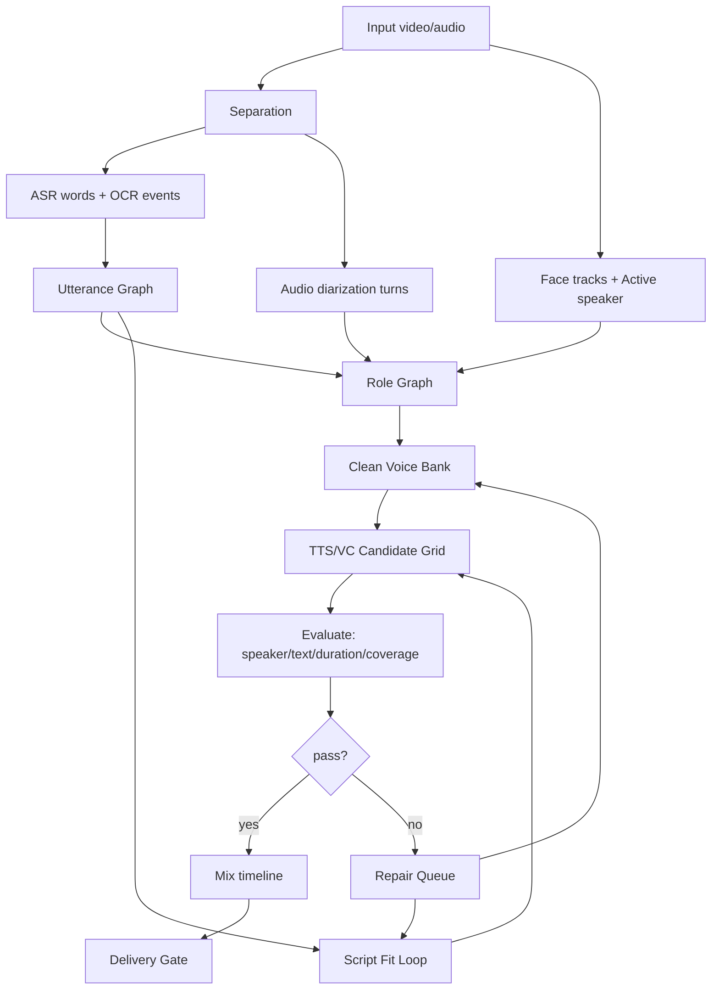

# translip 配音质量改造调研与方案

日期：2026-04-25

本报告基于当前仓库实现、`task-20260425-023015` 失败样本，以及外部开源项目/论文调研，目标是解决两类核心问题：

- 人物识别和音色不匹配。
- 部分桥段没有英文配音或听感上漏配音。

## 1. 当前项目结构整理

`translip` 当前是典型的级联式视频配音 pipeline：

```text
Stage 1 音频分离
-> OCR detect
-> Task A 说话人归因转写
-> ASR/OCR correction
-> Task B speaker profile / registry / voice bank
-> Task C 翻译与配音脚本
-> Task D 单说话人 TTS
-> Task E 时间轴拟合与混音
-> Task G 视频导出
```

核心实现位置：

| 模块 | 代码位置 | 当前作用 |
|---|---|---|
| 音频分离 | `src/translip/pipeline/`, `src/translip/models/` | Demucs/CDX23/ClearerVoice 风格的人声/背景分离 |
| ASR | `src/translip/transcription/asr.py` | faster-whisper 转写 |
| 说话人聚类 | `src/translip/transcription/speaker.py` | SpeechBrain embedding + sklearn 聚类 |
| OCR 校正 | `src/translip/transcription/ocr_correction.py` | 用 OCR 字幕校正 ASR 文本和窗口 |
| speaker profile | `src/translip/speakers/` | reference clip、speaker registry |
| voice bank | `src/translip/dubbing/voice_bank.py` | 给 Task D 推荐 reference |
| 翻译 | `src/translip/translation/` | M2M100 / SiliconFlow 后端、duration QA |
| TTS | `src/translip/dubbing/` | MOSS-TTS-Nano、Qwen TTS 后端 |
| 混音 | `src/translip/rendering/` | fit、overlap resolve、content_quality |
| repair | `src/translip/repair/` | 返修队列、rewrite、candidate 重生成，尚未完整接入主流程 |
| 交付 | `src/translip/delivery/` | final preview/final dub 导出 |

这个方向是对的：中间产物充分、质量指标也已经开始建立。真正的问题在于 **质量闭环没有硬约束**。当前系统能识别很多失败，但失败没有强制回流修复，最终仍会表现为 pipeline succeeded。

## 2. 当前关键缺口

### 2.1 Speaker attribution 缺口

当前 `src/translip/transcription/speaker.py` 的做法是：

```text
ASR segment
-> 相邻 segment 合并成 embedding group
-> SpeechBrain embedding
-> AgglomerativeClustering
-> 如果 cluster 数超过 cap，强行重聚到最多 8 个 speaker
```

这在短剧/预告片场景中风险很高：

- 先按 ASR segment 切，再聚类 speaker，时间边界已可能不准。
- 相邻短句经常来自不同角色，但当前会按 gap 合并成 embedding group。
- raw cluster 多时直接压到最多 8 个 speaker，容易把不同角色合并。
- speaker label 没有置信度、没有 role 层、没有画面人物约束。

`task-20260425-023015` 中 Task A log 出现：

```text
Speaker clustering produced 50 clusters for 64 embedding groups. Re-clustering with cap=8.
```

这就是音色串人的首要根因。

### 2.2 Reference bank 缺口

当前 `src/translip/speakers/reference.py` 的 reference 选择有几个问题：

- `MAX_REFERENCE_SEC=15.0`，偏长。
- 倾向按 `(duration, rms)` 选长且响的片段。
- 没有做重叠说话检测、音乐检测、单说话人一致性检测。
- 没有将歌曲、旁白、电话音、环境噪声与普通对白分层处理。

结果是：reference 可能包含多人连续对白、背景音乐或错误 speaker。TTS 后端再强也会被污染 reference 拖垮。

### 2.3 漏配音闭环缺口

`task-20260425-023015` 的漏配音至少来自四个入口：

- Task D speaker 选择过滤掉 `spk_0002`，导致 6 条直接没生成。
- 8 条 OCR-only event 因 `ocr_only_policy=report_only` 没进入翻译/TTS。
- Task E 有 22 条 `skipped_overlap`，已合成但被混音阶段丢弃。
- 18 条 audible coverage failed，字幕窗口内听不到或覆盖不足。

这些都应该进入统一的 `missing_or_failed_utterance` repair queue，而不是散落在不同报告里。

### 2.4 TTS/VC 模型缺口

当前默认 `moss-tts-nano-onnx` 在该任务上 speaker similarity 均值只有 `0.3211`，186 条里只有 5 条 `passed`。这说明默认 TTS 不能承担“影视角色音色克隆”的主模型。

项目已有 `qwen_tts_backend.py` 和 repair candidate 机制，但当前主流程没有把“多模型候选 + 自动评估 + 选优”作为硬闭环。

## 3. 外部项目与论文调研

### 3.1 ASR / word alignment / diarization

#### WhisperX

仓库：[m-bain/whisperX](https://github.com/m-bain/whisperX)

WhisperX 提供 faster-whisper ASR、wav2vec2 forced alignment、pyannote diarization，并输出 word-level timestamps。它的 README 明确强调：

- 支持 word-level timestamps 与 speaker diarization。
- 通过 VAD 预处理降低幻觉。
- 但 overlapping speech 和 diarization 仍然不是完美的。

适合本项目的用法：

- 不一定整体替换 Task A。
- 更适合作为 `alignment_backend=whisperx`，给 ASR/OCR/字幕提供更细粒度 word anchor。
- 用 word-level speaker assignment 替代当前 segment-level speaker assignment。

结论：值得接入，但不能把 WhisperX 当作最终 speaker truth。

#### pyannote.audio

仓库：[pyannote/pyannote-audio](https://github.com/pyannote/pyannote-audio)

pyannote.audio 是 PyTorch speaker diarization 工具包，官方 README 说明它提供 pretrained models/pipelines，并有 `community-1` open-source speaker diarization pipeline 可本地运行。

适合本项目的用法：

- 增加 `diarization_backend=pyannote`。
- 输出 diarization turns，再用 word-level alignment 把词分配到 speaker turn。
- 用 pyannote 的 overlapped speech/speaker change 相关能力辅助过滤 reference。

注意：

- 需要 Hugging Face token 和模型使用条款。
- 仍需和 OCR、ASR、画面人物融合，不能单独决定 role。

#### NVIDIA NeMo diarization / Sortformer / MSDD

文档：[NVIDIA NeMo Speaker Diarization Models](https://docs.nvidia.com/nemo-framework/user-guide/latest/nemotoolkit/asr/speaker_diarization/models.html)

NeMo 提供两类 diarization：

- Sortformer：端到端 speaker diarization。
- Cascaded pipeline：MarbleNet VAD + TitaNet speaker embedding + MSDD。

NeMo 文档还明确指出，真实对话里 speaker turn 可以非常短，diarization 需要在几百毫秒到几秒级做精细判断；长音频片段有更好 speaker trait，但会牺牲时间粒度。

适合本项目的用法：

- 作为 pyannote 的替代或高质量模式。
- 特别适合做 benchmark：同一视频跑 current / pyannote / NeMo，比较 DER-like 指标、speaker purity、人工抽检通过率。

结论：建议做可插拔后端，不建议硬依赖。

### 3.2 视频人物识别 / active speaker

#### AVA-ActiveSpeaker

论文页：[Google Research AVA-ActiveSpeaker](https://research.google/pubs/ava-activespeaker-an-audio-visual-dataset-for-active-speaker-detection/)

AVA-ActiveSpeaker 是主动说话人检测数据集，论文页说明它包含约 365 万人工标注帧、38.5 小时视频，标注 face track 是否正在说话以及语音是否可听。这个任务正是“画面里谁在说话”。

#### TalkNet-ASD

仓库：[TaoRuijie/TalkNet-ASD](https://github.com/TaoRuijie/TalkNet-ASD)

TalkNet 是音视频主动说话人检测模型，仓库提供 end-to-end demo，可在视频里标记正在说话的脸。

适合本项目的用法：

- 新增可选 `active_speaker_backend=talknet`。
- 对影视/短剧画面中可见的人脸，生成 `face_track_id -> speaking probability`。
- 与 audio diarization turn 融合，建立 `role_id`。
- 当 audio-only diarization 把两个人合并时，active speaker 可以强约束拆分。

结论：这是解决“人物音色对不上”的关键增强。只靠音频 diarization 对影视短句不够。

### 3.3 Speech translation / end-to-end dubbing

#### SeamlessM4T / SeamlessExpressive

仓库：[facebookresearch/seamless_communication](https://github.com/facebookresearch/seamless_communication)
论文：[SeamlessM4T arXiv](https://arxiv.org/abs/2308.11596)

SeamlessM4T 支持 S2ST、S2TT、T2ST、T2TT、ASR。论文摘要说明它面向最多约 100 种语言，并在 speech-to-text / speech-to-speech 翻译上优于强级联系统。SeamlessExpressive 进一步关注语速、停顿、声音风格。

适合本项目的用法：

- 做端到端 S2ST benchmark。
- 不建议直接替代当前全部 pipeline，因为本项目需要可控角色、可审查字幕、可修复每个 utterance。
- 可作为“翻译候选”或“语音风格参考”，尤其用于比较 M2M100 的翻译质量。

结论：作为评测基线和部分场景 fallback 有价值，不适合作为唯一架构。

### 3.4 TTS / voice cloning / voice conversion

#### Qwen3-TTS

仓库：[QwenLM/Qwen3-TTS](https://github.com/QwenLM/Qwen3-TTS)

官方 README 说明 Qwen3-TTS 支持稳定、富表达、流式语音生成、自由 voice design 和 voice cloning。Base 模型支持 3 秒快速 voice clone，并支持中英日韩德法俄葡西意等语言。其 Python API 需要 `ref_audio` 与 `ref_text`，也可构建 reusable voice clone prompt。

适合本项目的用法：

- 作为优先 TTS backend，替换 `moss-tts-nano-onnx` 的默认地位。
- 用 voice clone prompt 缓存每个 role 的 reference features。
- 与 repair candidate grid 集成：同一 utterance 生成 2-3 个候选，自动选 speaker/text/duration 综合得分最高者。

结论：项目已经有 qwen backend，应把它升为主路径候选。

#### CosyVoice / Fun-CosyVoice

仓库：[FunAudioLLM/CosyVoice](https://github.com/FunAudioLLM/CosyVoice)

README 说明 Fun-CosyVoice 3.0 面向野外 zero-shot multilingual speech synthesis，强调 content consistency、speaker similarity 和 prosody naturalness；Key Features 包含 multilingual/cross-lingual zero-shot voice cloning。CosyVoice2 也有 streaming、instruct、文本规范化等能力。

适合本项目的用法：

- 加为候选 TTS backend，特别适合中英跨语言配音。
- 作为 Qwen3-TTS 的备选，做逐角色/逐片段自动评估。

注意：

- 模型体积和依赖比当前 MOSS 重。
- 需要确认具体模型权重 license 是否满足你的使用场景。

#### F5-TTS

仓库：[SWivid/F5-TTS](https://github.com/SWivid/F5-TTS)
论文：[F5-TTS arXiv](https://arxiv.org/abs/2410.06885)

F5-TTS 是 flow matching/DiT 路线的 TTS，仓库提供 CLI、Gradio、Docker、Triton/TensorRT-LLM 支持，推理 RTF 公开可见，社区采用度高。

适合本项目的用法：

- 做 TTS 候选模型和 bakeoff benchmark。
- 对离线研究/内部评估价值高。

注意：

- 代码 MIT，但 README 标注 pretrained models 因训练数据原因是 CC-BY-NC。若项目要商业化，需要谨慎。

#### OpenVoice

仓库：[myshell-ai/OpenVoice](https://github.com/myshell-ai/OpenVoice)

OpenVoice 强调 tone color cloning、style control、zero-shot cross-lingual voice cloning。OpenVoice V2 支持英语、西语、法语、中文、日语、韩语，V1/V2 都是 MIT license。

适合本项目的用法：

- 作为轻量、许可友好的 cross-lingual voice cloning fallback。
- 可用于角色音色不够像但文本/时长合格的候选重试。

#### Seed-VC

仓库：[Plachtaa/seed-vc](https://github.com/Plachtaa/seed-vc)

Seed-VC 支持 zero-shot voice conversion、实时 voice conversion 和 singing voice conversion。README 说明无需训练即可用 1-30 秒参考音频克隆 voice；也支持少量数据微调。

适合本项目的用法：

- 两阶段方案：先用稳定英文 TTS 生成“文本正确、时长合适”的英文语音，再用 Seed-VC 转到目标角色音色。
- 对长片段和强音色相似度需求更合适。

注意：

- GPL-3.0 license，商业/闭源集成需要隔离或换模型。

### 3.5 Forced alignment / subtitle sync

#### aeneas

仓库：[readbeyond/aeneas](https://github.com/readbeyond/aeneas)

aeneas 是老牌 forced alignment 工具，可把文本片段与音频自动同步，输出 SRT/VTT/JSON/TextGrid 等格式。

适合本项目的用法：

- 可以作为 subtitle/audio sync 的参考实现。

注意：

- 项目较老，AGPL-3.0，对商业集成不友好。
- 对现代多语音/嘈杂影视素材不一定足够。

#### Montreal Forced Aligner

文档：[Montreal Forced Aligner](https://montreal-forced-aligner.readthedocs.io/en/latest/)

MFA 是更系统化的 forced alignment 工具，适合同语言音频/文本强制对齐。

适合本项目的用法：

- 对生成后的英文 TTS 做英文 forced alignment，验证每个词是否落在预算内。
- 不适合直接对中文源音频和英文译文做跨语言对齐。

## 4. 推荐最终方案

我建议不要单纯“换一个 TTS 模型”。这个项目的问题是链路型问题，最佳方案是升级为 **Utterance-first + Role Graph + Candidate Repair Loop**。

### 4.1 核心架构



### 4.2 数据模型必须升级

当前所有东西围绕 `segment_id`。建议新增：

```text
utterance_id: 真实一句台词，来自 ASR/OCR/字幕融合
role_id: 真实角色/人物，可能由多个 speaker cluster 和 face track 共同确定
voice_id: 可用于合成的音色资产
candidate_id: 某个 utterance 的某次 TTS/VC 尝试
delivery_state: placed / repaired / skipped / blocked / non_dialogue
```

不要再让 `speaker_id` 同时承担“音频聚类标签、角色、音色资产、TTS 路由”四个职责。

## 5. 分阶段落地计划

### P0：先消灭漏配音

目标：任何应该配音的 utterance 都不能静默丢失。

改动：

1. Task D speaker selection 改为：`speaker_limit<=0` 时尝试所有 cloneable speaker。没有 usable short segment 的 speaker 也必须进入 fallback/review。
2. `duration>6s` 不再导致整个 speaker 被跳过，而是把 segment 标为 `needs_split_or_realign`。
3. OCR-only event 从 `report_only` 改为可配置的 `inject_with_review`。
4. Task E `skipped_overlap` 不允许直接结束，必须写入 repair queue。
5. audible coverage failed 必须写入 repair queue。
6. Task G 当 `content_quality=blocked` 时，UI 和 API 必须明确显示“未产出可交付 final dub”。

验收：

- translation segment count = Task D segment count + non_dialogue count。
- Task E `skipped_overlap=0` 或所有 skipped 都有 selected repair candidate。
- audible coverage failed count = 0。

### P1：先用项目现有能力补上 repair loop

项目已有 `src/translip/repair/`，但入口偏 Task D report，不覆盖完整缺失链路。建议扩展 repair queue 来源：

```text
Task C untranslated / script review
Task D missing audio
Task D failed quality
Task E skipped_overlap
Task E subtitle coverage failed
OCR-only injected utterance
```

repair action 增加：

- `split_overlong_asr_segment`
- `inject_ocr_only_utterance`
- `merge_adjacent_short_utterances`
- `rewrite_to_fit_budget`
- `regenerate_with_backend`
- `voice_convert_candidate`
- `manual_role_review`

验收：

- repair queue 能覆盖本任务所有 6 + 8 + 22 + 18 个问题入口。
- 每个 repair item 都有 `root_cause`、`action`、`attempts`、`selected_attempt`。

### P2：建立 Role Graph，修正人物与音色错配

新增可选阶段：

```text
Task A / OCR correction
-> role-resolve
-> Task B
```

role-resolve 输入：

- ASR word timestamps
- OCR subtitle windows
- audio diarization turns
- current speaker labels
- optional active speaker face tracks
- speaker embedding similarity graph

输出：

- `segments.zh.role-corrected.json`
- `role_graph.json`
- `speaker_diagnostics.json`

策略：

1. 用 pyannote 或 NeMo 生成 diarization turns。
2. 用 WhisperX 或等价 forced alignment 得到 word-level timestamps。
3. 将 words/utterances 分配给 diarization turns。
4. 如果视频中有人脸，使用 TalkNet-ASD 建 face track 和 speaking probability。
5. 用 role graph 融合 audio speaker、face track、时间连续性、字幕上下文。
6. speaker 不确定时标记 `role_confidence=low`，禁止直接进 voice clone。

验收：

- 不再出现 raw 50 clusters 强行压 8 后直接进入 Task B。
- 每个 role 有 purity 诊断。
- 低置信 role 不允许自动生成 final dub，只能生成 review/preview。

### P3：重建 Clean Voice Bank

reference 选择从“最长且响”改成“干净且一致”。

新规则：

- 目标时长 3-8s。
- 单说话人概率高。
- 无重叠说话。
- 无音乐/强背景。
- RMS/SNR 合格。
- embedding 与 role prototype 一致。
- 文本和音频一致。
- 歌曲、喊叫、电话声、旁白分开标记。

推荐产物：

```text
voice_bank/
  roles.json
  references/<role_id>/<reference_id>.wav
  reference_quality.json
```

验收：

- 每个 reference 有 `purity_score`、`snr_score`、`speaker_consistency`。
- reference 不合格时，使用 default designed voice 或 manual review，不硬克隆。

### P4：TTS/VC Candidate Grid

每个 utterance 不只生成一次，而是生成候选并自动选优。

候选维度：

- backend：Qwen3-TTS、CosyVoice、OpenVoice、MOSS fallback。
- reference：top 1-3 clean references。
- script：原译文、短改写、极短兜底。
- VC：可选 Seed-VC / 其他 voice conversion。

评分：

```text
score = speaker_similarity * 0.35
      + text_similarity * 0.30
      + duration_fit * 0.25
      + coverage_fit * 0.10
```

硬门槛：

- text similarity 不达标，重生成。
- duration 超预算，重写或重生成。
- speaker similarity 低于阈值，换 reference / backend / VC。

推荐模型优先级：

| 用途 | 优先模型 |
|---|---|
| 默认跨语言 voice clone | Qwen3-TTS |
| 备选高质量 TTS | CosyVoice / Fun-CosyVoice |
| 许可友好的轻量 fallback | OpenVoice |
| 研究/内部评估 | F5-TTS |
| 追求音色相似的二阶段方案 | 稳定英文 TTS + Seed-VC |

### P5：Script Fit Loop

翻译不能只追求字面正确，必须满足时间预算。

建议：

- M2M100 只作为 baseline，不作为高质量配音默认。
- 对每个 utterance 建 duration budget。
- 使用 LLM/规则改写生成 2-3 个长度候选。
- 专名 glossary 必须生效：Dubai、Burj Khalifa、Lele、Harry、小莉等。
- 对短中文口语不要逐字翻译，要翻成可说的英语短句。

验收：

- `duration_risky` 和 `duration_may_overrun` 不能直接进入 TTS，必须先过 script fit。
- 回读 ASR text similarity 达标。

### P6：混音从 greedy skip 改为 repair-aware scheduling

当前 `_resolve_overlaps()` 会按质量选择并跳过冲突片段。应该改为：

1. 先尝试 rewrite/regenerate 缩短。
2. 再尝试合并相邻短句。
3. 再尝试轻微压缩。
4. 再尝试保留核心词。
5. 最后才允许 skip，并且 skip 必须是 `blocked`。

目标：听感上不能无声漏句。

## 6. 技术选型建议

### 推荐短期组合

```text
ASR: faster-whisper 保留
Alignment: WhisperX word alignment 或 CTC forced alignment
Diarization: pyannote community-1 可选
Active speaker: TalkNet-ASD 可选实验
TTS: Qwen3-TTS 主候选 + MOSS fallback
Repair: 复用现有 repair 模块，扩展 missing/overlap/OCR-only 来源
Delivery: content_quality gate 强约束
```

优点：改动可控，能最快解决漏配音和明显串音色。

### 推荐中期组合

```text
ASR/Alignment: WhisperX-style word timestamp
Diarization: pyannote + NeMo backend abstraction
Role: audio diarization + face active speaker + manual review
TTS candidates: Qwen3-TTS + CosyVoice + OpenVoice
Optional VC: Seed-VC isolated process
```

优点：对影视短剧更可靠，开始真正解决人物/音色。

### 不建议

- 只调当前 speaker clustering 阈值。
- 只把 MOSS 换成某个更大 TTS。
- 只依赖 audio-only diarization。
- content_quality blocked 仍继续产出“看似成功”的 final dub。

这些都会在短剧/多角色/快切视频中继续失败。

## 7. 评估指标

必须把“效果”变成可回归的指标。

### 覆盖指标

- `utterance_total`
- `tts_generated_count`
- `mixed_count`
- `missing_count`
- `skipped_overlap_count`
- `audible_coverage_failed_count`

硬标准：

```text
missing_count = 0
skipped_overlap_count = 0
audible_coverage_failed_count = 0
```

### 人物/音色指标

- role assignment confidence
- speaker embedding similarity
- reference purity score
- per-role similarity median
- failed speaker similarity ratio

建议阈值：

```text
speaker_failed_ratio < 5%
per_role_similarity_median >= 0.45
low_confidence_role 不进入 final dub
```

### 文本/时长指标

- backread text similarity
- duration ratio
- subtitle window coverage
- protected term hit rate

建议阈值：

```text
text_similarity >= 0.90
0.70 <= duration_ratio <= 1.35
subtitle_coverage_ratio >= 0.80
protected_term_missing = 0
```

## 8. 对 task-20260425-023015 的具体落地判断

本任务最应该优先修：

1. `spk_0002` 被 Task D 整组跳过：P0 必修。
2. 8 条 OCR-only 未配音：P0 必修。
3. 22 条 overlap skip：P0/P1 必修。
4. 说话人 50 cluster 压 8：P2 必修。
5. reference 长且混杂：P3 必修。
6. MOSS-TTS similarity 过低：P4 必修。
7. M2M100 翻译导致重复/误译：P5 必修。

如果只允许先做一轮，我建议顺序是：

```text
P0 coverage repair
-> Qwen3-TTS candidate grid
-> clean reference selection
-> role diagnostics + manual review
-> pyannote/WhisperX/TalkNet optional high-quality mode
```

这样最快能把“漏配音”压下去，同时为音色质量提升建立数据基础。

## 9. 最终结论

好的解决方式不是单点换模型，而是把项目从“线性生成管线”升级成“带证据融合和返修闭环的配音系统”。

最小可行改造：

- 所有台词进入 utterance ledger。
- 所有 missing/skipped/low coverage 必须进入 repair queue。
- Task D 不允许因为 segment 过长跳过整个 speaker。
- OCR-only 必须可注入配音。
- Qwen3-TTS 成为主要候选后端。
- reference bank 改成 clean voice bank。
- content_quality blocked 时禁止伪装成可交付。

效果优先的最终形态：

- WhisperX/pyannote/NeMo 提供更准的“谁在何时说话”。
- TalkNet/AVA 路线提供“画面中谁在说话”。
- Role Graph 把 audio speaker、face track、字幕上下文合成真实角色。
- Qwen3/CosyVoice/OpenVoice/F5/Seed-VC 组成 candidate grid。
- 自动评估和 repair loop 决定最终入轨音频。

这套方案能同时解决“人物音色对不上”和“桥段漏配音”，并且能用回归指标长期压住质量，而不是每个任务靠人工听完才发现问题。

