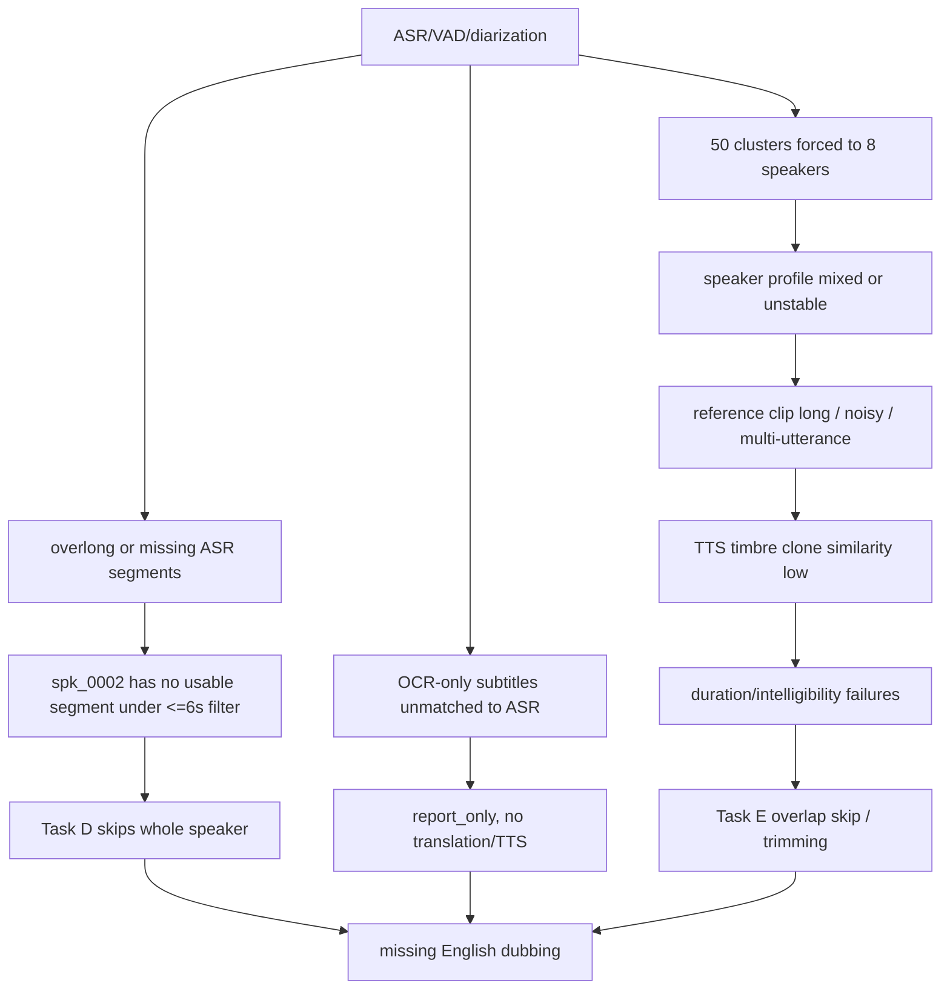

# task-20260425-023015 配音问题分析报告

分析对象：

- 任务目录：`/Users/masamiyui/.cache/translip/output-pipeline/task-20260425-023015`
- 输入视频：`/Users/masamiyui/OpenSoureProjects/Forks/video-voice-separate/test_video/我在迪拜等你.mp4`
- Pipeline：`asr-dub+ocr-subs`
- 目标语言：`en`
- 翻译后端：`local-m2m100` (`facebook/m2m100_418M`)
- TTS 后端：`moss-tts-nano-onnx`
- 关键配置：`speaker_limit=0`、`segments_per_speaker=0`、`transcription_correction.ocr_only_policy=report_only`

## 结论摘要

这个任务虽然所有 pipeline stage 都显示 `succeeded`，但成品质量状态是 `blocked`，不是可交付状态。Task G 只导出了 `preview`，`final_dub_video=null`，原因是 Task E 的内容质量检查失败。

主要问题有三类：

1. **确实存在漏配音**：192 条英文翻译片段中，Task D 只生成了 186 条音频；Task E 只放入混音 164 条，另有 22 条已合成但因重叠被跳过；还有 8 条 OCR-only 字幕因为策略是 `report_only`，没有进入翻译和 TTS。
2. **人物和音色严重不稳定**：Task A 说话人聚类先产生 50 个簇，随后被强制压到 8 个 speaker，导致角色边界不可靠；Task B 的 reference clip 又经常是长片段或多句连续对白，给音色克隆带入混合声纹风险。
3. **合成质量本身未达标**：Task E 汇总显示 186 条合成里只有 5 条 `passed`，83 条 `failed`，98 条 `review`；speaker similarity 均值只有 `0.3211`，speaker 维度仅 15 条通过，33 条失败，138 条需要复核。

## 漏配音明细

### 1. Task D 未生成音频：6 条

这 6 条全部属于 `spk_0002`。Task B 里 `spk_0002` 是 `available`，也有 reference clip，但 Task D stage manifest 没有 `spk_0002` 的 report。

| segment | speaker | time | duration | 中文 | 英文 |
|---|---:|---:|---:|---|---|
| `seg-0013` | `spk_0002` | 37.94-72.85 | 34.91s | 三分钟之后停车场见 | After three minutes, we saw the parking lot. |
| `seg-0072` | `spk_0002` | 196.67-216.70 | 20.03s | 把篷打开 | Open the cage. |
| `seg-0078` | `spk_0002` | 224.06-236.01 | 11.95s | 我来为您服务先等一下 | I will wait for you first. |
| `seg-0083` | `spk_0002` | 242.51-251.41 | 8.90s | 这边请 | Please here. |
| `seg-0106` | `spk_0002` | 302.58-320.52 | 17.94s | 对不起我弄错了 | Sorry I was wrong. |
| `seg-0107` | `spk_0002` | 320.52-332.08 | 11.56s | 奶奶 | The grandmother |

直接原因在 `src/translip/dubbing/planning.py`：

- `pick_task_d_speaker_ids()` 只选择至少有 1 条 usable segment 的 speaker。
- `is_usable_task_d_segment()` 把 `duration_sec > 6.0` 的片段判为不可用。
- `spk_0002` 的 6 条 segment 全部超过 6 秒，所以 `usable_counts[spk_0002] == 0`，整个 speaker 被跳过。

也就是说，`speaker_limit=0` 本意是生成所有 speaker，但实际实现仍会因为“没有短可用片段”跳过整个 speaker，这是本任务最明确的系统性漏配音 bug。

### 2. Task E 已合成但未放入混音：22 条

Task E `mix_report.en.json` 显示：

- `placed_count=164`
- `skipped_count=22`
- `skip_reason_counts={"skipped_overlap": 22}`

这些片段已经有 Task D 音频，但 Task E 因时间重叠选择跳过，没有进入最终配音轨。典型例子：

| segment | speaker | 中文 | 英文 | 主要原因 |
|---|---:|---|---|---|
| `seg-0010` | `spk_0001` | 我现在就要去迪拜了 | I am going to Dubai now. | `replaced_by:seg-0011`, subtitle not rendered |
| `seg-0087` | `spk_0004` | 一会儿带你去吃阿拉伯餐 | Take you to the Arab meal. | `replaced_by:seg-0088`, upstream failed |
| `seg-0089` | `spk_0001` | 乐乐奶奶爸爸妈妈 | Happy mom mom mom mom mom mom mom | 生成过长、被替换 |
| `seg-0108` | `spk_0001` | 奶奶这个就是我跟你说 | My grandmother, that’s what I told you. | 生成过长、被替换 |
| `seg-0113` | `spk_0001` | 哈里先生给您介绍 | Mr. Harry to introduce you. | 生成过长、被替换 |
| `seg-0149` | `spk_0006` | 我们之间哪不合适你跟我说 | What is not right between us, you tell me. | 生成过长、被替换 |
| `seg-0161` | `spk_0006` | 橡皮擦跟感情就不是一回事 | Gumming and emotions are not one thing. | 被后续片段替换 |
| `seg-0186` | `spk_0006` | 反正不管你走到天涯海角 | No matter what you are going to the coast of the world. | 压缩/重叠后被替换 |

这里的问题不是 TTS 没跑，而是混音阶段没有 repair queue。当前逻辑遇到重叠时会直接跳过其中一个片段，导致听感上就是“漏了一句”。

### 3. 字幕窗口不可听或覆盖不足：18 条

Task E 的 audible coverage 统计：

- `subtitle_window_count=136`
- `failed_count=18`
- `average_coverage_ratio=0.7678`
- `min_coverage_ratio=0.0`

其中 12 条是被 overlap skip 后字幕窗口完全没有配音覆盖，另外 6 条虽然被 placed，但覆盖率低于阈值：

- `seg-0001` coverage `0.489`
- `seg-0008` coverage `0.4664`
- `seg-0057` coverage `0.4873`
- `seg-0115` coverage `0.2244`
- `seg-0125` coverage `0.4896`
- `seg-0169` coverage `0.418`

这些 case 会表现为英文配音没有对齐到字幕出现的时间，或者字幕还在但英语声音已经提前结束。

### 4. OCR-only 字幕未进入配音：8 条

ASR-OCR correction 报告有 8 条 OCR-only event，全部 `action=reported_only`：

| time | text |
|---:|---|
| 395.68-396.36 | 创业 |
| 402.27-403.18 | 小莉 |
| 403.64-404.77 | 终于找到你了 |
| 405.91-407.50 | 我求求你别来烦我了 |
| 407.73-408.86 | 我们不合适 |
| 415.00-415.91 | 我妈说了 |
| 416.14-417.73 | 感情是需要磨合的 |
| 417.95-418.64 | 我妈还说 |

这些字幕没有匹配到 ASR segment，而当前策略是只报告不注入，所以不会被翻译、不会 TTS、不会出现在英文配音里。

## 人物音色错配原因

### 1. 说话人聚类被强制压缩，speaker label 本身不可靠

Task A log：

```text
Speaker clustering produced 50 clusters for 64 embedding groups. Re-clustering with cap=8.
```

代码路径在 `src/translip/transcription/speaker.py`。当初始聚类数超过 cap 时，会用 `n_clusters=cap` 重新聚类。这个视频是短剧/预告片，存在多角色、快速切换、背景音乐、短句和多人对话。把 50 个声纹簇硬压到 8 个，必然会合并不同人物或不同声学条件。

这个问题会向后传染：

- Task B 直接按这些 speaker label 建 reference bank。
- Task C 翻译保留这些 speaker id。
- Task D 依据 speaker id 使用对应 reference 合成。
- 如果 speaker id 错，后面再好的 TTS 也会用错音色。

### 2. Reference clip 太长，且经常跨多句连续对白

Task B 的 reference 多数是 6-15 秒连续片段，不是干净的单说话人短音频。例子：

- `spk_0000` reference 有 14.76s、14.21s、11.22s 三段，文本覆盖“奶奶/乐乐/爸爸/妈妈”等关系句，至少说明片段内部语义和对话角色很密。
- `spk_0001` 有 65 个 segment，reference 包含机场、视频通话、家庭对话等多个场景。
- `spk_0003` reference 同时覆盖旅游博主段落和后半段情感争执段落，角色边界高度可疑。
- `spk_0005` 只有 1 条 reference，7.36s，包含多个极短酒店服务短句。
- `spk_0007` 是歌曲/音乐段，不适合作为普通对白 voice clone reference。

voice bank 报告里也出现 `long_reference_will_be_trimmed`。对音色克隆来说，长 reference 不是天然更好：如果里面有多个人、背景声、音乐、笑声、重叠对白，模型拿到的是混合特征，输出就容易不像任何一个真实角色。

### 3. TTS 后端音色保持能力不足

Task E 质量摘要：

- `overall_status_counts`: `failed=83`, `passed=5`, `review=98`
- `speaker_status_counts`: `failed=33`, `passed=15`, `review=138`
- `speaker_similarity.average=0.3211`
- `speaker_similarity.median=0.3191`

按 speaker 聚合：

| speaker | 合成数 | 平均 similarity | 状态概览 |
|---|---:|---:|---|
| `spk_0000` | 28 | 0.326 | failed 16, review 12 |
| `spk_0001` | 65 | 0.334 | passed 5, failed 24, review 36 |
| `spk_0003` | 24 | 0.325 | failed 6, review 18 |
| `spk_0004` | 45 | 0.357 | failed 18, review 27 |
| `spk_0005` | 5 | 0.170 | failed 5 |
| `spk_0006` | 17 | 0.204 | failed 13, review 4 |
| `spk_0007` | 2 | 0.358 | failed 1, review 1 |

这说明问题不只是某一个角色，而是整条 `moss-tts-nano-onnx` 克隆链路在该任务上没有稳定保留原人物音色。`spk_0005`、`spk_0006` 特别差，基本不可用。

### 4. 翻译和脚本长度控制也在放大问题

Task C 统计：

- 192 条全部 `condense_status=skipped`
- 96 条 `script_status=review`
- `duration_risky=56`
- `duration_may_overrun=25`
- `too_short_source=27`

有些翻译质量很差，会直接导致 TTS 过长、重复或内容错：

- `乐乐奶奶爸爸妈妈` -> `Happy mom mom mom mom mom mom mom`
- `奶奶爸爸妈妈` -> `Mom Mom Mom Mom Mom Mom`
- `一月喷泉` -> `The spring of January.`
- `哈利法塔是哈利哈` -> `The Halifa is the Halifa.`
- `橡皮擦跟感情就不是一回事` -> `Gumming and emotions are not one thing.`

最极端的生成时长：

- `seg-0074`：源窗口 0.4s，英文 `Good Morning` 生成 12.16s，比例 30.4x。
- `seg-0173`：源窗口 0.92s，生成 10.0s，比例 10.87x。
- `seg-0089`：源窗口 1.878s，生成 10.0s，比例 5.32x。

这些过长音频被压缩、裁剪、替换或跳过，最终表现为漏字、漏句、音画不同步。

## 根因链路



## 建议方案

### 立即修复

1. **Task D speaker 选择不能因为 overlong segment 跳过整个 speaker**
   - 当 `speaker_limit<=0` 时，应尝试所有 cloneable speaker。
   - `usable_counts==0` 的 speaker 可以降级排在后面，但不能直接丢弃。
   - 对 `duration>6s` 的 segment，进入拆分/二次对齐队列，而不是让该 speaker 从 Task D 消失。

2. **OCR-only event 需要生成 synthetic dubbing segment**
   - 将 `ocr_only_policy` 从 `report_only` 升级为 `inject_with_review`。
   - speaker 可先用时间邻近 speaker、前后上下文、或 unknown/default voice 兜底。
   - 这能直接解决本任务 8 条 OCR-only 没英文配音的问题。

3. **Task E overlap skip 必须进入 repair queue**
   - 对 `skipped_overlap` 不应直接丢弃。
   - 优先策略：合并相邻短句、缩短英文脚本、重新 TTS、重新 fit。
   - 如果仍然冲突，至少以低音量/短尾方式保留核心词，而不是静默。

4. **content_quality=blocked 时不要给用户“成功可交付”的暗示**
   - 当前 pipeline `succeeded` 但内容 `blocked`，容易误导。
   - UI/报告应明确标红：只有 preview，未产出 final dub。

### 中期优化

1. **重做 diarization/role resolver**
   - 不要用固定 cap=8 强行压缩 speaker。
   - 对短剧类视频使用 VAD turn segmentation + speaker embedding + temporal smoothing + OCR/镜头上下文。
   - raw cluster 远大于 cap 时，应进入“speaker review required”，而不是静默合并。

2. **Reference bank 只收干净单说话人片段**
   - reference 建议 3-8s，单人、无音乐、无重叠对白、RMS/SNR 达标。
   - 长 reference 先切成更短的 candidate，再用 embedding 一致性筛选。
   - 对 `spk_0007` 这种歌曲段应标记为 `non_dialogue` 或使用旁白/不克隆策略。

3. **翻译脚本要启用长度约束和上下文纠错**
   - `condense_mode=off` 在该任务上不合适。
   - 使用上下文感知翻译/LLM 改写，强制每句满足原时间预算。
   - 对专名建立 glossary：Dubai、Burj Khalifa、Harry、Lele、小莉等。

4. **替换或级联更强的 TTS/VC 模型**
   - 当前 `moss-tts-nano-onnx` 在此任务上音色保持不足。
   - 为了效果优先，建议改成“两阶段”：
     1. 高质量英文 TTS 生成稳定语音。
     2. 使用 voice conversion 将英文语音迁移到目标角色声纹。
   - 也可以直接评估 Qwen3-TTS、CosyVoice2、XTTS-v2、Seed-VC/同类 VC 模型，并以 speaker similarity、WER/text similarity、duration fit 三项自动打分选最优。

### 目标架构

建议把当前线性 pipeline 升级为带质量闭环的 dubbing graph：

1. **Utterance Graph**：ASR、OCR、字幕时间窗统一成 `utterance_id`，不再让 ASR segment 独占真相。
2. **Role Graph**：单独维护 `role_id`，允许多个 speaker cluster merge/split 后再绑定人物。
3. **Clean Voice Bank**：reference clip 先过纯净度、一致性、SNR、非音乐检测。
4. **Script Fit Loop**：翻译、压缩、重写直到满足时长预算。
5. **TTS Candidate Loop**：同一 utterance 生成多个候选，按音色、文本一致性、时长自动选优。
6. **Mix Repair Loop**：任何 missing、skipped、low coverage 都自动回流修复，不能直接进入最终交付。

## 预期收益

如果只做立即修复：

- `spk_0002` 这类整 speaker 漏配音可直接消除。
- OCR-only 漏配音从 8 条降到 0 条或 review 状态。
- overlap skip 从“直接丢句”变为“重写/重合成/降级保留”，实际漏听会明显减少。

如果完成中期优化：

- speaker 音色错配会显著降低，尤其是多角色短剧场景。
- speaker similarity 通过率应从当前 `15/186` 明显提升。
- Task G 不再出现 pipeline 成功但内容 `blocked` 的模糊状态。

## 建议验收指标

下一轮同视频回归建议至少满足：

- 翻译 segment 数 = Task D 音频数，除非明确标记为 `non_dialogue`。
- Task E `skipped_overlap=0`，或全部有 repair 后替代输出。
- audible coverage failed count = 0。
- content_quality.status != `blocked`。
- speaker similarity passed/review/failed 中，failed 占比低于 5%。
- 人工抽检每个主角色 5 条，角色音色一致、无明显串人。

