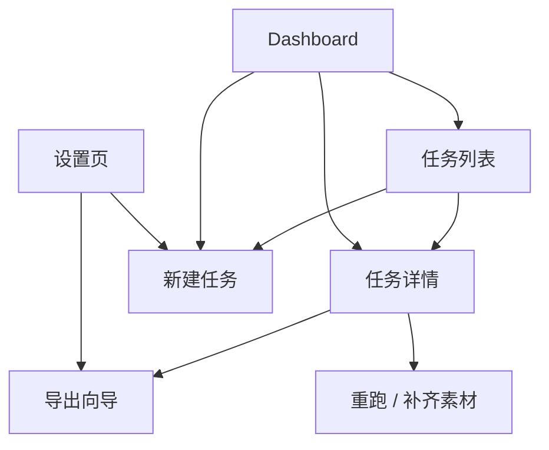

# 任务配置体验重构：页面级内容与参数规格

- 项目: `translip`
- 文档状态: Draft v1
- 创建日期: 2026-04-17
- 关联文档:
  - [任务配置体验重构：从“参数配置”转向“结果驱动”的产品与交互方案](/Users/masamiyui/OpenSoureProjects/Forks/video-voice-separate/docs/superpowers/specs/2026-04-17-task-config-product-ux-redesign.zh-CN.md)

---

## 1. 文档目的

上一份文档已经回答了“为什么现在的配置体验别扭，以及应该改成什么方向”。

这份文档继续细化到页面级，回答 4 个更具体的问题：

1. 每个页面的核心目标是什么
2. 每个页面到底应该展示哪些内容
3. 每个页面到底允许编辑哪些参数
4. 哪些参数绝对不应该出现在该页面

这份文档的目标不是描述前端组件实现，而是先把产品层的 **页面职责边界** 和 **参数归属边界** 定清楚。

---

## 2. 先定义总原则

如果不先把总原则定住，页面很容易再次退化成“大表单 + 大杂烩”。

### 2.1 页面职责原则

| 页面 | 主要职责 | 不承担的职责 |
|---|---|---|
| Dashboard | 看整体运行态势，找到下一步要处理的任务 | 详细配置任务 |
| 任务列表 | 筛选、查找、批量管理任务 | 编辑任务参数 |
| 新建任务 | 定义本次任务的意图和执行范围 | 调整成品字幕样式 |
| 任务详情 | 看状态、看素材、看问题、触发下一步动作 | 完整编辑导出样式 |
| 导出向导 | 选择导出版本、确认素材来源、预览、导出 | 修改执行期 pipeline 设置 |
| 设置页 | 管理全局默认值、环境、预设 | 承担单个任务的配置 |

### 2.2 参数归属原则

所有参数只分四类。

#### A. 全局默认参数

作用范围：整个系统

示例：

- 默认语言对
- 默认质量档位
- 默认翻译后端
- 默认 TTS 后端
- 默认预览时长
- 默认字幕样式 preset

只能在设置页修改。

#### B. 任务意图参数

作用范围：当前任务创建时定义

示例：

- 输入视频
- 任务名称
- 源语言 / 目标语言
- 成品目标 `output_intent`
- 质量档位 `quality_preset`

只能在新建任务阶段定义，创建后默认不在详情页直接编辑。

#### C. 执行参数

作用范围：当前任务如何运行

示例：

- 模板
- 阶段范围
- 设备
- 缓存
- 各阶段模型 / 后端

默认只在新建页的高级设置或开发者设置中出现。详情页只读展示，不直接原地改写。

#### D. 交付参数

作用范围：当前任务如何导出成品

示例：

- 导出版本
- 视频来源
- 音轨来源
- 英文字幕来源
- 字幕样式
- 预览时长

只在导出向导中编辑。

### 2.3 用户永远看到的顺序

所有页面必须遵守同一条顺序：

1. 先告诉用户“当前是什么”
2. 再告诉用户“你可以做什么”
3. 最后才展示“高级控制”

不能反过来。

---

## 3. 全局参数模型

为了让页面分工清楚，建议全局采用下面这套模型。

## 3.1 参数分层

```text
Global Defaults
  ├─ default_source_lang
  ├─ default_target_lang
  ├─ default_output_intent
  ├─ default_quality_preset
  ├─ default_translation_backend
  ├─ default_tts_backend
  ├─ default_preview_duration_sec
  └─ default_subtitle_style_preset

Task
  ├─ identity
  │   ├─ name
  │   ├─ input_path
  │   ├─ source_lang
  │   └─ target_lang
  ├─ intent
  │   ├─ output_intent
  │   └─ quality_preset
  ├─ pipeline_config
  └─ delivery_config

Runtime Derived
  ├─ asset_availability
  ├─ export_readiness
  ├─ recommended_export_profile
  └─ blockers / suggestions
```

## 3.2 建议新增的用户层字段

### `output_intent`

用于表达用户想要的结果，不直接暴露内部模板。

推荐值：

- `dub_final`
- `bilingual_review`
- `english_subtitle`
- `fast_validation`

### `quality_preset`

用于表达执行质量档位，而不是直接暴露一堆后端参数。

推荐值：

- `fast`
- `standard`
- `high_quality`

### `export_profile`

用于表达导出版本，而不是直接暴露 `subtitle_mode + video_source + audio_source` 组合。

推荐值：

- `dub_clean`
- `dub_no_subtitles`
- `bilingual_review`
- `english_subtitle_burned`
- `preview_only`

### `subtitle_style_preset`

用于表达字幕样式 preset，而不是一开始就显示 8 个微调项。

推荐值：

- `default_clear`
- `short_video_high_contrast`
- `tutorial`
- `minimal_review`

---

## 4. 页面总览

## 4.1 页面地图



## 4.2 页面与参数归属矩阵

| 页面 | 展示任务参数 | 可编辑参数 | 只读衍生信息 | 主要 CTA |
|---|---|---|---|---|
| Dashboard | 少量摘要参数 | 无 | 运行态、待导出、失败状态 | 新建任务 / 继续处理 |
| 任务列表 | 少量摘要参数 | 筛选参数 | 状态、进度、导出就绪度 | 查看详情 / 新建任务 |
| 新建任务 | 任务意图参数、部分执行参数 | 任务意图 + 部分执行参数 | 推荐说明、预计产物 | 创建任务 |
| 任务详情 | 任务摘要、执行摘要、产物摘要 | 不直接编辑任务配置 | 导出阻塞、素材状态、建议动作 | 导出成品 / 重跑 |
| 导出向导 | 导出所需素材与设置 | 交付参数 | 预览、可导出文件、阻塞原因 | 生成预览 / 导出 |
| 设置页 | 全局默认参数 | 全局默认参数 | 系统环境、模型状态 | 保存默认值 |

---

## 5. Dashboard 规格

## 5.1 页面目标

Dashboard 不是配置页。

它的目标只有两个：

1. 让用户快速看到系统当前最重要的任务状态
2. 让用户能快速跳转到“需要处理的下一步”

## 5.2 页面应该展示的内容

### 模块 A：总览卡片

展示：

- 总任务数
- 运行中任务数
- 已完成任务数
- 失败任务数
- 待导出任务数

其中“待导出任务数”建议新增，因为这比单纯显示完成任务更有行动意义。

### 模块 B：需要继续处理的任务

按优先级展示：

1. 失败但可恢复的任务
2. 已完成但待导出的任务
3. 正在运行的任务

每张卡片应包含：

- 任务名称
- 结果类型 `output_intent`
- 当前状态
- 当前阶段
- 总体进度
- 当前建议动作

建议动作示例：

- `继续导出`
- `补跑擦字幕`
- `从失败阶段重跑`
- `查看运行中状态`

### 模块 C：最近完成

展示最近完成的任务列表，字段包括：

- 任务名称
- 结果类型
- 状态
- 语言方向
- 完成时间
- 导出状态

## 5.3 Dashboard 允许编辑的参数

无。

Dashboard 只允许：

- 跳转
- 快速筛选
- 继续动作

不允许在这里改任务配置。

## 5.4 Dashboard 展示哪些参数

| 展示项 | 是否可编辑 | 说明 |
|---|---|---|
| 任务名称 | 否 | 文本摘要 |
| `output_intent` 对应的人话标签 | 否 | 如“英文配音成片” |
| 任务状态 | 否 | `running / failed / succeeded` |
| 当前阶段 | 否 | 用用户可理解名称显示 |
| 语言方向 | 否 | `ZH → EN` |
| 导出状态 | 否 | `可导出 / 待补齐素材 / 已导出` |

## 5.5 Dashboard 不应该展示的内容

- 模板 ID
- `run_from_stage / run_to_stage`
- 后端与模型细节
- 字幕样式参数
- 各种内部路径

---

## 6. 任务列表规格

## 6.1 页面目标

任务列表页的目标是：

1. 让用户高效查找任务
2. 让用户快速判断哪些任务值得点进去
3. 让用户做批量管理

## 6.2 页面应该展示的内容

### 顶部区

展示：

- 页面标题
- `新建任务` 主按钮

### 筛选条

建议包含：

- 搜索框
- 状态筛选
- 结果类型筛选 `output_intent`
- 导出状态筛选
- 创建时间筛选

当前只有状态和搜索，建议补齐“结果类型”和“导出状态”，这样才真正支持任务运营。

### 列表字段

推荐列如下：

| 列名 | 是否默认显示 | 说明 |
|---|---|---|
| 任务名称 | 是 | 主识别信息 |
| 结果类型 | 是 | 例如“中英双语审片版” |
| 状态 | 是 | 运行状态 |
| 进度 | 是 | 当前运行进度 |
| 语言方向 | 是 | `ZH → EN` |
| 当前阶段 | 是 | 对运行中任务尤其有用 |
| 导出状态 | 是 | `可导出 / 待导出 / 已导出 / 受阻` |
| 创建时间 | 是 | 时间管理 |
| 耗时 | 否 | 可放二级信息 |

### 行内快速动作

推荐：

- 查看详情
- 继续导出
- 重跑
- 删除
- 复制为新任务

“复制为新任务”很有价值，因为很多任务配置会重复使用。

## 6.3 列表页允许编辑的参数

只允许编辑筛选参数，不允许直接编辑任务配置。

可编辑参数：

- `search`
- `status_filter`
- `intent_filter`
- `export_status_filter`
- `page`

## 6.4 列表页不应该展示的内容

- 字幕样式明细
- 模型、后端、设备等技术参数
- 大段 artifact 文件列表
- 导出向导本体

列表页只负责“找任务”和“去下一步”，不负责展开所有上下文。

---

## 7. 新建任务页规格

## 7.1 页面目标

新建任务页的目标是：

> 让用户以最低理解成本发起一个任务。

它不是系统配置中心，也不是导出设置页。

## 7.2 页面结构

推荐拆成 4 个模块，而不是当前按技术阶段切块。

1. 素材与语言
2. 成品目标
3. 质量与高级控制
4. 任务摘要与创建

## 7.3 模块 A：素材与语言

### 展示内容

- 输入视频路径 / 上传入口
- 媒体探测结果
- 源语言
- 目标语言
- 任务名称

### 可编辑参数

| 用户字段 | 内部字段 | 必填 | 默认值 | 展示方式 |
|---|---|---|---|---|
| 任务名称 | `name` | 否 | 自动生成 | 文本输入 |
| 输入视频 | `input_path` | 是 | 无 | 路径输入 / 上传 |
| 源语言 | `source_lang` | 是 | 来自全局默认 | 下拉 |
| 目标语言 | `target_lang` | 是 | 来自全局默认 | 下拉 |

### 只读展示

- 时长
- 分辨率
- 格式
- 是否检测到视频轨
- 是否疑似存在硬字幕

### 不应该出现的参数

- 模板
- 字幕样式
- 阶段范围
- 模型后端

## 7.4 模块 B：成品目标

### 页面意图

这是新建页最核心的模块，必须替代当前模板选择器。

### 展示方式

使用 4 张大卡片。

| 用户卡片名称 | 内部 `output_intent` | 用户理解 |
|---|---|---|
| 英文配音成片 | `dub_final` | 最终可交付配音视频 |
| 中英双语审片版 | `bilingual_review` | 保留中文并叠加英文字幕 |
| 英文字幕版 | `english_subtitle` | 优先干净画面 + 英文字幕 |
| 快速验证版 | `fast_validation` | 优先尽快出结果 |

每张卡片要展示：

- 一句结果描述
- 预计耗时档位
- 默认会启用的能力
- 是否推荐

### 可编辑参数

| 用户字段 | 内部字段 | 必填 | 默认值 | 展示方式 |
|---|---|---|---|---|
| 成品目标 | `output_intent` | 是 | 来自全局默认 | 结果卡片单选 |

### 系统自动推导

根据 `output_intent` 自动推导：

- 默认模板
- 默认阶段终点
- 默认是否启用 OCR 支线
- 默认是否倾向擦字幕
- 默认导出版本

### `output_intent` 映射表

| `output_intent` | 用户名称 | 默认模板 | 默认阶段终点 | 默认导出版本 | 默认策略摘要 |
|---|---|---|---|---|---|
| `dub_final` | 英文配音成片 | `asr-dub-basic` | `task-g` | `dub_no_subtitles` | 原视频 + dub 音轨 + 不烧录字幕 |
| `bilingual_review` | 中英双语审片版 | `asr-dub+ocr-subs` | `task-g` | `bilingual_review` | 原视频 + 英文字幕 + 优先 preview / 可切 dub |
| `english_subtitle` | 英文字幕版 | `asr-dub+ocr-subs+erase` | `task-g` | `english_subtitle_burned` | 优先干净视频 + 英文字幕 + dub 音轨 |
| `fast_validation` | 快速验证版 | `asr-dub-basic` | `task-g` | `preview_only` | 优先尽快产出 preview 可看片段 |

### `quality_preset` 对执行参数的推荐映射

| `quality_preset` | 用户理解 | 执行倾向 |
|---|---|---|
| `fast` | 尽快看到结果 | 更快模型、优先 preview、较少高成本处理 |
| `standard` | 默认平衡 | 当前默认推荐链路 |
| `high_quality` | 更稳更精细 | 更高质量模型、保守贴合、更完整素材链路 |

### 不应该出现的参数

- `template` 下拉
- `subtitle_source` 原始枚举
- `video_source / audio_source` 细节

这些都属于系统内部推导或高级设置。

## 7.5 模块 C：质量与高级控制

这个模块建议拆成 3 层。

### 第一层：质量档位

默认对所有用户可见。

| 用户字段 | 内部字段 | 默认值 | 展示方式 |
|---|---|---|---|
| 质量档位 | `quality_preset` | `standard` | 分段切换 |

推荐值：

- `fast`
- `standard`
- `high_quality`

### 第二层：更多设置

默认收起，面向进阶用户。

建议字段：

| 用户字段 | 内部字段 | 默认值 | 备注 |
|---|---|---|---|
| 翻译后端 | `translation_backend` | 来自全局默认 | 如 `local-m2m100` / `siliconflow` |
| TTS 后端 | `tts_backend` | 来自全局默认 | 如 `qwen3tts` |
| 设备 | `device` | 来自全局默认 | `auto / cpu / cuda / mps` |
| 启用缓存 | `use_cache` | 来自全局默认 | 常用 |
| 保留中间产物 | `keep_intermediate` | `false` | 进阶调试 |
| 保存为常用方案 | `save_as_preset` | `false` | 新建时可选 |
| 预设名称 | `preset_name` | 空 | 仅勾选时显示 |

### 第三层：开发者设置

默认隐藏，只有显式打开“开发者模式”后才出现。

建议字段：

| 用户字段 | 内部字段 | 默认值来源 | 说明 |
|---|---|---|---|
| 工作流模板 | `template` | 由 `output_intent` 推导 | 允许覆盖 |
| 起始阶段 | `run_from_stage` | `stage1` | 仅调试 |
| 结束阶段 | `run_to_stage` | 由意图推导 | 仅调试 |
| 字幕输入策略 | `subtitle_source` | 由意图推导 | 仅调试 |
| 视频来源策略 | `video_source` | 由意图推导 | 仅调试 |
| 音频来源策略 | `audio_source` | 由意图推导 | 仅调试 |
| 分离模式 | `separation_mode` | 默认值 | 仅调试 |
| 分离质量 | `separation_quality` | 默认值 | 仅调试 |
| ASR 模型 | `asr_model` | 默认值 | 仅调试 |
| 翻译压缩策略 | `condense_mode` | 默认值 | 仅调试 |
| 时长贴合策略 | `fit_policy` | 默认值 | 仅调试 |
| 混音档位 | `mix_profile` | 默认值 | 仅调试 |
| 背景音增益 | `background_gain_db` | 默认值 | 仅调试 |

### 明确禁止出现在新建页的参数

以下参数在新建页绝不出现：

- `subtitle_mode`
- `subtitle_render_source`
- `subtitle_font`
- `subtitle_font_size`
- `subtitle_color`
- `subtitle_outline_color`
- `subtitle_outline_width`
- `subtitle_position`
- `subtitle_margin_v`
- `subtitle_bold`
- `bilingual_chinese_position`
- `bilingual_english_position`

这些全部属于导出期。

## 7.6 模块 D：任务摘要与创建

### 页面作用

在点击创建前，用户必须看到“这次任务到底会产出什么”，而不是看到参数回显。

### 摘要内容

必须展示：

- 结果类型
- 语言方向
- 预计默认导出内容
- 预计启用的关键能力
- 可能的风险提醒

建议示例：

```text
本次任务将生成：
- 中英双语审片版
- 语言：中文 → 英文
- 默认导出：原视频 + 英文字幕 + 配音音轨
- 系统将自动启用 OCR 字幕链路
```

### CTA

主按钮：

- `创建任务`

次按钮：

- `保存为常用方案`

### 创建后行为

创建成功后直接进入任务详情页，而不是停留在新建页。

---

## 8. 任务详情页规格

## 8.1 页面目标

任务详情页的职责是：

1. 告诉用户当前任务状态
2. 告诉用户已经产出了什么
3. 告诉用户缺什么
4. 给出下一步动作

它不是第二个配置页。

## 8.2 页面结构

推荐拆成 6 个区块。

1. 顶部任务摘要
2. 当前推荐动作
3. 素材与成品状态
4. 运行流程视图
5. 问题与建议
6. 运行操作与技术信息

## 8.3 区块 A：顶部任务摘要

### 展示内容

- 任务名称
- 任务 ID
- 状态
- 结果类型
- 语言方向
- 创建时间
- 耗时
- 当前阶段
- 总体进度

### 展示形式

用户语言应优先，例如：

- `结果类型：英文字幕版`
- `当前状态：已完成，可导出`

### 不应该默认展示

- 模板 ID
- 原始配置 JSON

这些可以折叠到“技术详情”里。

## 8.4 区块 B：当前推荐动作

这是详情页最应该突出的区域。

根据任务状态，主 CTA 要变化。

| 状态 | 主 CTA | 次 CTA |
|---|---|---|
| 运行中 | 查看当前阶段 | 停止任务 |
| 失败 | 从失败阶段重跑 | 查看错误详情 |
| 已完成且可导出 | 导出成品 | 查看产物 |
| 已完成但素材不完整 | 补齐缺失素材 | 调整导出方案 |
| 已导出 | 再次导出 | 查看已导出文件 |

### CTA 区块必须展示的信息

- 当前是否可导出
- 如不可导出，阻塞原因是什么
- 这一步是“继续跑”还是“导出”

## 8.5 区块 C：素材与成品状态

### 展示目标

不要再按 `task-a / task-c / task-g` 来组织，而要按用户能理解的资产类型来组织。

推荐四组：

1. 音频素材
2. 字幕素材
3. 视频素材
4. 最终成品

### 每组展示内容

#### 音频素材

- 审片混音是否可用
- 配音成品是否可用
- 最近生成时间

#### 字幕素材

- OCR 原字幕是否可用
- OCR 英文字幕是否可用
- ASR 英文字幕是否可用

#### 视频素材

- 原视频是否可用
- 干净视频是否可用

#### 最终成品

- 是否已有导出结果
- 最近一次导出版本
- 最近一次导出时间

### 显示方式

每个素材状态都用统一状态样式：

- 可用
- 缺失
- 生成中
- 失败

并且应明确支持点击查看对应文件。

## 8.6 区块 D：运行流程视图

### 展示内容

- 工作流图
- 当前活跃阶段
- 各阶段状态
- 各阶段耗时

### 默认层级

普通用户默认只需要看到：

- 已完成
- 运行中
- 失败点

技术路径和内部节点分组可以保留，但不要让它喧宾夺主。

## 8.7 区块 E：问题与建议

这是详情页必须新增并长期保留的区块。

### 典型建议卡

#### 卡片 1：缺少干净视频

文案：

- `当前没有干净画面，无法导出“英文字幕版”。`

动作：

- `补跑擦字幕`
- `改为双语版导出`

#### 卡片 2：缺少 OCR 英文字幕

文案：

- `当前没有 OCR 英文字幕，系统建议改用 ASR 字幕。`

动作：

- `改用 ASR`
- `补跑 OCR 翻译`

#### 卡片 3：只有 preview，没有 dub

文案：

- `当前只有审片混音，没有正式配音音轨。可先导出预览版。`

动作：

- `导出预览版`
- `继续生成正式配音`

### 这一区块的本质

它负责把技术缺口翻译成用户可以采取的动作。

## 8.8 区块 F：运行操作与技术信息

### 运行操作

可提供：

- 从某阶段重跑
- 停止任务
- 删除任务
- 复制为新任务

### 技术信息

折叠展示：

- `pipeline_config`
- 模板
- 阶段范围
- 后端 / 模型
- 原始 artifact 路径

### 规则

技术信息默认折叠，不干扰主流程。

## 8.9 详情页允许编辑的参数

默认不允许原地修改任务意图参数和执行参数。

可直接触发的动作有：

- 导出
- 重跑
- 复制为新任务

如果用户确实要改原始执行配置，应通过：

- `复制为新任务`
- 或调试模式下的单独编辑动作

不要直接在详情页中间放一大块可编辑执行表单。

---

## 9. 导出向导规格

## 9.1 页面定位

这里建议采用抽屉或全屏弹层，不建议长期嵌在详情页正文中。

导出向导是“交付配置唯一入口”。

所有成品相关参数都在这里编辑。

## 9.2 导出向导结构

推荐固定 4 步。

1. 选择导出版本
2. 确认素材来源
3. 选择字幕样式
4. 预览并导出

## 9.3 Step 1：选择导出版本

### 页面目标

先选结果，再看参数。

### 建议导出版本卡片

| 用户名称 | 内部 `export_profile` | 说明 |
|---|---|---|
| 无字幕配音版 | `dub_no_subtitles` | 最终配音交付 |
| 中英双语版 | `bilingual_review` | 保留中文并叠加英文 |
| 英文字幕版 | `english_subtitle_burned` | 烧录英文字幕 |
| 预览版 | `preview_only` | 用于快速审片 |

### 页面展示

每张卡片显示：

- 画面来源偏好
- 音轨来源偏好
- 字幕处理方式
- 适用场景

### 可编辑参数

| 用户字段 | 内部字段 | 必填 | 默认值 |
|---|---|---|---|
| 导出版本 | `export_profile` | 是 | 根据 `output_intent` 推荐 |

### `export_profile` 映射表

| `export_profile` | 用户名称 | `subtitle_mode` | 画面偏好 | 音轨偏好 | 字幕来源偏好 |
|---|---|---|---|---|---|
| `dub_no_subtitles` | 无字幕配音版 | `none` | `original` | `dub` | 无 |
| `bilingual_review` | 中英双语版 | `bilingual` | `original` | `preview` 优先 | `ocr` 优先，缺失则 `asr` |
| `english_subtitle_burned` | 英文字幕版 | `english_only` | `clean` 优先 | `dub` | `ocr` 优先，缺失则 `asr` |
| `preview_only` | 预览版 | `none` 或由意图继承 | `original` | `preview` | 无或继承推荐 |

## 9.4 Step 2：确认素材来源

### 页面目标

在系统推荐的基础上确认素材来源，而不是让用户自由组合所有技术参数。

### 页面展示

#### 画面来源

可选：

- 自动推荐
- 原视频
- 干净视频

#### 音轨来源

可选：

- 自动推荐
- preview
- dub

#### 英文字幕来源

可选：

- 自动推荐
- OCR
- ASR

### 可编辑参数

| 用户字段 | 内部字段 | 必填 | 默认值 |
|---|---|---|---|
| 画面来源 | `video_source_choice` | 是 | `auto` |
| 音轨来源 | `audio_source_choice` | 是 | `auto` |
| 英文字幕来源 | `subtitle_render_source` | 条件必填 | `auto` 或推荐值 |

### 可用性规则

| 资源 | 可选条件 | 缺失时 UI 表现 |
|---|---|---|
| 干净视频 | `subtitle-erase` 成功且产物存在 | 禁用并解释原因 |
| OCR 字幕 | `ocr-translate` 产物存在 | 禁用并解释原因 |
| dub 音轨 | `task-e` 或 `task-g` 正式音轨可用 | 禁用并解释原因 |

### 只读推荐说明

例如：

- `当前推荐：干净视频 + dub + OCR`
- `原因：你选择的是英文字幕版，且当前已检测到干净画面与 OCR 英文字幕`

## 9.5 Step 3：选择字幕样式

### 页面目标

先选样式 preset，后做高级微调。

### 第一层：样式 preset

建议 4 个 preset：

| 用户名称 | 内部 `subtitle_style_preset` | 场景 |
|---|---|---|
| 默认清晰 | `default_clear` | 通用横屏视频 |
| 短视频高对比 | `short_video_high_contrast` | 社媒 / 竖屏 |
| 教程演示 | `tutorial` | 录屏 / 演示讲解 |
| 极简审片 | `minimal_review` | 审片优先 |

### 第二层：高级微调

点击“高级微调”后才显示。

### 可编辑参数

| 用户字段 | 内部字段 | 默认值 | 展示规则 |
|---|---|---|---|
| 样式 preset | `subtitle_style_preset` | 推荐值 | 默认展示 |
| 字体 | `subtitle_font` | 来自 preset | 高级微调 |
| 字号 | `subtitle_font_size` | 来自 preset 或自动 | 高级微调 |
| 字幕位置 | `subtitle_position` | 来自 preset | 高级微调 |
| 垂直边距 | `subtitle_margin_v` | 自动 | 高级微调 |
| 字幕颜色 | `subtitle_color` | 来自 preset | 高级微调 |
| 描边颜色 | `subtitle_outline_color` | 来自 preset | 高级微调 |
| 描边宽度 | `subtitle_outline_width` | 来自 preset | 高级微调 |
| 是否加粗 | `subtitle_bold` | 来自 preset | 高级微调 |
| 双语中文位置 | `bilingual_chinese_position` | 底部 | 仅双语模式显示 |
| 双语英文位置 | `bilingual_english_position` | 顶部 | 仅双语模式显示 |

### 输入控件规则

建议：

- 颜色使用色板 / 颜色选择器
- 字体使用推荐列表
- 字号支持“自动”选项
- 不让普通用户手输 hex 和自由文本字体名

## 9.6 Step 4：预览并导出

### 页面目标

预览是主流程，不是附属动作。

### 页面展示

必须展示：

- 当前导出摘要
- 当前阻塞项
- 10 秒预览播放器
- 将要生成的文件列表

### 可编辑参数

| 用户字段 | 内部字段 | 默认值 | 说明 |
|---|---|---|---|
| 预览时长 | `subtitle_preview_duration_sec` | 全局默认值 | 可在高级模式中改 |
| 生成预览 | `export_preview` | `true` | 默认开启 |
| 导出正式成品 | `export_dub` | `true` | 默认开启 |

### CTA

主按钮：

- `生成 10 秒预览`
- `导出最终成品`

次按钮：

- `返回上一步`
- `保存为默认导出方案`

### 页面反馈

导出完成后要明确反馈：

- 生成了哪些文件
- 本次配置是什么
- 是否设为该意图下的默认导出方案

## 9.7 导出向导中绝不能出现的参数

- `run_from_stage`
- `run_to_stage`
- 各阶段模型
- 缓存设置
- 设备选择
- 任何 pipeline 级别的后端控制

导出向导只管“已有素材怎么交付”，不管“素材怎么再生产”。

---

## 10. 设置页规格

## 10.1 页面目标

设置页负责管理系统级默认值，而不是代替新建任务页。

## 10.2 建议拆成 4 个 Tab

1. 默认偏好
2. 常用方案
3. 系统环境
4. 开发者选项

## 10.3 Tab 1：默认偏好

### 可编辑参数

| 用户字段 | 内部字段 | 默认值 |
|---|---|---|
| 默认源语言 | `default_source_lang` | `zh` |
| 默认目标语言 | `default_target_lang` | `en` |
| 默认成品目标 | `default_output_intent` | `dub_final` |
| 默认质量档位 | `default_quality_preset` | `standard` |
| 默认翻译后端 | `default_translation_backend` | `local-m2m100` |
| 默认 TTS 后端 | `default_tts_backend` | `qwen3tts` |
| 默认设备 | `default_device` | `auto` |
| 默认启用缓存 | `default_use_cache` | `true` |
| 默认保留中间产物 | `default_keep_intermediate` | `false` |
| 默认预览时长 | `default_preview_duration_sec` | `10` |
| 默认字幕样式 preset | `default_subtitle_style_preset` | `default_clear` |

### 页面展示

这些默认值应全部是可编辑的，并影响：

- 新建任务页默认初始值
- 导出向导默认推荐值

## 10.4 Tab 2：常用方案

这个 Tab 用于管理业务预设，而不是技术 preset。

### 展示内容

- 常用新建任务方案
- 常用导出方案

### 业务预设示例

- 英文配音成片
- 中英双语审片版
- 英文字幕烧录版
- 快速验证版

### 可编辑参数

| 用户字段 | 内部字段 | 说明 |
|---|---|---|
| 方案名称 | `preset_name` | 用户命名 |
| 方案类型 | `preset_type` | `task_intent` / `delivery` |
| 关联结果类型 | `output_intent` | 可选 |
| 质量档位 | `quality_preset` | 可选 |
| 导出版本 | `export_profile` | 仅导出预设 |
| 样式 preset | `subtitle_style_preset` | 仅导出预设 |

## 10.5 Tab 3：系统环境

### 只读展示

- Python 版本
- 平台
- 当前设备
- 缓存目录
- 缓存大小
- 模型可用性

### 行为

不允许在这里改单个任务配置。

## 10.6 Tab 4：开发者选项

### 可编辑参数

| 用户字段 | 内部字段 | 默认值 | 说明 |
|---|---|---|---|
| 启用开发者模式 | `developer_mode` | `false` | 打开后新建页出现开发者设置 |
| 默认显示技术细节 | `show_technical_details_by_default` | `false` | 详情页行为 |
| 默认展开高级导出微调 | `expand_delivery_advanced_by_default` | `false` | 导出向导行为 |

### 规则

这些开关应影响 UI 层，不应污染任务本身的数据模型。

---

## 11. 参数归属清单

这部分用来防止之后的需求继续把参数塞错页面。

## 11.1 只属于新建任务页的参数

- `name`
- `input_path`
- `source_lang`
- `target_lang`
- `output_intent`
- `quality_preset`
- `save_as_preset`
- `preset_name`

## 11.2 只属于新建页高级设置 / 开发者设置的参数

- `device`
- `use_cache`
- `keep_intermediate`
- `translation_backend`
- `tts_backend`
- `template`
- `run_from_stage`
- `run_to_stage`
- `subtitle_source`
- `video_source`
- `audio_source`
- `separation_mode`
- `separation_quality`
- `asr_model`
- `condense_mode`
- `fit_policy`
- `mix_profile`
- `background_gain_db`

## 11.3 只属于导出向导的参数

- `export_profile`
- `subtitle_mode`
- `subtitle_render_source`
- `subtitle_style_preset`
- `subtitle_font`
- `subtitle_font_size`
- `subtitle_color`
- `subtitle_outline_color`
- `subtitle_outline_width`
- `subtitle_position`
- `subtitle_margin_v`
- `subtitle_bold`
- `bilingual_chinese_position`
- `bilingual_english_position`
- `subtitle_preview_duration_sec`
- `export_preview`
- `export_dub`

## 11.4 只属于设置页的参数

- `default_source_lang`
- `default_target_lang`
- `default_output_intent`
- `default_quality_preset`
- `default_translation_backend`
- `default_tts_backend`
- `default_device`
- `default_use_cache`
- `default_keep_intermediate`
- `default_preview_duration_sec`
- `default_subtitle_style_preset`
- `developer_mode`
- `show_technical_details_by_default`
- `expand_delivery_advanced_by_default`

## 11.5 详情页只能展示、不能默认编辑的参数

- `pipeline_config` 整体
- 任务摘要
- 运行摘要
- 当前素材状态
- 导出就绪状态
- 上次导出配置摘要

---

## 12. 页面级“该显示什么，不该显示什么”

## 12.1 新建任务页

应该显示：

- 我将产出什么
- 要跑多快 / 多稳
- 默认会启用哪些能力

不该显示：

- 字幕样式参数
- 复杂成品导出项
- 技术术语优先级高于用户语言

## 12.2 任务详情页

应该显示：

- 当前状态
- 当前已有素材
- 为什么还不能导出
- 下一步动作

不该显示：

- 扁平大表单式导出配置
- 原始 JSON 为主视图

## 12.3 导出向导

应该显示：

- 导出版本
- 素材来源
- 样式 preset
- 预览与导出结果

不该显示：

- 运行阶段
- 模型 / 设备 / 缓存

## 12.4 设置页

应该显示：

- 全局默认值
- 预设库
- 系统环境

不该显示：

- 当前任务的临时导出状态
- 某个具体任务的局部配置

---

## 13. 关键状态下的页面行为

## 13.1 新建任务后立刻运行中

页面跳转到任务详情页，并突出：

- 当前阶段
- 预计下一步
- 可以稍后回来导出

## 13.2 任务完成且满足导出条件

详情页主 CTA 直接变为：

- `导出成品`

并展示：

- 可导出版本建议
- 最近一次导出状态

## 13.3 任务完成但导出条件不满足

详情页主 CTA 变为：

- `补齐缺失素材`

同时必须展示：

- 缺失项
- 原因
- 一键操作

## 13.4 用户从详情页进入导出向导

导出向导打开后，默认已经带好：

- 推荐导出版本
- 推荐素材来源
- 推荐样式 preset

用户不是从空白状态开始填。

---

## 14. 推荐实施顺序

如果要按开发成本和产品收益平衡来做，建议分三步。

### 第一步：先把页面职责切开

1. 新建页改成“意图驱动”
2. 详情页去掉内嵌扁平导出表单
3. 新增导出向导

### 第二步：再把参数归位

1. 新建页只保留任务意图和执行配置
2. 导出向导承接全部交付参数
3. 设置页补全全局默认值

### 第三步：最后补足推荐与预设

1. 引入 `output_intent`
2. 引入 `export_profile`
3. 引入 `subtitle_style_preset`
4. 完善业务预设与导出预设

---

## 15. 最终结论

如果要让“整个配置过程”真正顺起来，页面级设计必须满足下面这几个硬条件：

1. 新建页只问“你要什么结果”和“你愿意用什么质量档位”
2. 详情页只负责告诉用户“现在有什么、缺什么、下一步做什么”
3. 所有成品相关参数都收拢到导出向导
4. 所有全局默认值都收拢到设置页
5. 模板、阶段、模型、缓存这些工程参数，只在高级模式里露出

只要能把这 5 件事做到位，用户就会明显感受到：

- 页面更清楚
- 选择更直观
- 任务和导出的关系更容易理解
- 不会再在错误的页面做错误类型的决定
