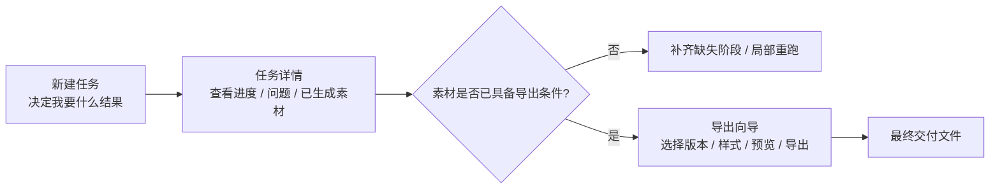

# 任务配置体验重构：从“参数配置”转向“结果驱动”的产品与交互方案

- 项目: `translip`
- 文档状态: Draft v1
- 创建日期: 2026-04-17
- 适用范围: 新建任务页、任务详情页、成品导出流程

---

## 1. 一句话结论

当前流程真正的问题，不是“字段太多”，而是把 **不同阶段的决策混在了错误的时间点**：

- 新建任务时，用户本来只想回答“我要产出什么”
- 任务运行时，用户本来只想回答“现在跑到哪了，有没有问题”
- 导出成品时，用户本来才需要回答“字幕长什么样，最终导出哪几个版本”

因此推荐的最终方案不是继续修补表单，而是把整个体验改成：

1. **意图驱动的新建任务**
2. **状态驱动的任务详情**
3. **向导式的成品导出**

核心原则只有一句：

> 创建任务决定“怎么生产”，导出成品决定“怎么交付”，调试能力只在需要时露出。

---

## 2. 当前问题诊断

结合当前 `NewTaskPage`、`TaskDetailPage` 和现有交付逻辑，当前体验至少有 8 个产品层问题。

### 2.1 决策时机错位

用户在新建任务时就被要求面对：

- 工作流模板
- 字幕来源
- 视频源/音频源
- 阶段范围
- 各阶段模型与后端

其中很多决策，其实只有在“看到产物之后”才有意义。尤其是字幕样式、预览片段、成品导出版本，明显属于交付期决策，不该出现在创建阶段。

### 2.2 用户看到的是“系统内部术语”，不是“我要什么结果”

目前页面大量使用：

- `template`
- `run_from_stage`
- `run_to_stage`
- `subtitle_source`
- `delivery policy`

这些术语更像工程内部模型，不像用户任务语言。普通用户真正想表达的是：

- 我要英文配音版
- 我要双语审片版
- 我要把原中文擦掉，只保留英文字幕
- 我要先快速看效果，再决定是否出正式成片

### 2.3 新建页仍然像“配置中心”，不是“发起任务”

页面当前的主交互是大表单，问题在于：

- 用户必须先理解流水线结构，才能有把握点击创建
- 信息密度高，但大部分字段没有上下文
- 用户没有被明确告知“哪些决定后面还能改，哪些会影响重跑”

这会直接拉高首次使用门槛。

### 2.4 详情页把三件事堆在一起

任务详情页目前混合了：

- 进度查看
- 产物浏览
- 字幕样式编辑与成品导出

这三个任务目标不一致，导致页面没有明确主线。用户点进详情页时，系统没有告诉他：

- 你现在最应该做什么
- 当前是否具备导出条件
- 如果缺少关键素材，应该补跑哪里

### 2.5 “交付策略”对用户不够直观

现在的摘要常用 `video_source + audio_source + subtitle_source` 组合表达交付策略，但从用户角度，这不是一个结果描述。

例如：

- `original · both · asr`

这串对工程师能看懂，对普通用户几乎没有解释力。用户需要的是：

- 原视频 + 配音音轨 + 英文字幕
- 干净画面 + 英文字幕
- 原视频 + 中英双语 + 审片混音

### 2.6 预设体系颗粒度不对

当前预设更像“技术预设”，不是“业务预设”。

用户真正需要的预设通常是：

- 英文配音成片
- 双语审片版
- 英文字幕烧录版
- 快速低成本验证版

而不是一组后端、阶段和缓存参数。

### 2.7 高级用户和普通用户没有分层

现在同一套界面同时服务三类人：

1. 想快速出结果的内容用户
2. 会微调成品字幕的进阶用户
3. 需要控制阶段、后端和重跑的开发/调试用户

这三类人的决策能力和需求完全不同。界面没有做层级隔离，就会让普通用户承担开发者复杂度。

### 2.8 配置边界虽然已经拆开，但体验边界还没拆开

数据层面已经有了 `config` 和 `delivery_config` 的分离，这是必要的底层前提。

但从产品体验上看，用户仍然会觉得：

- 新建任务时要配置很多不该配置的东西
- 详情页里导出能力像是“嵌进去的一大坨表单”

说明数据边界变清楚了，**但用户心智边界还没有真正变清楚**。

---

## 3. 用户真正的任务是什么

如果从产品视角重新抽象，用户的任务不是“配置 pipeline”，而是以下几类。

### 3.1 场景 A：我要快速出一个能看的版本

用户诉求：

- 先确认配音效果和字幕效果大致可用
- 不想理解底层模板
- 默认能跑起来最重要

系统应该支持：

- 一键默认方案
- 快速预览导向
- 尽量少做不可逆决策

### 3.2 场景 B：我要一个可以交付的正式成片

用户诉求：

- 最终视频文件稳定、可下载、可分享
- 明确知道导出的版本是什么
- 样式在导出前可调

系统应该支持：

- 成品导向的选择
- 导出前预览
- 明确的文件结果和命名

### 3.3 场景 C：我要决定字幕怎么处理

用户诉求：

- 保留中文
- 擦掉中文
- 只要英文
- 中英双语

系统应该支持：

- 直接表达“我要哪种字幕结果”
- 自动推导需要的依赖，比如 OCR、擦字幕、干净视频
- 在素材缺失时给出阻塞原因和补救动作

### 3.4 场景 D：我要排查问题或局部重跑

用户诉求：

- 知道失败在哪个阶段
- 从某个阶段继续跑
- 不想影响已经确认过的成品配置

系统应该支持：

- 调试能力单独放置
- 阶段术语只在调试时出现
- 导出配置和执行配置彻底解耦

---

## 4. 设计目标

这次重构建议围绕 6 个目标展开。

### 4.1 让用户先选“结果”，再选“参数”

不要先问用户模板、阶段、视频源、字幕源。先问：

- 你要什么成品
- 你要多快还是多稳
- 需不需要高级控制

### 4.2 一个页面只承载一个主要目标

- 新建页：发起任务
- 详情页：看状态和问题
- 导出页/导出向导：生成最终成品

### 4.3 逐层展开，不一次性暴露全部能力

默认只展示必要项。

高级项应该逐层暴露：

1. 普通层：结果卡片、语言、质量档位
2. 进阶层：字幕来源、样式 preset、导出版本
3. 开发层：模板、阶段范围、后端、设备、缓存

### 4.4 让系统负责“推导”，让用户负责“确认”

例如用户选择“英文字幕版”，系统应自动推导：

- 需要英文字幕来源
- 如果视频有中文硬字幕，优先建议擦字幕
- 如果没有干净视频，给出“需补齐”的提醒

而不是让用户自己组合多个底层开关。

### 4.5 让摘要和 CTA 说人话

摘要应该描述结果，而不是描述内部参数。

好的摘要是：

- 输出：原视频 + 英文配音 + 中文字幕保留
- 输出：干净画面 + 英文字幕 + 审片音轨

不好的摘要是：

- `original · both · asr`

### 4.6 把“失败恢复路径”设计成显性流程

不是只显示一个失败状态，而是明确告诉用户：

- 缺什么
- 为什么缺
- 下一步点哪里补

---

## 5. 推荐的产品结构

推荐采用如下结构：



### 5.1 三层心智模型

#### 第一层：任务意图层

用户在创建任务时应该只关心：

- 我想要什么结果
- 我要快一点还是稳一点
- 要不要保存成常用方案

#### 第二层：执行层

系统内部负责：

- 选模板
- 决定跑哪些阶段
- 选默认依赖路径
- 管理缓存与复用

这层默认不直接让普通用户操作。

#### 第三层：交付层

当素材已经生成后，用户才去决定：

- 导出哪个版本
- 烧录哪种字幕
- 用什么样式
- 要不要先看 10 秒预览

### 5.2 推荐的配置边界

| 层级 | 用户看到的概念 | 对应配置 | 是否默认展示 |
|---|---|---|---|
| 任务意图 | 成品目标、质量档位、语言 | `output_intent` + 简化质量选项 | 是 |
| 执行配置 | 模板、阶段范围、模型、缓存、设备 | `pipeline_config` | 否 |
| 交付配置 | 导出版本、字幕来源、样式、预览 | `delivery_config` | 仅导出时展示 |

---

## 6. 推荐的字段归位方式

这是这次体验重构最关键的一部分。

### 6.1 创建任务时应保留的字段

创建阶段默认只保留：

- 输入视频
- 源语言 / 目标语言
- 成品目标
- 质量档位
- 是否使用默认推荐
- 是否保存为常用方案

“更多设置”里可以放：

- 设备
- 缓存
- 保留中间产物
- 翻译后端
- TTS 后端

“开发者设置”里才放：

- 模板
- `run_from_stage`
- `run_to_stage`
- 更细的阶段后端与模型

### 6.2 不该出现在创建页的字段

这些字段都应该移到导出期：

- 字幕模式
- 英文字幕来源
- 字体
- 字号
- 字幕颜色
- 描边颜色
- 描边宽度
- 顶部/底部位置
- 垂直边距
- 粗体
- 双语位置
- 预览片段参数

### 6.3 需要重新命名或重新抽象的字段

| 当前概念 | 问题 | 建议替代 |
|---|---|---|
| 工作流模板 | 太像内部术语 | 成品目标 / 处理方案 |
| 字幕来源 | 不清楚是输入字幕还是烧录来源 | 英文字幕来源 / 字幕输入策略 |
| 交付策略 | 过于抽象 | 最终成片内容 |
| 起始阶段 / 结束阶段 | 普通用户理解成本高 | 仅开发者设置中显示 |
| Delivery Composer | 太像内部工具名 | 导出成品 / 成品设置 |

### 6.4 进一步推荐的数据模型

在现有 `pipeline_config + delivery_config` 的基础上，建议再增加一个更靠近产品的概念：

- `output_intent`

例如：

- `dub_preview`
- `dub_final`
- `english_subtitle`
- `bilingual_review`

这样用户选择的是意图，系统再把它映射到：

- 模板
- 是否需要 OCR
- 是否需要擦字幕
- 默认导出版本
- 默认字幕样式 preset

这会比直接暴露 `template + video_source + audio_source + subtitle_source` 更稳定，也更容易扩展。

---

## 7. 推荐的新建任务交互

## 7.1 页面目标

新建任务页的目标应该非常单一：

> 让用户在尽可能少的判断下，把任务发出去。

### 7.2 页面结构

推荐改成 3 步，而不是当前“功能分段式大表单”。

#### Step 1：选择素材与语言

内容：

- 输入视频路径 / 上传
- 自动探测时长、分辨率、是否可能存在硬字幕
- 源语言 / 目标语言

用户在这一页只回答：

- 这是哪个视频
- 我想翻成什么语言

#### Step 2：选择成品目标

用 **大卡片** 代替模板下拉框。

推荐卡片：

1. **英文配音成片**
   - 输出最终配音视频
   - 默认不烧录英文字幕
   - 适合正式交付

2. **双语审片版**
   - 保留中文 + 增加英文字幕
   - 默认生成便于审片的版本

3. **英文字幕版**
   - 尽量去掉原中文，烧录英文字幕
   - 适合社媒和海外分发

4. **快速验证版**
   - 优先出结果，适合先看效果
   - 可以只出 preview 版本

每张卡片都要展示：

- 一句结果描述
- 预计耗时档位
- 系统将自动启用的能力
- 是否推荐

不要让用户直接看到模板 ID。

#### Step 3：质量与高级控制

默认只展示一个质量档位三选一：

- **快速**
- **标准**
- **高质量**

然后提供两个折叠区：

- `更多设置`
- `开发者设置`

其中：

- `更多设置` 面向进阶用户
- `开发者设置` 面向调试用户

### 7.3 新建页右侧应始终有“任务摘要”

推荐做成固定摘要卡，而不是只在最后确认页看一次。

摘要内容示例：

```text
本次任务将生成：
- 英文配音成片
- 输出语言：中文 → 英文
- 默认导出：正式配音版
- 如检测到原硬字幕，将保留中文，不主动擦除
```

如果用户选择英文字幕版，摘要应自动改成：

```text
本次任务将生成：
- 英文字幕成片
- 优先使用干净画面
- 如无干净画面，将提示补跑擦字幕
- 默认提供 10 秒字幕预览
```

### 7.4 推荐的 UI 组件形态

新建页尽量少用 `select`，优先使用：

- 大卡片：成品目标
- 分段开关：质量档位
- Badge 列表：系统自动启用能力
- Accordion：高级设置
- 右侧摘要卡：实时解释本次决策结果

### 7.5 新建页线框建议

```text
┌──────────────────────────────┬────────────────────────────┐
│ Step 1 素材与语言             │ 本次任务摘要               │
│ [视频路径__________________] │ 目标：英文字幕成片         │
│ [自动探测结果]               │ 语言：中文 → 英文         │
│ [源语言] [目标语言]          │ 默认导出：英文字幕         │
│                              │ 依赖：OCR / 擦字幕 / 导出  │
├──────────────────────────────┼────────────────────────────┤
│ Step 2 成品目标               │ 风险提示 / 建议            │
│ [卡片A][卡片B]               │ 若无干净画面，将提示补跑   │
│ [卡片C][卡片D]               │                            │
├──────────────────────────────┼────────────────────────────┤
│ Step 3 质量与高级控制         │ [创建任务]                 │
│ [快速][标准][高质量]         │                            │
│ [更多设置 ▼]                 │                            │
│ [开发者设置 ▼]               │                            │
└──────────────────────────────┴────────────────────────────┘
```

---

## 8. 推荐的任务详情交互

## 8.1 详情页的主目标

详情页不应该再是“第二个配置中心”，而应该是：

> 一个告诉用户当前状态、缺什么、下一步做什么的运行控制台。

### 8.2 页面结构建议

详情页应明确分成 4 个区域。

#### 区域 A：顶部状态条

展示：

- 当前状态
- 当前阶段
- 总体进度
- 已耗时
- 主 CTA

主 CTA 根据状态动态变化：

- 运行中：`查看当前阶段`
- 成功且可导出：`导出成品`
- 缺少素材：`补齐缺失素材`
- 失败：`从失败阶段重跑`

#### 区域 B：当前产物概览

按用户能理解的类别展示：

- 音频产物
- 字幕产物
- 视频产物
- 最终成品

不要先按 `task-a / task-c / task-g` 给用户分类。

可以在进阶模式里补充技术归属。

#### 区域 C：问题与建议

这是现在页面明显缺少的一块。

如果导出条件不具备，应直接出现建议卡：

- 未发现干净视频，无法导出“仅英文字幕版”
- 未发现 OCR 英文字幕，当前可改用 ASR 字幕
- TTS 未成功，当前只能导出 preview 审片版

每条建议都应带动作按钮：

- `改用 ASR`
- `补跑擦字幕`
- `从 task-c 重跑`

#### 区域 D：运行操作

这里才放：

- 重跑
- 停止
- 删除
- 查看技术产物

### 8.3 详情页不建议默认内嵌完整导出表单

这是一个非常关键的产品判断。

如果导出配置长期内嵌在详情页中间，会带来两个问题：

- 页面主线被打断
- 导出配置看起来像“详情页里的一大块编辑器”

更好的方式是：

- 详情页只显示导出状态和最近一次导出结果
- 用户点 `导出成品` 后，打开 **抽屉式导出向导**

如果短期不改成抽屉，也至少应该改成：

- 默认收起
- 以“导出成品”卡片入口触发
- 不要直接展示全部高级字段

### 8.4 详情页线框建议

```text
┌───────────────────────────────────────────────────────────────┐
│ 任务名称            [状态] [进度] [主CTA: 导出成品]          │
├───────────────────────────────────────────────────────────────┤
│ 当前产物                                                     │
│ [音频] [字幕] [视频] [最终成品]                              │
├───────────────────────────────────────────────────────────────┤
│ 问题与建议                                                   │
│ - 缺少干净画面，无法导出英文字幕版      [补跑擦字幕]         │
│ - OCR 字幕缺失，建议切到 ASR            [改用 ASR]           │
├───────────────────────────────────────────────────────────────┤
│ 工作流进度图                                                 │
├───────────────────────────────────────────────────────────────┤
│ 运行操作: [从某阶段重跑] [停止] [删除] [查看技术产物]        │
└───────────────────────────────────────────────────────────────┘
```

---

## 9. 推荐的导出成品交互

这部分是整个体验能否“清晰易懂、直观”的决定性环节。

## 9.1 导出不要做成一个扁平大表单

当前 Delivery Composer 的问题是：

- 字段很多
- 字段技术味太重
- 缺少“先选结果，再微调”的顺序

正确方式应该是一个 4 步导出向导。

### 9.2 导出向导步骤

#### Step 1：选择导出版本

用卡片或单选项表达最终结果，而不是先让用户碰字体和描边。

推荐选项：

- 无字幕配音版
- 英文字幕版
- 中英双语版
- 审片版

每个选项下面明确描述：

- 画面来源
- 音轨来源
- 字幕形态
- 适合什么用途

#### Step 2：确认素材来源

只在这里处理真正需要确认的来源选择：

- 视频画面：原视频 / 干净视频
- 音轨：preview / dub
- 英文字幕来源：OCR / ASR

这一步不是自由组合，而是 **系统先推荐，用户再确认**。

比如：

- 若用户选择“英文字幕版”，默认推荐 `干净视频 + dub + OCR`
- 若 OCR 缺失，则自动回退为 `ASR`，同时解释原因

#### Step 3：选择字幕样式

默认先给 **样式 preset**，不要一上来就是 8 个手工字段。

建议至少提供 4 个 preset：

1. 默认清晰
2. 短视频高对比
3. 演示/教程
4. 极简审片

只有点击“高级微调”后，才展开：

- 字体
- 字号
- 位置
- 边距
- 颜色
- 描边
- 粗体

颜色应使用色板或颜色选择器，不要让用户手输 hex。

字体应是下拉推荐列表，不要是自由文本输入。

#### Step 4：生成 10 秒预览并确认导出

预览是导出流程里的核心动作，不是附属功能。

推荐布局：

- 左侧：当前选择摘要
- 右侧：10 秒预览播放器
- 底部：`重新生成预览` / `导出最终成品`

### 9.3 导出向导线框建议

```text
┌──────────────────────────── 导出成品 ───────────────────────────┐
│ Step 1 导出版本                                                │
│ [无字幕配音版] [英文字幕版] [中英双语版] [审片版]             │
├───────────────────────────────────────────────────────────────┤
│ Step 2 素材来源                                                │
│ 画面:  (●) 干净视频   ( ) 原视频                              │
│ 音轨:  (●) dub        ( ) preview                             │
│ 字幕:  (●) OCR        ( ) ASR                                 │
│ [提示] 当前未发现 OCR 字幕，已自动切换到 ASR                  │
├───────────────────────────────────────────────────────────────┤
│ Step 3 字幕样式                                                │
│ [默认清晰] [短视频高对比] [教程演示] [极简审片]               │
│ [高级微调 ▼]                                                   │
├───────────────────────────────────────────────────────────────┤
│ Step 4 预览与导出                                              │
│ [视频预览窗口]                                                 │
│ [重新生成预览] [导出最终成品]                                 │
└───────────────────────────────────────────────────────────────┘
```

### 9.4 导出后的结果反馈

导出成功后，页面不应该只多出几个 artifact 链接，而应该明确反馈：

- 本次导出了哪些文件
- 使用了什么配置
- 是否可设为默认导出方案

推荐反馈文案：

```text
已生成 2 个成品：
- final_dub.en.mp4
- final_preview.en.mp4

本次配置：
- 版本：中英双语版
- 视频：原视频
- 音轨：dub
- 英文字幕：OCR
- 样式：默认清晰
```

---

## 10. 默认值与推荐逻辑

产品体验顺不顺，核心不在字段多少，而在默认值是不是合理。

### 10.1 默认推荐原则

#### 原则 A：优先保证“能导出”

如果某个理想选项缺少素材，系统应该：

- 先给一个能跑通的默认方案
- 再解释为什么不是最优方案

不要把用户卡死在空白配置里。

#### 原则 B：优先保证“结果一致”

同一个成品目标应尽量映射到稳定的默认路径。

例如：

- “双语审片版”默认始终推荐 `原视频 + preview/dub + OCR/ASR 英文字幕`
- “英文字幕版”默认优先 `干净视频 + 英文字幕`

#### 原则 C：把缺失素材变成显式状态

不是简单隐藏选项，而是展示禁用态并说明原因。

例如：

- `干净视频（不可选：尚未生成）`
- `OCR 字幕（不可选：OCR 翻译结果缺失）`

### 10.2 推荐逻辑示例

| 用户选择 | 系统默认推荐 | 若缺失素材 | 替代方案 |
|---|---|---|---|
| 英文配音成片 | 原视频 + dub + 无烧录字幕 | dub 缺失 | 回退到 preview，提示不适合正式交付 |
| 双语审片版 | 原视频 + preview/dub + 英文字幕 | OCR 缺失 | 切换 ASR |
| 英文字幕版 | 干净视频 + 英文字幕 | 干净视频缺失 | 提示补跑擦字幕，不自动改成原视频 |
| 快速验证版 | preview + 默认样式 + 10 秒预览 | preview 缺失 | 提示先完成前置阶段 |

### 10.3 样式默认值

建议不要直接暴露“0=自动”这类工程表述给普通用户。

更好的表述是：

- 字号：自动
- 边距：自动
- 描边：标准

只有在高级微调里，才显示真实数值。

---

## 11. 预设策略

预设建议分成两层。

### 11.1 业务预设

这是用户真正高频使用的预设，应默认放在新建任务和导出向导中。

示例：

- 英文配音成片
- 双语审片版
- 英文字幕烧录版
- 快速低成本验证版

这些预设的优势是：

- 以结果命名
- 好理解
- 可稳定复制

### 11.2 技术预设

这是给进阶或调试用户的，不应该与业务预设混在一起。

示例：

- `cuda + qwen3tts + siliconflow`
- `cpu fallback`
- `task-c rerun preset`

技术预设建议收进：

- `开发者设置`
- 或单独的“技术配置模板”

---

## 12. 术语与文案建议

UI 是否直观，很大程度上取决于文案。

### 12.1 应该保留的用户语言

- 成品目标
- 导出版本
- 英文字幕来源
- 当前可导出内容
- 缺失素材
- 补齐素材
- 重新导出

### 12.2 建议替换的系统语言

| 旧文案 | 新文案 |
|---|---|
| 工作流模板 | 成品目标 |
| Delivery Composer | 导出成品 |
| 交付策略 | 最终成片内容 |
| Subtitle Source | 英文字幕来源 |
| Run From / Run To | 调试阶段范围 |
| Artifact | 产物文件 |

### 12.3 用户能听懂的提示文案

不建议：

- `当前未识别到可预览字幕文件`

建议：

- `当前还没有可用于烧录的英文字幕。你可以改用 ASR 字幕，或补跑 OCR 翻译。`

不建议：

- `subtitle_source=ocr`

建议：

- `英文字幕将使用 OCR 翻译结果。`

---

## 13. 关键异常路径

一个成熟的交互方案必须把异常路径也设计完整。

### 13.1 用户选择英文字幕版，但没有干净视频

界面行为：

- `干净视频` 选项显示禁用
- 顶部显示阻塞提示
- 主按钮从 `导出最终成品` 改为 `补跑擦字幕`

### 13.2 用户选择 OCR 字幕，但 OCR 结果缺失

界面行为：

- 保留 `OCR` 选项但标记为缺失
- 自动推荐 `ASR`
- 提供一键切换

### 13.3 用户只想先看样式，不想正式导出

界面行为：

- 导出向导中突出 `生成 10 秒预览`
- 预览成功后再引导 `导出最终成品`

### 13.4 用户是开发/调试角色

界面行为：

- 默认不打断主流程
- 通过 `开发者设置` 打开：
  - 模板
  - 阶段范围
  - 模型 / 后端
  - 缓存 / 中间产物

---

## 14. 推荐落地顺序

如果按产品收益优先级来排，建议这样做。

### Phase 1：先把用户心智理顺

1. 新建页改成“素材与语言 + 成品目标 + 质量与高级控制”
2. 隐藏模板和阶段范围到开发者设置
3. 把“交付策略”改成“最终成片内容”
4. 详情页增加“问题与建议”区块

这是最影响理解成本的一步。

### Phase 2：把导出流程独立出来

1. 将 Delivery Composer 改为抽屉式导出向导
2. 增加导出版本卡片
3. 增加样式 preset
4. 增加预览优先的流程

这是最影响导出成功率的一步。

### Phase 3：补足预设与推荐系统

1. 引入 `output_intent`
2. 建立业务预设
3. 按素材状态做默认推荐和禁用解释
4. 补充导出后“设为默认方案”

这是最影响长期复用效率的一步。

---

## 15. 成功标准

这次重构不应只看“字段有没有拆开”，而应该看以下指标是否改善。

### 15.1 体验指标

- 新用户首次创建任务成功率提升
- 从进入新建页到点击创建的中位时间下降
- 首次导出成功率提升
- 因配置理解错误导致的重跑率下降

### 15.2 交付指标

- 导出前预览使用率提升
- 最终导出完成率提升
- 导出后再次修改样式的比例下降

### 15.3 理解成本指标

- 用户是否还能在默认流程里看到模板、阶段范围等术语
- 用户是否能在不理解 pipeline 的情况下完成一次完整任务

---

## 16. 最终推荐方案

如果只保留一个明确结论，我建议是：

### 16.1 数据层

继续保留并强化：

- `pipeline_config`
- `delivery_config`

并新增更靠近产品语言的：

- `output_intent`

### 16.2 创建阶段

从“配置 pipeline”改成“选择成品目标”。

默认只让用户做 3 类决定：

1. 素材与语言
2. 成品目标
3. 质量档位

### 16.3 详情阶段

从“配置 + 浏览混合页”改成“状态与建议中心”。

详情页应该告诉用户：

- 现在跑到哪
- 当前有什么
- 缺什么
- 下一步去哪

### 16.4 导出阶段

从“扁平大表单”改成“向导式导出”。

导出顺序必须固定为：

1. 选择导出版本
2. 确认素材来源
3. 选择样式 preset
4. 先看预览，再导出最终成品

---

## 17. 总结

这次要优化的，不是某一个字段的位置，而是整个产品的决策顺序。

真正清晰的配置流程，应该让用户始终处在这样的心智路径里：

1. **我要什么结果**
2. **系统会怎么帮我做**
3. **现在进行到哪一步**
4. **最后我要怎么导出**

只要 UI 还能让用户在创建阶段思考模板、在详情页中途思考一整套字幕样式参数，那这条路径就还没有真正被理顺。

从产品角度，最值得坚持的方向是：

> 用“结果”和“下一步动作”组织界面，而不是用“内部能力”和“技术字段”组织界面。
