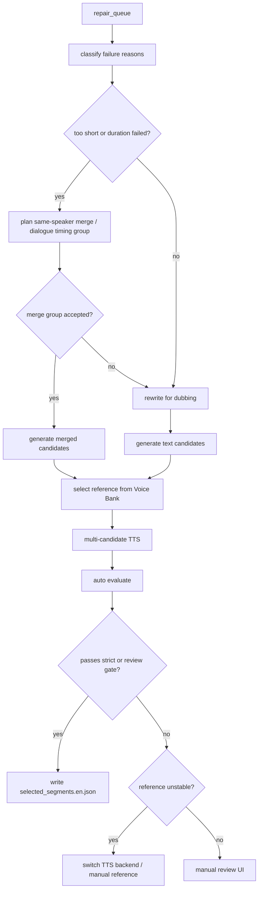

# 短句合并与 Voice Bank 音色克隆优化方案

## 1. 文档目的

本文是 `Task D/E 配音质量门控、双轨产物与返修队列技术方案` 的专项补充，重点解决两个会直接影响影视配音可用性的核心问题：

1. 短句片段过多，导致 TTS 输出时长发散、重复、听感割裂。
2. 当前音色克隆主要依赖单个 reference clip，遇到短参考、噪声、情绪偏差、文本不匹配时，整位说话人的音色都会漂移。

本文给出完整的产品和工程方案，明确：

- 什么情况下可以自动合并短句。
- 什么情况下只能做多说话人时间编组，不能合成一条 TTS。
- 如何利用同一说话人的多段语音构建 Voice Bank。
- 如何用 reference benchmark 自动选择更稳定的参考音频。
- 如何把合并、改写、换参考音频、多候选重生成、换模型接入现有 repair queue。

## 2. 当前样本任务诊断

样本任务：

```text
task_id = task-20260421-075513
task_root = ~/.cache/translip/output-pipeline/task-20260421-075513
```

### 2.1 Task D 质量分布

本任务 Task C 翻译阶段有 175 段，Task D 实际生成并评估了 173 段。`spk_0004` 和 `spk_0006` 各只有 1 个极短片段，没有稳定进入 Task D 说话人级合成报告。

Task D 评估结果：

```text
overall_status:
  failed = 140
  review = 33
  passed = 0

speaker_status:
  failed = 91
  review = 79
  passed = 3

duration_status:
  failed = 84
  review = 38
  passed = 51

intelligibility_status:
  failed = 39
  review = 34
  passed = 100
```

repair planner 对本任务的动作建议：

```text
repair_count = 142
strict_blocker_count = 140

reason_counts:
  duration_failed = 84
  generated_too_long = 74
  generated_too_short = 10
  intelligibility_failed = 39
  speaker_failed = 91
  task_d_overall_failed = 140
  too_short_source = 60

action_counts:
  merge_short_segments = 47
  regenerate_candidates = 100
  rewrite_for_dubbing = 100
  switch_reference_audio = 91
  switch_tts_backend = 14
  manual_review = 2
```

结论：当前不是单一故障，而是“短句时长问题”和“音色参考问题”叠加。只过滤 failed 能保护正式产物，但不能提高可用片段比例；真正提升质量必须让 repair queue 驱动合并、改写、重生成、换参考音频和换模型。

### 2.2 短句与失败的关系

按源片段时长统计：

| 源片段时长 | 片段数 | overall failed | speaker failed | duration failed |
| --- | ---: | ---: | ---: | ---: |
| `< 0.8s` | 12 | 12 | 7 | 11 |
| `< 1.0s` | 35 | 34 | 24 | 27 |
| `< 1.2s` | 56 | 54 | 30 | 44 |
| `< 1.5s` | 86 | 80 | 45 | 62 |
| `< 2.0s` | 122 | 107 | 65 | 70 |

短句会触发三类问题：

- TTS 对孤立词、语气词、称呼词发散，出现重复或超长输出。
- speaker embedding 在极短音频上不稳定，导致声纹评估偏低。
- 英文翻译天然比中文更长，单段硬贴原时长容易失败。

典型异常：

```text
seg-0047 source=0.52s generated=30.0s text="and go."
seg-0167 source=0.60s generated=5.76s text="Well well."
seg-0164 source=0.68s generated=0.56s text="well"
```

### 2.3 音色克隆问题

当前各主要说话人的平均 speaker similarity 均偏低：

| speaker_id | Task D 段数 | overall failed | speaker failed | avg speaker_similarity | 当前 reference |
| --- | ---: | ---: | ---: | ---: | --- |
| `spk_0000` | 50 | 36 | 14 | 0.293 | `clip_0005.wav` |
| `spk_0001` | 65 | 53 | 37 | 0.229 | `clip_0004.wav` |
| `spk_0002` | 8 | 8 | 7 | 0.203 | `clip_0002.wav` |
| `spk_0003` | 43 | 37 | 30 | 0.202 | `clip_0003.wav` |
| `spk_0005` | 6 | 5 | 2 | 0.279 | `clip_0001.wav` |
| `spk_0007` | 1 | 1 | 1 | 0.185 | `clip_0001.wav` |

reference planner 已建议替换部分 reference：

| speaker_id | 当前 reference | planner 推荐 reference |
| --- | --- | --- |
| `spk_0000` | `clip_0005.wav` | `clip_0004.wav` |
| `spk_0001` | `clip_0004.wav` | `clip_0005.wav` |
| `spk_0002` | `clip_0002.wav` | `clip_0003.wav` |
| `spk_0003` | `clip_0003.wav` | `clip_0004.wav` |
| `spk_0005` | `clip_0001.wav` | 只有一个候选 |
| `spk_0007` | `clip_0001.wav` | 只有一个候选 |

结论：`spk_0000`、`spk_0001`、`spk_0002`、`spk_0003` 都有足够多原始语音，应该从“单 reference clip”升级到“Voice Bank + reference benchmark”。`spk_0004`、`spk_0006`、`spk_0007` 样本太少，不应依赖自动音色克隆，需要人工指定参考音频、映射到相近角色、或使用非克隆基础音色。

## 3. 核心设计原则

### 3.1 不把不同说话人合成一条 TTS

短句合并必须区分两个概念：

| 概念 | 是否生成一条 TTS | 是否允许不同 speaker | 用途 |
| --- | --- | --- | --- |
| `same_speaker_merge_group` | 是 | 否 | 把同一说话人的连续短句合成一段更稳定的配音 |
| `dialogue_timing_group` | 否 | 是 | 只做时间预算和排布，A/B 两个人仍分别合成 |

用户担心的情况是合理的：如果把 A 和 B 两个人的话直接拼成一条文本，并用 A 的 reference 生成，最后必然会变成“只有 A 发音”。所以工程上必须把“文本合并”和“时间编组”拆开。

强约束：

```text
speaker_id 不同 -> 禁止 TTS 文本合并
speaker_id 不确定 -> 禁止自动 TTS 文本合并
多人重叠 / speaker_conflict -> 禁止自动 TTS 文本合并
```

### 3.2 先修片段结构，再修音色

对于 `< 1.2s` 的短句，先换参考音频往往收益有限，因为失败原因常常不是“声音不像”，而是 TTS 对短文本发散、重复或时长不稳定。

推荐 repair 顺序：

```text
短句/时长失败
-> same_speaker_merge_group 或 rewrite_for_dubbing
-> 多候选重生成
-> reference benchmark / switch_reference_audio
-> switch_tts_backend
-> manual_review
```

### 3.3 Voice Bank 不是简单堆更多音频

使用同一说话人的多段声音做克隆通常会更好，但前提是：

- 样本必须确实来自同一说话人。
- 样本要干净、单人、无重叠、无强背景声。
- 情绪和表演状态要一致，不能把喊叫、耳语、笑声、远场混在一起。
- 如果 TTS backend 需要 reference text，文本必须和拼接后的音频严格对应。

否则，多段参考反而会污染音色，使声音更不稳定。

## 4. 短句合并方案

### 4.1 合并对象

优先处理同时满足以下条件的片段：

- `duration_failed=true`
- `too_short_source=true` 或 `source_duration_sec < 1.5`
- `generated_too_long=true` 或 `duration_ratio > threshold`
- 相邻片段属于同一个 `speaker_id`
- 相邻片段之间 gap 很小，听感上像一句话或同一轮台词

本任务中 repair planner 已标记：

```text
merge_short_segments = 47
```

这部分是第一批自动合并的主要收益来源。

### 4.2 自动合并硬规则

只有满足所有硬规则，才允许自动生成 `same_speaker_merge_group`：

```text
same speaker_id
same speaker_label / role，如果存在
相邻或近邻片段，中间没有其他 speaker 插入
gap_sec >= -0.08
gap_sec <= 0.35
combined_source_duration_sec >= 1.2
combined_source_duration_sec <= 6.0
segment_count <= 4
no hard scene boundary
no music-only boundary
no overlap_speech flag
no speaker_conflict flag
no low_confidence_speaker flag
```

建议默认值：

```toml
[dubbing.merge]
enabled = true
max_gap_sec = 0.35
max_overlap_sec = 0.08
min_merged_duration_sec = 1.2
max_merged_duration_sec = 6.0
max_segments_per_group = 4
auto_accept_score = 0.75
review_score = 0.55
```

### 4.3 自动合并评分

硬规则通过后，再计算合并收益和风险：

```text
merge_score =
  shortness_gain * 0.30
  + gap_score * 0.20
  + duration_fit_score * 0.20
  + text_cohesion_score * 0.15
  + speaker_confidence_score * 0.15
  - semantic_risk_penalty
```

评分含义：

- `shortness_gain`：合并后是否从极短片段变成更适合 TTS 的 1.2-6.0s。
- `gap_score`：片段间隔越小越适合合并。
- `duration_fit_score`：合并后的英文目标文本是否更容易贴合总时长。
- `text_cohesion_score`：是否像同一句话、同一语义单元、同一轮台词。
- `speaker_confidence_score`：speaker diarization 是否稳定。
- `semantic_risk_penalty`：问答边界、称呼对象变化、明显换话题等风险。

处理策略：

```text
merge_score >= 0.75 -> 自动合并
0.55 <= merge_score < 0.75 -> 进入人工 review
merge_score < 0.55 -> 不合并
```

### 4.4 文本合并策略

合并时不直接拼接原英文翻译，而是生成一个 `merged_target_text`：

1. 保留原始 `source_segment_ids`。
2. 拼接原文和当前英文翻译作为上下文。
3. 调用 dubbing rewrite 生成更适合总时长的英文台词。
4. 对称呼、人名、地名、术语使用 glossary。
5. 输出必须控制在 `merged_source_duration_sec` 的可读时长内。

示例：

```json
{
  "repair_group_id": "mg-spk_0001-0084-0086",
  "group_type": "same_speaker_merge_group",
  "source_segment_ids": ["seg-0084", "seg-0085", "seg-0086"],
  "speaker_id": "spk_0001",
  "anchor_start_sec": 88.12,
  "anchor_end_sec": 90.04,
  "source_text": "奶奶 奶奶 我先洗个澡",
  "original_target_text": "Mom Mom Mom Mom Mom Mom. I will take a shower first.",
  "merged_target_text": "Grandma, I'll shower first.",
  "target_duration_sec": 1.92,
  "merge_score": 0.83,
  "status": "planned"
}
```

注意：这里的目标不是忠实保留每个孤立词，而是在不改变剧情信息的前提下，让影视配音可听、可贴时长。

### 4.5 不同说话人的处理方式

如果 A/B 两个说话人相邻、都很短，不能生成 `same_speaker_merge_group`。应生成 `dialogue_timing_group`：

```json
{
  "repair_group_id": "dg-0110-0112",
  "group_type": "dialogue_timing_group",
  "no_tts_merge": true,
  "anchor_start_sec": 120.30,
  "anchor_end_sec": 122.10,
  "children": [
    {
      "segment_id": "seg-0110",
      "speaker_id": "spk_0001",
      "target_text": "Really?"
    },
    {
      "segment_id": "seg-0111",
      "speaker_id": "spk_0003",
      "target_text": "Yes."
    },
    {
      "segment_id": "seg-0112",
      "speaker_id": "spk_0001",
      "target_text": "Let's go."
    }
  ],
  "repair_action": "joint_timing_only"
}
```

`dialogue_timing_group` 只做这些事：

- 统一分配一组对话的总时间预算。
- 允许在组内微调停顿、淡入淡出、压缩比例。
- 每个 child 仍用自己的 `speaker_id` 和 reference 生成。
- Task E 放置时保证对话节奏不互相覆盖。

禁止做这些事：

- 禁止把 children 的文本拼成一条 TTS。
- 禁止用 A 的 reference 生成 B 的台词。
- 禁止在没有人工确认的情况下改 speaker_id。

### 4.6 合并产物结构

新增产物：

```text
task-d/voice/repair-plan/
  merge_plan.en.json

task-d/voice/merge_candidates/
  <repair_group_id>/
    attempt-0001.wav
    attempt-0002.wav
    attempts.json
```

`merge_plan.en.json`：

```json
{
  "task_id": "task-20260421-075513",
  "target_lang": "en",
  "source": {
    "repair_queue": "task-d/voice/repair-plan/repair_queue.en.json",
    "translation": "task-c/voice/translation.en.json",
    "speaker_profiles": "task-b/voice/speaker_profiles.json"
  },
  "stats": {
    "candidate_count": 47,
    "auto_merge_count": 0,
    "review_merge_count": 0,
    "rejected_count": 0
  },
  "groups": []
}
```

每个 group 必须保留原始片段映射：

```json
{
  "repair_group_id": "mg-spk_0001-0084-0086",
  "group_type": "same_speaker_merge_group",
  "source_segment_ids": ["seg-0084", "seg-0085", "seg-0086"],
  "speaker_id": "spk_0001",
  "anchor_start_sec": 88.12,
  "anchor_end_sec": 90.04,
  "merged_target_text": "Grandma, I'll shower first.",
  "decision": "auto_accept",
  "decision_reason": "same speaker, short adjacent lines, high cohesion",
  "metrics": {
    "merge_score": 0.83,
    "combined_source_duration_sec": 1.92,
    "estimated_target_duration_sec": 1.74
  },
  "replaces": [
    {
      "segment_id": "seg-0084",
      "policy": "covered_by_merge_group"
    }
  ]
}
```

### 4.7 Task E 消费方式

Task E 不直接猜测合并关系，只消费 Task D/repair runner 输出的 selected artifacts：

```text
task-d/voice/selected_segments.en.json
```

新增字段：

```json
{
  "selected_items": [
    {
      "selected_id": "mg-spk_0001-0084-0086",
      "selected_type": "merge_group",
      "source_segment_ids": ["seg-0084", "seg-0085", "seg-0086"],
      "speaker_id": "spk_0001",
      "audio_path": "task-d/voice/merge_candidates/mg-spk_0001-0084-0086/attempt-0002.wav",
      "anchor_start_sec": 88.12,
      "anchor_end_sec": 90.04,
      "quality_status": "review"
    }
  ]
}
```

Task E strict 规则：

- 如果某个原始 segment 被 `merge_group` 覆盖，则不再单独放置该 segment 的旧音频。
- 如果 merge_group 失败，则回退到原始 segment 的 loose 音频，strict 中继续标记为待返修。
- strict coverage 同时统计 `by_segment` 和 `by_time`，避免一个长 group 掩盖大量短 segment 的问题。

## 5. Voice Bank 音色克隆方案

### 5.1 当前 reference 选择的局限

当前代码已有 reference candidate 评分，主要看：

```text
duration
text length
rms
risk penalty
```

但当前策略仍有几个问题：

1. 大多数说话人最终只使用一个 reference clip，这个 clip 的质量会影响整位角色。
2. 拼接 fallback 只在没有可用长 clip 时触发，不会主动用多个干净片段构建更稳定的角色音色。
3. `prepare_reference_package` 会把 reference 音频裁到约 11 秒并追加尾部静音。如果 backend 需要 reference text，必须保证 reference text 与裁剪后的音频完全对应。
4. 当前 MOSS backend 主要传入 `--prompt-speech`，没有传 reference text；但 Qwen 类 backend 通常会受 reference text/audio 对齐影响。
5. 极短生成音频上的 speaker similarity 不稳定，不能只靠单段声纹分数判断 reference 好坏。

所以需要从“选一个 reference clip”升级为“构建、评测、选择 Voice Bank reference”。

### 5.2 Voice Bank 的目标形态

每个 speaker 生成一个可复用的 Voice Bank：

```text
task-b/voice/voice_bank/
  voice_bank.en.json
  spk_0000/
    single_refs/
      clip_0001.wav
      clip_0002.wav
    composites/
      composite_clean_10s.wav
      composite_expressive_10s.wav
    benchmark/
      reference_benchmark.en.json
```

`voice_bank.en.json`：

```json
{
  "target_lang": "en",
  "speakers": [
    {
      "speaker_id": "spk_0001",
      "profile_id": "profile_0001",
      "total_source_speech_sec": 94.83,
      "bank_status": "ready",
      "recommended_reference_id": "spk_0001/composites/composite_clean_10s",
      "references": [
        {
          "reference_id": "clip_0005",
          "type": "single",
          "audio_path": ".../clip_0005.wav",
          "reference_text": "...",
          "duration_sec": 7.8,
          "quality_score": 0.82,
          "risk_flags": []
        },
        {
          "reference_id": "composite_clean_10s",
          "type": "composite",
          "audio_path": ".../composite_clean_10s.wav",
          "reference_text": "text that exactly matches concatenated clips",
          "duration_sec": 10.2,
          "quality_score": 0.88,
          "source_clip_ids": ["clip_0005", "clip_0002", "clip_0001"],
          "risk_flags": []
        }
      ],
      "rejected_references": [
        {
          "reference_id": "clip_0004",
          "reason": "low transcript density or unstable benchmark"
        }
      ]
    }
  ]
}
```

### 5.3 Reference clip 过滤规则

单 clip 候选：

```text
ideal_duration_sec = 5.0 - 12.0
hard_duration_sec = 2.0 - 15.0
speaker_confidence >= 0.85
rms in stable range
has transcript text
no overlap_speech
no severe background music
no clipping
no long silence
no repeated single word only
```

composite 候选：

```text
total_speech_sec = 8.0 - 12.0
clip_count = 3 - 8
gap_between_clips_sec = 0.20 - 0.35
same speaker_id only
same acoustic condition preferred
same emotion bucket preferred
reference_text exactly joins selected clip texts
```

拒绝或降权：

- 只有 1 秒左右的说话样本。
- 文本是大量重复词，例如只包含“懂你 懂你 懂你”。
- reference 音频明显包含对方说话声。
- reference 音频中静音占比过高。
- 说话人离麦很远、背景乐盖住人声。
- 情绪过强且不代表大多数台词。

### 5.4 Composite reference 生成

多段参考音频的推荐实现：

1. 对每个候选 clip 做 VAD 裁剪，去掉头尾长静音。
2. 统一采样率和声道。
3. 按质量分、文本丰富度、声学一致性排序。
4. 选择 3-8 个片段，拼接到 8-12 秒。
5. clip 之间插入 0.20-0.35 秒静音，避免音素粘连。
6. 同步生成完全匹配拼接顺序的 `reference_text`。
7. 如果最终音频超过 backend 上限，必须同步裁剪 `reference_text`，不能只裁剪音频。

建议输出两个默认 composite：

```text
composite_clean_10s:
  默认生产 reference，优先干净、平稳、普通说话状态。

composite_expressive_10s:
  只在角色情绪明显时使用，保留部分表演张力，但仍禁止混入喊叫、笑场、重叠声。
```

对于当前 MOSS backend，composite 的主要价值是给 `--prompt-speech` 更多稳定音色信息。对于需要 reference text 的 backend，必须把 `audio_path` 和 `reference_text` 成对传入。

### 5.5 Reference benchmark

Voice Bank 不应只靠静态质量分选择 reference，必须用少量真实台词做 benchmark。

每个 speaker 选择 3-5 个 calibration segments：

```text
source_duration_sec = 1.5 - 4.5
text is intelligible
not extreme short
not extreme long
not music/overlap
cover different sentence shapes if possible
```

对以下候选做小规模生成：

```text
top 5 single references
composite_clean_10s
composite_expressive_10s
current production reference
optional: alternative TTS backend
```

评分：

```text
reference_benchmark_score =
  speaker_score * 0.45
  + intelligibility_score * 0.25
  + duration_score * 0.20
  + stability_score * 0.10
  - failure_penalty
```

选择规则：

```text
新 reference 平均 speaker_similarity 提升 >= 0.05
且 duration/intelligibility 不明显变差
且 calibration fail_count 更低
-> 可自动替换

如果 speaker_similarity 提升但 intelligibility 或 duration 变差
-> 进入 review

如果所有 reference 都低
-> speaker_reference_unstable，建议换 TTS backend 或人工指定参考音频
```

输出：

```text
task-d/voice/reference_benchmark/
  spk_0001/
    benchmark_attempts.json
    selected_reference.json
```

`selected_reference.json`：

```json
{
  "speaker_id": "spk_0001",
  "selected_reference_id": "composite_clean_10s",
  "selected_audio_path": ".../voice_bank/spk_0001/composites/composite_clean_10s.wav",
  "selected_reference_text": "...",
  "decision": "auto_selected",
  "baseline": {
    "reference_id": "clip_0004",
    "avg_speaker_similarity": 0.229,
    "fail_count": 4
  },
  "selected": {
    "avg_speaker_similarity": 0.31,
    "fail_count": 2
  }
}
```

### 5.6 针对本任务的 speaker 策略

| speaker_id | 当前情况 | 推荐策略 |
| --- | --- | --- |
| `spk_0000` | 50 段，95.08s 原始语音，当前相似度 0.293 | 构建 Voice Bank；benchmark `clip_0004`、`clip_0005`、`composite_clean_10s` |
| `spk_0001` | 65 段，94.83s 原始语音，speaker failed 37，短句很多 | 先做短句合并和改写；再 benchmark `clip_0005` 与 composite；过滤重复“奶奶/Mom”类参考 |
| `spk_0002` | 8 段，101.38s 原始语音，但生成时长和声纹都差 | 先检查 reference 是否长静音、文本过短、音频/文本不匹配；benchmark 前先做 VAD 清洗 |
| `spk_0003` | 43 段，72.40s 原始语音，speaker failed 30 | 构建 Voice Bank；优先测试 `clip_0004` 和 composite |
| `spk_0004` | 1 段，约 1.0s | 不自动克隆；进入 manual reference 或映射到已有角色 |
| `spk_0005` | 6 段，8.95s 原始语音，只有一个 reference | 可继续用单 reference，但不适合 composite；失败片段优先改写/重生成 |
| `spk_0006` | 1 段，约 1.2s | 不自动克隆；进入 manual reference 或基础音色 |
| `spk_0007` | 1 段，4.81s，文本重复“懂你” | 不适合作为稳定克隆 reference；建议人工确认是否映射到其他 speaker |

## 6. 合并与音色克隆的联合修复流程

推荐 repair runner 流程：



核心顺序：

1. 短句先尝试合并或改写。
2. 合并后的台词用 Voice Bank 选择 reference。
3. 每个候选生成后重新跑 duration、intelligibility、speaker 评估。
4. 只有被选中的候选进入 `selected_segments.en.json`。
5. Task E strict 只消费 selected artifacts，不直接消费所有生成音频。

## 7. CLI 与工程接口

### 7.1 新增命令

```bash
python -m translip build-voice-bank \
  --profiles task-b/voice/speaker_profiles.json \
  --translation task-c/voice/translation.en.json \
  --output-dir task-b/voice/voice_bank \
  --target-lang en
```

```bash
python -m translip plan-dub-merge \
  --repair-queue task-d/voice/repair-plan/repair_queue.en.json \
  --translation task-c/voice/translation.en.json \
  --profiles task-b/voice/speaker_profiles.json \
  --output task-d/voice/repair-plan/merge_plan.en.json
```

```bash
python -m translip benchmark-dub-reference \
  --profiles task-b/voice/speaker_profiles.json \
  --voice-bank task-b/voice/voice_bank/voice_bank.en.json \
  --translation task-c/voice/translation.en.json \
  --task-d-dir task-d/voice \
  --output-dir task-d/voice/reference_benchmark
```

扩展现有 repair runner：

```bash
python -m translip run-dub-repair \
  --repair-queue task-d/voice/repair-plan/repair_queue.en.json \
  --rewrite-plan task-d/voice/repair-plan/rewrite_plan.en.json \
  --reference-plan task-d/voice/repair-plan/reference_plan.en.json \
  --merge-plan task-d/voice/repair-plan/merge_plan.en.json \
  --voice-bank task-b/voice/voice_bank/voice_bank.en.json \
  --output-dir task-d/voice/repair-run
```

### 7.2 代码模块建议

```text
src/translip/repair/merge.py
  build_merge_plan()
  score_merge_candidate()
  build_dialogue_timing_groups()

src/translip/dubbing/voice_bank.py
  build_voice_bank()
  build_composite_reference()
  score_reference_clip()

src/translip/dubbing/reference_benchmark.py
  select_calibration_segments()
  run_reference_benchmark()
  select_best_reference()

src/translip/repair/executor.py
  consume merge_plan
  consume voice_bank
  write selected merge_group attempts
```

### 7.3 配置建议

```toml
[dubbing.merge]
enabled = true
max_gap_sec = 0.35
max_overlap_sec = 0.08
min_merged_duration_sec = 1.2
max_merged_duration_sec = 6.0
max_segments_per_group = 4
auto_accept_score = 0.75
review_score = 0.55

[dubbing.voice_bank]
enabled = true
min_single_ref_sec = 2.0
ideal_single_ref_min_sec = 5.0
ideal_single_ref_max_sec = 12.0
composite_min_sec = 8.0
composite_max_sec = 12.0
composite_gap_sec = 0.28
max_composite_clips = 8

[dubbing.reference_benchmark]
enabled = true
calibration_segments_per_speaker = 4
max_references_per_speaker = 7
min_speaker_similarity_gain = 0.05
```

## 8. 前端人工审查设计

需要新增或扩展 Dubbing Review 页面，提供三类操作。

### 8.1 短句合并审查

每个 merge candidate 展示：

- 原始相邻片段时间轴。
- 每段 speaker、原文、当前英文、原生成音频。
- 合并后的英文候选和生成音频。
- 合并原因、风险标记、merge score。

操作：

```text
accept_merge
reject_merge
edit_merged_text
split_back_to_original
mark_as_dialogue_timing_group
```

### 8.2 Voice Bank 审查

每个 speaker 展示：

- 当前 reference。
- planner 推荐 reference。
- composite reference。
- benchmark 结果。
- 每个 reference 的试听按钮和质量标记。

操作：

```text
select_reference
reject_reference
upload_manual_reference
map_to_existing_speaker
use_base_voice
rerun_reference_benchmark
```

### 8.3 候选音频选择

每个 repair item 展示多候选：

```text
原始音频
当前 loose 音频
attempt-0001
attempt-0002
attempt-0003
```

同时展示：

- 时长差异。
- speaker similarity。
- intelligibility score。
- 使用的 reference。
- 使用的 target text。
- 使用的 TTS backend。

人工选择后写入：

```text
task-d/voice/manual_decisions.en.json
task-d/voice/selected_segments.en.json
```

## 9. 质量门控与回退策略

### 9.1 Strict 规则

短期仍建议：

```text
strict allow_status = ["passed", "review"]
strict deny_status = ["failed"]
Task G default = loose
```

原因：

- 当前 `passed=0`，如果 strict 只允许 passed，正式产物会接近静音。
- review 不是理想交付，但比 failed 更接近可用。
- Task G 短期消费 loose 能保持成片完整度，strict 用于显示质量缺口和返修进度。

### 9.2 合并失败回退

每个 merge group 必须可回退：

```text
merge attempt failed
-> strict 不使用该 group
-> loose 保留原始 segment 音频
-> repair_queue 继续保留原 segment 或 group blocker
```

### 9.3 Voice Bank 失败回退

如果 benchmark 没有找到更好 reference：

```text
保留当前 reference
标记 speaker_reference_unstable
对该 speaker 的 repair item 降低自动通过优先级
建议 switch_tts_backend 或 manual_reference
```

### 9.4 极短片段评估规则

对 `< 1.0s` 的极短片段，speaker similarity 权重应降低，因为声纹 embedding 本身不稳定。

建议：

```text
source_duration_sec < 1.0:
  speaker_score_weight *= 0.5
  duration_score_weight += 0.2
  intelligibility_score_weight += 0.1
  prefer merge/rewrite over reference switching
```

## 10. 预期收益

基于 `task-20260421-075513` 的现状，保守预期如下。

### 10.1 第一阶段：merge plan + Voice Bank benchmark

不切换 TTS 模型，仅优化片段结构和 reference：

| 指标 | 当前 | 预期 |
| --- | ---: | ---: |
| strict 可用片段数 | 33/173 | 55-75/173 |
| duration failed | 84 | 45-60 |
| speaker failed | 91 | 55-70 |
| generated_too_long | 74 | 35-55 |

这个阶段的收益主要来自：

- 47 个短句合并候选中的一部分转为更稳定的合并段。
- `spk_0000/0001/0003` 使用更好的 reference 或 composite。
- 极短片段不再被错误地当作单句硬生成。

### 10.2 第二阶段：多候选重生成 + 配音改写

在第一阶段基础上，每个 repair item 生成 3-5 个候选：

| 指标 | 预期 |
| --- | ---: |
| strict 可用片段数 | 75-110/173 |
| high priority blocker | 明显下降 |
| 人工审查工作量 | 从全量审听变成只审 blocker 和冲突项 |

收益来自搜索空间扩大：

- 同一文本多次生成，过滤偶发失败。
- 同一语义多种英文表达，选择更贴时长的版本。
- 同一 speaker 多个 reference，选择更稳的音色。

### 10.3 第三阶段：TTS backend benchmark

如果当前 MOSS/Qwen 在部分 speaker 上仍无法稳定克隆，需要对同一 repair set 做模型级 benchmark：

```text
moss-tts-nano-onnx
qwen3tts
cosyvoice
external commercial voice clone backend
```

换模型不应直接替换默认链路，而应满足：

```text
同一 repair set 上 speaker failed 显著下降
duration/intelligibility 不明显恶化
运行成本和授权风险可接受
```

## 11. 技术成熟度评估

| 能力 | 成熟度 | 评价 |
| --- | --- | --- |
| same speaker 短句合并 | 高 | 基于现有时间轴、speaker_id、repair_queue 即可实现；最大风险是语义合并不自然，可用 review 兜底 |
| dialogue timing group | 中 | 不难实现，但需要 Task E 对组内时间预算和排布更精细 |
| Voice Bank 静态构建 | 高 | 基于 Task B reference clips 和音频统计即可实现 |
| composite reference | 中高 | 技术实现简单，质量取决于 speaker 纯度、VAD 和文本对齐 |
| reference benchmark | 高 | 已有 TTS 和自动评估能力，只是增加小规模批量尝试 |
| 自动 reference 替换 | 中高 | 对主要 speaker 有收益，对样本很少的 speaker 不可靠 |
| 自动配音改写 | 中高 | LLM 改写成熟，但必须有术语表、时长约束和人工可审查 |
| 换 TTS backend | 中 | 工程可行，质量和成本依赖具体 backend |
| 全自动影视级配音 | 中低 | 当前指标不足以完全无人工交付，仍需要 review UI 和人工决策 |

## 12. 推荐落地路线

### Phase 1: 数据结构和 planner

目标：

- 生成 `merge_plan.en.json`。
- 生成 `voice_bank.en.json`。
- 不改变生产音频，只给出可审查计划。

交付：

```text
plan-dub-merge
build-voice-bank
merge candidate stats
voice bank stats
```

### Phase 2: reference benchmark

目标：

- 对 `spk_0000/0001/0002/0003` 做 reference benchmark。
- 自动选择更好的单 reference 或 composite reference。

交付：

```text
reference_benchmark.en.json
selected_reference.json
speaker_reference_unstable flags
```

### Phase 3: 合并段真实生成

目标：

- 对自动通过的 `same_speaker_merge_group` 生成候选音频。
- 把成功 group 写入 `selected_segments.en.json`。
- Task E strict 消费 merge group。

交付：

```text
merge_candidates/<repair_group_id>/attempts.json
selected_segments.en.json 支持 merge_group
strict coverage by segment/time
```

### Phase 4: 多候选重生成和人工 UI

目标：

- repair item 自动生成 3-5 个候选。
- 前端支持合并确认、reference 切换、候选试听和人工选择。

交付：

```text
repair_candidates
manual_decisions.en.json
Dubbing Review UI
```

### Phase 5: TTS backend benchmark

目标：

- 用同一 repair set 比较不同 backend。
- 只在指标明确提升时切换默认 backend 或 speaker-level backend。

交付：

```text
backend_benchmark.en.json
speaker_backend_policy.en.json
```

## 13. 关键决策

### 13.1 strict 默认是否允许 review

建议继续允许：

```text
allow_status = ["passed", "review"]
deny_status = ["failed"]
```

原因：当前 `passed=0`，只允许 passed 会导致 strict 产物不可用。`review` 可以作为“可审听但不保证最终交付”的中间状态。

### 13.2 Task G 默认消费 strict 还是 loose

短期继续消费 loose：

```text
Task G default = loose
strict = quality-gated review artifact
```

原因：影视成片需要完整上下文，短期 strict coverage 太低。只有当：

```text
strict_coverage >= 95%
high_priority_repair_count = 0
manual_blocker_count = 0
```

才建议切换 Task G 默认输入为 strict。

### 13.3 不同 speaker 是否允许自动合并

不允许。

不同 speaker 只能进入 `dialogue_timing_group`，不能进入 `same_speaker_merge_group`。

### 13.4 是否默认使用多段参考音频

对样本充足的 speaker，建议默认启用 Voice Bank benchmark，而不是直接默认使用 composite。

也就是说：

```text
先构建 single + composite 候选
再用 benchmark 选择
不要无条件把多段音频拼起来替代当前 reference
```

## 14. 验收标准

### 14.1 merge planner

- `merge_plan.en.json` 能覆盖所有 `merge_short_segments` repair item。
- 不同 `speaker_id` 的片段不会出现在 `same_speaker_merge_group`。
- 每个 group 保留完整 `source_segment_ids`。
- 每个 reject/review 都有原因。

### 14.2 Voice Bank

- 每个 speaker 有 `bank_status`：
  - `ready`
  - `insufficient_samples`
  - `needs_manual_reference`
  - `unstable`
- composite reference 的 `reference_text` 与音频拼接顺序严格一致。
- 样本不足的 speaker 不会被强行 composite。

### 14.3 Reference benchmark

- 每个主要 speaker 至少测试当前 reference、planner 推荐 reference、composite reference。
- benchmark 输出 baseline 和 selected 对比。
- 自动替换必须满足 speaker_similarity 提升且其他指标不恶化。

### 14.4 Repair runner

- 成功 merge group 能写入 `selected_segments.en.json`。
- Task E strict 可以消费 merge group。
- merge 失败时 loose 不受影响。
- 所有候选音频可追溯到文本、reference、backend 和评估指标。

## 15. 立即可执行的实现清单

建议下一步按这个顺序做：

1. 新增 `src/translip/repair/merge.py`，先只输出 `merge_plan.en.json`，不生成音频。
2. 新增 `src/translip/dubbing/voice_bank.py`，输出 `voice_bank.en.json` 和 composite reference。
3. 新增 `benchmark-dub-reference`，先对 `spk_0000/0001/0002/0003` 跑小规模 benchmark。
4. 扩展 `run-dub-repair`，让它能消费 `merge_plan` 和 `voice_bank`。
5. 扩展 `selected_segments.en.json`，支持 `merge_group`。
6. 扩展 Task E strict 渲染，支持 group 覆盖多个原始 segment。
7. 前端增加 Dubbing Review 的 merge/reference/candidate 审查能力。

这条路线的价值是：先把错误片段结构化，再用自动 benchmark 选择更好的参考音频，最后通过多候选和人工 UI 把质量闭环做完整。它不会依赖一次性换模型，但保留了后续切换 TTS backend 的评测入口。
