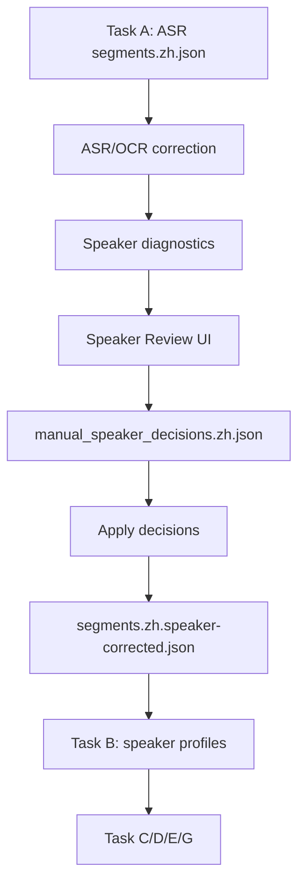

# Speaker Review 落地方案与操作手册

## 1. 背景

在影视配音链路中，`speaker_label` 的准确性会直接影响后续音色克隆、Voice Bank、短句合并和最终配音质量。

当前任务 `task-20260421-075513` 的字词识别整体可用，但说话人识别存在明显问题：

- 部分真实说话人被错误合并。
- 部分短句被误分成独立 speaker。
- 部分长时间戳短文本片段被错误用于 speaker profile。
- Task B 会把 Task A 的 speaker label 当成事实，进而污染 reference clip 和音色克隆。

因此本方案的目标不是只调一个聚类阈值，而是建立一个可诊断、可人工审查、可追溯、可重跑的 speaker attribution 修正闭环。

## 2. 本阶段目标

本阶段已经落地的是第一阶段闭环：

1. 自动生成 speaker 诊断。
2. 自动生成 speaker review plan。
3. 提供人工审查 UI。
4. 保存人工 speaker 决策。
5. 应用决策并输出 `segments.zh.speaker-corrected.json`。
6. Task B/C/E 优先消费 speaker-corrected segments。
7. non-cloneable speaker 不进入自动音色克隆和 registry 更新。
8. 通过单元测试、构建测试和浏览器测试验证。

本阶段不直接引入 pyannote / NeMo / whisperX diarization-first 后端。高质量 diarization backend 放在后续阶段，需要模型依赖、算力评估和 benchmark 后再启用。

## 3. 当前任务诊断结果

目标任务：

```text
task_id = task-20260421-075513
task_root = ~/.cache/translip/output-pipeline/task-20260421-075513
```

当前 Speaker Review API 输出：

```text
segment_count = 175
speaker_count = 8
high_risk_speaker_count = 3
review_segment_count = 79
speaker_run_count = 31
review_run_count = 23
high_risk_run_count = 0
decision_count = 0
corrected_exists = false
```

已经生成的诊断产物：

```text
asr-ocr-correct/voice/speaker_diagnostics.zh.json
asr-ocr-correct/voice/speaker_review_plan.zh.json
```

当前重点风险：

| speaker | 当前表现 | 建议 |
| --- | --- | --- |
| `SPEAKER_04` | 仅 1 段、约 1 秒 | 默认标记 non-cloneable，听上下文后合并到相邻真实 speaker |
| `SPEAKER_06` | 仅 1 段、约 1.2 秒 | 默认标记 non-cloneable，必要时合并到上下文 |
| `SPEAKER_07` | 仅 1 段、约 4.81 秒 | 默认标记 non-cloneable，确认是否片尾/误识别 |
| `SPEAKER_02` | 8 段但总时长约 101 秒，存在长时间戳短文本 | 优先审查长段，避免作为 reference clip 污染音色 |

典型异常片段：

| segment_id | speaker | 时间 | 文本 | 风险 |
| --- | --- | --- | --- | --- |
| `seg-0010` | `SPEAKER_02` | 38.5s - 73.6s | 三分钟之后停车场见 | 超长片段、边界风险 |
| `seg-0068` | `SPEAKER_02` | 195.6s - 216.5s | 您好 | 长时长短文本、超长片段 |
| `seg-0080` | `SPEAKER_02` | 243.3s - 252.3s | 你先休息休息 | 长时长短文本、边界风险 |

## 4. 方案架构

新增逻辑阶段放在 Task A / ASR-OCR correction 和 Task B 之间：

```text
Task A
-> ASR/OCR correction
-> Speaker Review
-> segments.zh.speaker-corrected.json
-> Task B speaker registry
-> Task C translation
-> Task D synthesis
-> Task E/G delivery
```

流程图：



如果没有 speaker-corrected 文件，系统保持旧逻辑：

```text
segments.zh.speaker-corrected.json
-> segments.zh.corrected.json
-> segments.zh.json
```

## 5. 新增产物

### 5.1 `speaker_diagnostics.zh.json`

路径：

```text
asr-ocr-correct/voice/speaker_diagnostics.zh.json
```

用途：

- speaker 级风险统计。
- speaker run 级风险统计。
- segment 级风险统计。
- 给 UI 提供总览和列表数据。

核心字段：

```json
{
  "summary": {
    "segment_count": 175,
    "speaker_count": 8,
    "high_risk_speaker_count": 3,
    "review_segment_count": 79,
    "speaker_run_count": 31,
    "review_run_count": 23
  },
  "speakers": [],
  "speaker_runs": [],
  "segments": []
}
```

### 5.2 `speaker_review_plan.zh.json`

路径：

```text
asr-ocr-correct/voice/speaker_review_plan.zh.json
```

用途：

- 把诊断结果转成 UI 可审查 item。
- 按 speaker、run、segment 三类组织审查入口。
- 给后续自动建议和人工优先级排序打基础。

### 5.3 `manual_speaker_decisions.zh.json`

路径：

```text
asr-ocr-correct/voice/manual_speaker_decisions.zh.json
```

用途：

- 保存人工审查决策。
- 每个 item 只保留最新决策。
- 可重复编辑、可追溯。

决策类型：

| 决策 | 含义 |
| --- | --- |
| `mark_non_cloneable` | 不参与自动音色克隆 |
| `keep_independent` | 保持为独立 speaker |
| `merge_speaker` | 将一个 speaker 全量合并到另一个 speaker |
| `relabel` | 指定片段/run 改为某个 speaker |
| `relabel_to_previous_speaker` | 改为上一个 speaker |
| `relabel_to_next_speaker` | 改为下一个 speaker |
| `merge_to_surrounding_speaker` | 当前后 speaker 相同时合并到上下文 |

### 5.4 `segments.zh.speaker-corrected.json`

路径：

```text
asr-ocr-correct/voice/segments.zh.speaker-corrected.json
```

用途：

- Task B/C/E 的新优先输入。
- 保留原始 `speaker_label` 的可追溯字段。
- 保存 `speaker_correction` 元数据。

示例：

```json
{
  "id": "seg-0002",
  "speaker_label": "SPEAKER_00",
  "original_speaker_label": "SPEAKER_01",
  "speaker_correction": {
    "source": "manual_speaker_decision",
    "decision": "relabel_to_previous_speaker",
    "previous_speaker_label": "SPEAKER_01",
    "target_speaker_label": "SPEAKER_00"
  }
}
```

### 5.5 `speaker-review-manifest.json`

路径：

```text
asr-ocr-correct/voice/speaker-review-manifest.json
```

用途：

- 记录应用决策时间。
- 记录输入、输出、决策文件路径。
- 记录变更 segment 数和 non-cloneable speaker 数。

## 6. 后端 API

### 6.1 获取 Speaker Review 数据

```http
GET /api/tasks/{task_id}/speaker-review
```

返回内容：

- `summary`
- `artifact_paths`
- `speakers`
- `speaker_runs`
- `segments`
- `review_plan`
- `decisions`
- `manifest`

### 6.2 保存人工决策

```http
POST /api/tasks/{task_id}/speaker-review/decisions
```

示例：

```json
{
  "item_id": "segment:seg-0002",
  "item_type": "segment",
  "decision": "relabel_to_previous_speaker",
  "source_speaker_label": "SPEAKER_01",
  "segment_ids": ["seg-0002"]
}
```

### 6.3 应用人工决策

```http
POST /api/tasks/{task_id}/speaker-review/apply
```

输出：

```text
segments.zh.speaker-corrected.json
segments.zh.speaker-corrected.srt
speaker-review-manifest.json
```

## 7. CLI

### 7.1 生成诊断

```bash
uv run python -m translip analyze-speakers \
  --segments ~/.cache/translip/output-pipeline/task-20260421-075513/asr-ocr-correct/voice/segments.zh.corrected.json \
  --output-dir ~/.cache/translip/output-pipeline/task-20260421-075513/asr-ocr-correct/voice
```

### 7.2 应用决策

```bash
uv run python -m translip apply-speaker-decisions \
  --segments ~/.cache/translip/output-pipeline/task-20260421-075513/asr-ocr-correct/voice/segments.zh.corrected.json \
  --decisions ~/.cache/translip/output-pipeline/task-20260421-075513/asr-ocr-correct/voice/manual_speaker_decisions.zh.json \
  --output ~/.cache/translip/output-pipeline/task-20260421-075513/asr-ocr-correct/voice/segments.zh.speaker-corrected.json \
  --srt-output ~/.cache/translip/output-pipeline/task-20260421-075513/asr-ocr-correct/voice/segments.zh.speaker-corrected.srt
```

## 8. 前端 UI

入口：

```text
任务详情页 -> 导出区 -> 说话人审查
```

UI 保持当前产品风格：

- 右侧 drawer。
- 与任务详情页其他审查抽屉一致的布局节奏。
- 顶部 summary 统计。
- Tab 分为三类：
  - 说话人总览
  - 短孤岛
  - 片段风险
- 所有操作以按钮、选择器、状态 pill 表达。
- 不引入独立设计风格。

### 8.1 说话人总览

用于先处理 speaker 级问题：

- 低样本 speaker。
- 单段 speaker。
- 默认不建议克隆的 speaker。
- 长时间戳异常 speaker。

支持操作：

- 不克隆。
- 保持独立。
- 合并到指定 speaker。

### 8.2 短孤岛

用于处理 speaker run 问题：

- 当前后 speaker 切换很密集。
- 单段 run。
- 短 run。
- 夹在上下文中的疑似误分 run。

支持操作：

- 改为上一个 speaker。
- 改为下一个 speaker。
- 改为指定 speaker。
- 保持。

### 8.3 片段风险

用于处理 segment 级问题：

- 长时长短文本。
- 超长片段。
- 短句。
- speaker 边界风险。

支持操作：

- 改为上一个 speaker。
- 改为下一个 speaker。
- 改为指定 speaker。
- 保持。

## 9. Task B 防污染

Task B 已支持读取 `speaker_review.non_cloneable_speakers`。

如果某个 speaker 被标记为 non-cloneable：

- `cloneable = false`
- `status = non_cloneable`
- `prototype_embedding = null`
- `reference_clips = []`
- `reference_clip_count = 0`
- 不写入 speaker registry
- 不参与 Task D 自动音色克隆候选

这样可以避免短样本和误分 speaker 污染 Voice Bank。

## 10. Cache 与重跑

Task B/C/E 的 cache key 已纳入 speaker-corrected segments 内容指纹。

这意味着：

- 如果没有 speaker 修正版，行为与旧链路一致。
- 如果应用了 speaker 修正，Task B/C/E 的 cache key 会变化。
- 从 Task B 重跑时不会误用旧 speaker profile。

推荐重跑方式：

```text
应用 speaker 修正
-> 从 Task B 重跑
-> Task C
-> Task D
-> Task E
-> Task G
```

短期不建议只从 Task D 重跑，因为 Task B 的 speaker profile 已经可能被错误 speaker 污染。

## 11. 当前任务操作建议

针对 `task-20260421-075513`，建议按这个顺序处理：

1. 打开“说话人审查”。
2. 在“说话人总览”里先处理：
   - `SPEAKER_04`
   - `SPEAKER_06`
   - `SPEAKER_07`
   - `SPEAKER_02`
3. 对 `SPEAKER_04`、`SPEAKER_06`、`SPEAKER_07`：
   - 如果确认不是真实稳定角色，标记“不克隆”。
   - 如果能从上下文判断真实归属，合并到对应 speaker。
4. 对 `SPEAKER_02`：
   - 优先查看长时间戳短文本片段。
   - 避免将这些片段作为 reference clip。
   - 必要时标记“不克隆”或分段改 speaker。
5. 切到“短孤岛”：
   - 优先处理单段 run。
   - 对明显上下文归属的 run，改为上一个或下一个 speaker。
6. 切到“片段风险”：
   - 处理长时长短文本。
   - 处理超长片段。
   - 处理边界风险片段。
7. 点击“应用 speaker 修正”。
8. 从 Task B 重跑。

## 12. 已完成代码范围

新增模块：

```text
src/translip/speaker_review/
src/translip/server/routes/speaker_review.py
frontend/src/components/speaker-review/SpeakerReviewDrawer.tsx
tests/test_speaker_review.py
tests/test_speaker_review_routes.py
```

修改模块：

```text
src/translip/cli.py
src/translip/orchestration/commands.py
src/translip/orchestration/runner.py
src/translip/speakers/runner.py
src/translip/speakers/registry.py
src/translip/dubbing/planning.py
src/translip/server/app.py
frontend/src/api/tasks.ts
frontend/src/types/index.ts
frontend/src/pages/TaskDetailPage.tsx
frontend/src/pages/__tests__/TaskDetailPage.delivery.test.tsx
tests/test_orchestration.py
tests/test_speakers.py
```

## 13. 验证结果

后端完整测试：

```text
uv run pytest tests -q
157 passed
```

Speaker Review 专项测试：

```text
uv run pytest tests/test_speaker_review.py tests/test_speaker_review_routes.py -q
5 passed
```

前端页面测试：

```text
npm run test -- TaskDetailPage.delivery.test.tsx --run
8 passed
```

前端构建：

```text
npm run build
passed
```

diff 检查：

```text
git diff --check
passed
```

浏览器验证：

```text
http://127.0.0.1:5173/tasks/task-20260421-075513
```

已验证：

- “说话人审查”按钮可见。
- Drawer 能打开。
- 真实任务数据能加载。
- summary 显示：
  - `speaker_count = 8`
  - `high_risk_speaker_count = 3`
  - `review_run_count = 23`
  - `speaker_run_count = 31`
  - `review_segment_count = 79`
- “说话人总览”“短孤岛”“片段风险”三个 tab 可切换。
- 页面视觉与当前 UI 风格一致。

截图：

```text
output/playwright/speaker-review-task-20260421-075513-final.png
```

## 14. 已知边界

### 14.1 Lint

当前 `npm run lint` 仍有既有问题：

- `TaskDetailPage.tsx` 里已有 effect 同步 setState。
- `ToolPage.tsx` 里已有 effect 同步 setState 和 `any`。

这些不是本次 Speaker Review 功能的运行阻断项。当前通过的是：

- 后端测试。
- 前端测试。
- TypeScript build。
- 浏览器验证。

后续可以单独做一次 React lint cleanup。

### 14.2 当前阶段不是自动 diarization

当前方案是诊断 + 人工审查闭环，不是全自动影视级 diarization。

原因：

- 快速多人对话中，一个 ASR segment 可能包含多个真实说话人。
- 当前后处理只能给整个 segment 改 speaker，不能在 segment 内拆 A/B。
- 高质量 diarization-first 需要新模型依赖和 benchmark。

## 15. 后续阶段

### Phase 2: 更强的 Task B 防污染

继续增强：

- reference clip 风险过滤。
- speaker profile quality gate。
- 对长时长短文本 reference 默认排除。
- 对低样本 speaker 默认 fallback voice。

### Phase 3: 自动二次纠错

新增：

- speaker prototype relabel suggestions。
- 短孤岛自动建议。
- 前后 speaker 一致时的保守自动 merge。
- `speaker_relabel_suggestions.zh.json`。

### Phase 4: 高质量 diarization backend

引入：

- diarization-first 模式。
- speaker turn 级切分。
- word-to-speaker alignment。
- benchmark report。

建议只作为 `high_quality` 模式，不直接替换默认链路。

## 16. 预期收益

| 项目 | 预期收益 |
| --- | --- |
| speaker 纠错 | 减少错误角色音色合成 |
| non-cloneable | 防止短样本污染 Voice Bank |
| Task B 重跑 | 重新生成更干净的 speaker profile |
| reference 质量 | 减少错误 reference clip 导致的音色漂移 |
| 人工审查 UI | 把 speaker 问题从黑盒变成可操作流程 |
| cache 指纹 | 修正后不会误用旧产物 |

## 17. 技术成熟度

| 能力 | 成熟度 | 说明 |
| --- | --- | --- |
| speaker diagnostics | 高 | 规则诊断，已可用 |
| manual speaker decisions | 高 | JSON 决策文件，低风险 |
| apply speaker decisions | 高 | segment label 重写，已测试 |
| UI 审查闭环 | 高 | 已通过前端测试和浏览器验证 |
| Task B 防污染 | 中高 | 已支持 non-cloneable，后续可继续增强 reference gate |
| 自动二次纠错 | 中 | 需要更多真实样本校准 |
| diarization-first | 中低 | 需要模型和 benchmark |

## 18. 当前结论

这套方案已经把说话人识别问题从“上游错误、下游被动承受”改成了可控流程：

```text
诊断
-> 人工审查
-> 决策文件
-> speaker-corrected segments
-> Task B 防污染
-> 从 Task B 重跑
```

对 `task-20260421-075513`，下一步应该先在 UI 里完成 speaker 决策，再应用修正并从 Task B 重跑，而不是继续在当前错误 speaker profile 上优化音色克隆。
