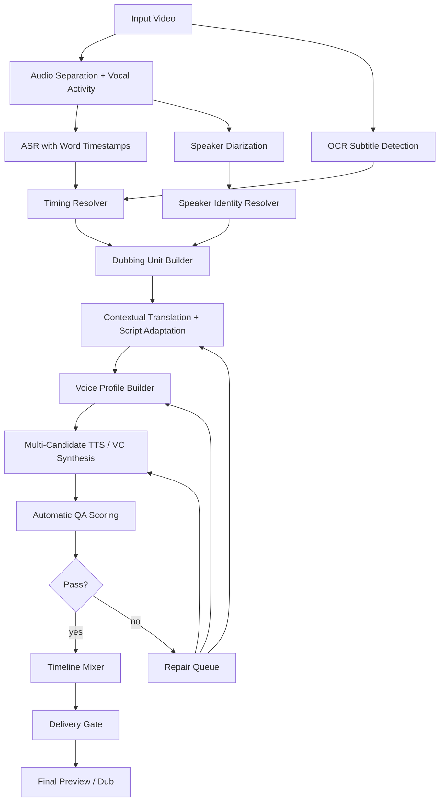

# 配音质量优先重构方案

> 分析对象：`/Users/masamiyui/.cache/translip/output-pipeline/task-20260424-094948`
>
> 目标：不以保留现有架构为前提，只以最终成片效果为目标，系统性解决“英文配音缺失感”、说话人识别混乱、音色克隆不稳、合成可懂度差、交付产物误导等问题。

## 1. 结论摘要

这次任务不是简单的“某些英文 wav 没有生成”。证据显示：

- C 阶段翻译条目：31 条。
- D 阶段实际生成 `seg-*.wav`：31 个。
- E 阶段混音：`placed_count = 31`，`skipped_count = 0`。
- 但 E 阶段质量状态：18/31 个片段 `overall_status = failed`，失败率 58.06%。
- 说话人质量：`speaker_status failed = 5`，`review = 13`。
- 可懂度质量：`intelligibility_status failed = 5`，`review = 9`。

所以用户看到或听到的“有些桥段没有英文配音”，本质上是四类问题叠加：

1. **时间锚点错位**：OCR 文本被替换进 ASR 段，但混音仍使用 ASR 起点，导致英语提前播完。
2. **TTS 时长失控**：短句生成异常长音频，被压缩或裁尾，听起来像缺字或缺句。
3. **说话人识别错误**：原始聚类先得到 13 类，又被强行压到 3 类，多个角色被混到同一个 speaker。
4. **音色合成质量不足**：当前 `moss-tts-nano-onnx` 对短句、跨语种音色克隆和英文可懂度不稳定，多个片段回读文本错误。

我建议把当前流水线从“阶段串联式产物生成”改成“质量闭环式配音制作系统”：先建立可信时间轴和角色身份，再做多候选合成、自动评测、失败重试和人工复核，最后只交付质量通过的成片。

## 2. 本次任务的问题证据

### 2.1 配音并非缺文件，而是错时和低质量

当前产物：

| 项目 | 结果 |
| --- | ---: |
| 翻译条目 | 31 |
| D 阶段 wav 文件 | 31 |
| E 阶段 placed | 31 |
| E 阶段 skipped | 0 |
| E 阶段 failed | 18 |

这说明“生成覆盖率”表面是 100%，但“可用覆盖率”不足。

### 2.2 典型“桥段没有英文配音”的根因

| 段 | 中文 | 英文 | ASR 时间 | OCR 字幕时间 | 实际配音时间 | 问题 |
| --- | --- | --- | ---: | ---: | ---: | --- |
| `seg-0006` | 召集全体成员 | Gather everyone. | 13.35-18.11 | 16.25-17.75 | 13.35-15.91 | 字幕出现时配音轨基本静音 |
| `seg-0010` | 阿扁 | by Alan | 26.20-29.38 | 29.00-29.75 | 26.20-27.73 | 英语提前 1.27 秒结束，且翻译错误 |
| `seg-0021` | 父王孩儿未能完成龙族的使命 | Father King Child failed... | 61.46-71.28 | 67.00-70.00 | 61.46-67.62 | 配音大多在字幕出现前播完 |
| `seg-0030` | 小爷是魔 | The boy is the devil. | 87.92-92.65 | 91.75-92.25 | 87.92-90.72 | 字幕出现时配音轨基本静音 |

当前代码中的关键机制：

- OCR 校正只替换 `text`，不更新 `start/end`。
- 混音固定使用 ASR `anchor_start` 放置配音。
- 过短或过长的 TTS 不会触发重新改稿，只会压缩、裁剪或直接通过。

因此，只要 ASR 段起点过早、OCR 字幕出现较晚、英文 TTS 又比 ASR 段短，就会出现“字幕/画面到这里了，但英文已经播完”的缺失感。

### 2.3 说话人识别问题

`task-a.log` 显示：

> Speaker clustering produced 13 clusters for 15 embedding groups. Re-clustering with cap=3.

这意味着系统一开始认为可能有 13 个声音簇，但算法又基于 embedding 数量把它强行压到 3 个 speaker。结果更像“时间块聚类”，不是“角色身份聚类”。

风险：

- `spk_0000` 混入了师父、报信、军令、敖丙相关短句。
- `spk_0002` 混入了父王、哪吒、父母叮嘱等不同语境。
- 参考音色是混合角色音色，后续克隆必然不稳定。

### 2.4 音色克隆和合成问题

当前 voice bank 虽然显示 3 个 speaker 都 `available`，但质量指标说明它们不够可用：

- 平均 speaker similarity 约 `0.3985`。
- `spk_0002` 15 段中 11 段 failed。
- `seg-0018` / `seg-0028` 目标是 `Ne Zha.`，回读成 `Thank you.`。
- `seg-0022` 目标是 `Hate to hate.`，回读为类似 `H-t-t-t-t H`。
- 多段 speaker similarity 低到 `0.16-0.20`。

这说明当前合成后并没有达到“像原角色、说对英文、时长合适”的基本要求。

### 2.5 交付产物问题

当前 `delivery-manifest.json` 中：

- `export_dub = false`
- `final_dub_video = null`

但目录里仍有 `task-g/final-dub/final_dub.en.mp4`，修改时间早于当前交付预览。这个文件很可能是旧产物残留，会误导用户以为它是当前任务交付结果。

## 3. 设计原则

### 3.1 效果优先，不追求全自动假完成

新的系统不应该用 `succeeded` 掩盖 `review_required`。如果成片中存在明显错时、错音色、错文本，任务状态应进入 `needs_repair` 或 `blocked_delivery`，而不是继续产出看似成功的最终文件。

### 3.2 文本、时间、角色三者必须一起可信

当前系统把 OCR 当成“文本修正来源”，但没有把 OCR 的时间信息传下去。重构后，每个配音单元必须同时包含：

- `source_text`: 原文。
- `target_text`: 英文配音稿。
- `speech_window`: 原始人声真实发声窗口。
- `subtitle_window`: OCR 硬字幕显示窗口。
- `dubbing_window`: 英文配音应该覆盖的窗口。
- `speaker_identity`: 角色身份，而不是临时 cluster id。
- `voice_profile`: 经过质量验证的参考音色。

### 3.3 不裁掉内容，失败就改稿或重合成

当前 `overflow_unfitted` 会压缩、裁尾。质量优先系统应改成：

1. 如果英文太长，先自动改写脚本。
2. 如果仍太长，再换 TTS 候选。
3. 如果仍失败，进入人工复核。
4. 除非用户明确选择“宁可缺字也要贴时间”，否则禁止静默裁掉配音内容。

### 3.4 用多候选竞争，而不是押注单一 TTS

单个后端不可能稳定处理所有短句、情绪、角色、跨语种音色。新系统应支持 TTS/VC 候选池，每段至少生成多个候选，然后用质量评分选择最优。

可作为候选池的开源方向包括：

- CosyVoice / CosyVoice2/3：官方仓库显示支持多语种、zero-shot、cross-lingual，并提供公开评测表。
- F5-TTS：flow matching TTS，适合 zero-shot 和 code-switching 场景。
- Chatterbox：开源 TTS，偏英文自然度和表达力。
- Seed-VC：zero-shot voice conversion，可作为“先生成清晰英文，再转原角色音色”的后处理方案。

候选模型必须通过本项目自己的 benchmark 后才能进入默认链路，不能只凭 README 选择。

## 4. 推荐总体架构



核心变化：

- 不再让 ASR segment 独占时间轴。
- OCR、ASR word timestamp、VAD/人声能量共同决定配音窗口。
- speaker cluster 只是候选，不直接等于角色。
- 翻译不再逐条直译，而是按 dubbing unit 和上下文改写。
- TTS 不再一次生成即混入，而是进入质量评测和 repair loop。
- 交付阶段读取质量门，不允许把 `review_required` 包装成成功。

## 5. 技术方案

### 5.1 新增 Timing Resolver

目标：解决“英文提前播完，字幕出现时无声”的核心问题。

输入：

- ASR segment：`start/end/text/speaker_label`
- ASR word timestamp：每个词或字的时间
- OCR event：`start/end/text/confidence/box`
- vocal activity：人声能量窗口

输出：

```json
{
  "unit_id": "unit-0006",
  "segment_ids": ["seg-0006"],
  "source_text": "召集全体成员",
  "speech_window": {"start": 15.95, "end": 17.95, "confidence": 0.82},
  "subtitle_window": {"start": 16.25, "end": 17.75, "confidence": 0.99},
  "dubbing_window": {"start": 15.95, "end": 18.10, "policy": "speech_ocr_fused"},
  "timing_warnings": ["asr_start_too_early_by_2.90s"]
}
```

窗口选择策略：

1. 如果 OCR 与 ASR 重叠但 ASR 起点早于 OCR 超过 1 秒，检查人声能量。
2. 如果人声能量也集中在 OCR 附近，则以 `OCR start - 0.2s` 作为候选配音起点。
3. 如果人声能量证明原声确实更早，则保留原声时间，但要求英文配音至少覆盖 OCR 可见窗口的一部分。
4. 如果英文成品无法覆盖 `dubbing_window`，不得裁剪静默通过，必须进入脚本压缩或重合成。

预期收益：

- 消除 `seg-0006`、`seg-0030` 这类字幕出现时配音轨完全静音的问题。
- 把“表面生成覆盖率 100%”变成“可感知覆盖率 95%+”。

### 5.2 重做 Dubbing Unit Builder

当前很多片段过短，如 `报`、`哪吒`、`吒儿`，单独 TTS 容易生成异常长音频或识别成其他词。新的 unit builder 应按语义、时间和 speaker 聚合短句。

规则：

- 小于 1.5 秒的短句默认不能单独合成，除非它是强情绪独立喊叫。
- 相邻短句如果同 speaker、间隔小于 700ms，应组成一个 dubbing unit。
- OCR 多行拆分但语义连续时，应合并成一个 unit。
- unit 内可以生成整句音频，再按内部 token/word 对齐切回 timeline。

对本任务的直接修正：

- `seg-0004 + seg-0005`：`Report. Enemy sighted on the sea.`，不要让 `Report.` 单独生成 8.16 秒。
- `seg-0018 + seg-0019`：`Ne Zha, until next time.`，避免 `Ne Zha.` 被合成为 `Thank you.`。
- `seg-0022 + seg-0023`：合并处理，避免重复的 `Hate to hate.` 和四连 `I hate you`。

预期收益：

- 短句异常时长显著下降。
- 可懂度失败率从当前 16.13% 降到 3% 以下。
- 减少 `needs_dubbing_unit` 被标记但仍单独合成的失败。

### 5.3 重做翻译和配音稿生成

当前 `local-m2m100` 的问题不是小瑕疵，而是足以破坏剧情和 TTS 的错误：

- `阿扁` -> `by Alan`
- `欠你的都还清了` -> `You owe it all.`
- `父王孩儿未能完成龙族的使命` -> `Father King Child failed...`
- `那又如何` -> `And how.`

建议废弃“逐段机器直译即配音”的策略，改成两层稿件：

1. `literal_translation`: 直译，保留信息。
2. `dubbing_script`: 面向配音的自然英文，受时长预算约束。

每条 dubbing script 必须携带：

```json
{
  "text": "I have repaid what I owed you.",
  "style": "dramatic, restrained",
  "max_syllables": 12,
  "max_duration_sec": 2.4,
  "protected_terms": ["Ne Zha", "Ao Bing", "Chentang Pass"],
  "rewrite_attempts": [
    {"text": "I have repaid what I owed you.", "estimated_sec": 2.3, "status": "fit"}
  ]
}
```

技术实现：

- 默认启用上下文翻译：整段剧情窗口一起翻译，而不是逐句。
- 加入术语表：Ne Zha、Ao Bing、Chentang Pass、East Sea Dragon Clan、Shen Gongbao。
- 加入时长改写器：根据 `dubbing_window.duration` 自动生成 2-5 个候选稿。
- 合成失败时先重写稿，再重试 TTS。

预期收益：

- 减少直译错误导致的荒谬台词。
- 缩短超时句，避免后续强行压缩和裁剪。
- 提升 Whisper backread 的 text similarity。

### 5.4 重做说话人识别为 Speaker Identity Resolver

当前 speaker id 是聚类产物，不应该直接进入音色克隆。建议拆成三层：

1. `audio_cluster_id`: 自动聚类结果。
2. `speaker_identity`: 人类可理解的角色身份，如 `master`, `soldier`, `ao_bing`, `ne_zha`, `father`, `mother`。
3. `voice_profile_id`: 实际用于 TTS/VC 的音色配置。

算法策略：

- 不再用简单 embedding 数量推导 speaker cap。
- 使用 HDBSCAN 或阈值图聚类，允许 `unknown` 和 `needs_review`。
- 同一角色的候选段必须满足音色相似、时间连续、文本语境不冲突。
- 可选加入视频人脸/镜头上下文，但不能强依赖。
- 每个 speaker 输出风险等级：
  - `safe`: 单一角色、参考音干净、时长足够。
  - `review`: 可能混 speaker。
  - `blocked`: 不允许自动克隆。

本任务中，`spk_0002` 应至少被拆分或标记为 review，而不是直接拿它的参考音克隆 15 段。

预期收益：

- speaker similarity 平均值从约 0.40 提升到 0.55+。
- 减少“一个角色突然换嗓子”或“多个角色共用一个怪异嗓音”的问题。

### 5.5 重做 Voice Profile Builder

当前 reference 选择主要看时长、文本、RMS，不能保证是单人、干净、无 BGM、无情绪错配。

新的 voice profile 应包含：

```json
{
  "voice_profile_id": "voice-ao-bing-v1",
  "speaker_identity": "ao_bing",
  "reference_clips": [
    {
      "path": ".../clip.wav",
      "duration_sec": 8.2,
      "noise_score": 0.08,
      "music_leak_score": 0.12,
      "single_speaker_score": 0.94,
      "emotion": "tense",
      "approved": true
    }
  ],
  "cloneability": "good",
  "preferred_backend_order": ["cosyvoice", "f5-tts", "chatterbox", "seed-vc"]
}
```

参考音策略：

- 参考音优先选择 5-12 秒单人干声。
- 含 BGM、喊叫、多人重叠、音效盖过人声的片段降权或禁用。
- 对每个角色保留多种情绪参考：neutral、angry、sad、urgent。
- 没有合格参考音时，不做伪克隆；改用角色预设音色或进入人工上传参考音。

预期收益：

- 降低克隆不稳定和音色漂移。
- 避免短 reference 和混合 reference 污染合成。

### 5.6 多候选 TTS / VC 合成

当前只用 `moss-tts-nano-onnx`，质量不足时没有真正 fallback。建议改成 candidate grid：

```json
{
  "unit_id": "unit-0021",
  "candidates": [
    {"backend": "cosyvoice", "script_variant": 1, "reference": "clean_ref_a"},
    {"backend": "f5-tts", "script_variant": 1, "reference": "clean_ref_a"},
    {"backend": "chatterbox", "script_variant": 2, "reference": "english_style_ref"},
    {"backend": "clear_tts_plus_seed_vc", "script_variant": 2, "reference": "clean_ref_a"}
  ]
}
```

评分维度：

- 文本可懂度：ASR backread WER/CER。
- 时长适配：是否覆盖 `dubbing_window`，是否无需裁剪。
- 音色相似度：speaker embedding similarity。
- 音频质量：静音、爆音、重复、拖尾、金属音检测。
- 情绪匹配：基于 prompt 或 reference emotion。

选择策略：

- 短句优先可懂度，不强求最高音色相似。
- 长句优先自然度和时长覆盖。
- 情绪句允许轻微时长溢出，但不能裁掉内容。
- 如果所有候选都失败，进入 repair queue，不交付最终成片。

候选模型来源说明：

- CosyVoice 官方仓库提供多语种、zero-shot、cross-lingual 能力和评测表。
- F5-TTS 官方仓库面向 zero-shot / code-switching TTS。
- Chatterbox 官方仓库偏英文自然度和表达力，可作为英文清晰度候选。
- Seed-VC 官方仓库支持 1-30 秒参考音的 zero-shot voice conversion，可作为“清晰英文 TTS + 角色音色转换”的路线。

预期收益：

- 避免单一模型在短句或专名上失败。
- 将当前 58% failed ratio 降到 10% 以下。
- 把“生成一次即混入”升级为“多候选竞争后再混入”。

### 5.7 混音策略改造：禁止静默错时和无感裁剪

当前 fit 策略包括：

- `overflow_unfitted`
- `underflow_unfitted`
- `tail_trimmed_for:*`

这些策略在工程上保证了不重叠，但在观感上会制造“缺配音”。

新策略：

1. **先改稿，不先压缩**：超过时长预算时，触发 script adaptation。
2. **再重合成，不先裁剪**：同稿不同 backend/reference。
3. **最后轻度 fitting**：只允许小范围 time-stretch，比如 0.92x-1.12x。
4. **禁止内容裁尾**：裁尾只能用于移除尾部静音，不能裁人声。
5. **覆盖检测**：每个 unit 的配音能量必须覆盖 `dubbing_window` 的核心区域。

新增 QA：

```json
{
  "audible_coverage": 0.91,
  "subtitle_overlap_coverage": 0.87,
  "speech_window_overlap": 0.93,
  "tail_trimmed_voiced_audio": false
}
```

预期收益：

- 明确消除 `seg-0006` 和 `seg-0030` 这种 OCR 窗口内无英文的问题。
- 减少用户感知的“漏配音”。

### 5.8 交付门禁和产物清理

交付层应做两件事：

1. 清理旧产物。
2. 根据质量状态决定是否允许导出。

规则：

- 每次 Task G 开始前清空本次要生成的 `final-preview` / `final-dub` 路径，或写入 run-specific 子目录。
- `delivery-manifest.json` 必须只声明本次实际生成的文件。
- 如果 `content_quality.status != passed`，默认只允许导出 `review_preview`，禁止命名为正式 final。
- UI/API 必须显式展示：
  - `failed_segment_count`
  - `audible_coverage`
  - `speaker_review_required`
  - `repair_queue_count`

预期收益：

- 不再出现 `final_dub.en.mp4` 文件存在但 manifest 写 `null` 的误导。
- 用户能区分“预览可看”和“最终可交付”。

## 6. 分阶段落地计划

### Phase 0：针对当前任务的快速修复

目标：让这条 Ne Zha 预告片先达到可用预览。

动作：

1. 人工修正 31 条英文配音稿，优先修正明显错译：
   - `阿扁` 不应是 `by Alan`。
   - `欠你的都还清了` 改为 `I have repaid what I owed you.`
   - `父王孩儿未能完成龙族的使命` 改为 `Father, I failed the Dragon Clan.`
   - `那又如何` 改为 `So what?`
2. 对明显错时段手动改 `dubbing_window`：
   - `seg-0006`
   - `seg-0010`
   - `seg-0021`
   - `seg-0030`
3. 合并短句：
   - `seg-0004 + seg-0005`
   - `seg-0018 + seg-0019`
   - `seg-0022 + seg-0023`
4. 为 `spk_0002` 重选 reference，必要时不克隆，先用清晰角色预设音色。
5. 重新生成多候选，人工试听失败段。
6. 清理旧 `final-dub`，只保留 manifest 声明的产物。

预期收益：

- 用户感知漏配音的段落减少到 0-1 个。
- 剧情台词不再明显荒谬。
- 预览质量从 `review_required` 提升到可人工验收。

### Phase 1：修正核心架构缺陷

目标：让后续任务不再重复同类错时。

实现：

1. 新增 `TimingResolver`。
2. `asr-ocr-correct` 不再只输出 corrected text，还输出 OCR event mapping 和 timing warnings。
3. `task-c` 读取 dubbing units，而不是裸 ASR segments。
4. `task-e` 使用 `dubbing_window`，不直接使用 ASR `anchor_start`。
5. 新增 audible coverage QA。

预期收益：

- 解决“配音提前播完”的主因。
- 错时段能在 E 阶段自动标红，而不是等用户听出来。

### Phase 2：建立质量闭环合成

目标：让合成失败自动修，而不是失败也混入。

实现：

1. TTS candidate grid。
2. script adaptation retry。
3. reference retry。
4. backend fallback。
5. strict delivery gate。

预期收益：

- failed ratio 从 58% 降到 10% 以下。
- intelligibility failed 从 5/31 降到 1/31 以下。

### Phase 3：角色和音色系统升级

目标：让角色音色稳定。

实现：

1. Speaker Identity Resolver。
2. Voice Profile Builder。
3. 角色级 reference bank。
4. 人工 speaker review 作为质量门。
5. 支持角色预设音色和用户上传参考音。

预期收益：

- speaker similarity 平均值提升到 0.55+。
- 用户不再听到同一个角色频繁换声线。

### Phase 4：制作级体验

目标：把系统从“自动跑 pipeline”变成“配音制作工作台”。

实现：

1. Timeline review UI：能看到 ASR、OCR、配音、字幕四条轨。
2. 每段候选试听和一键替换。
3. 角色音色库管理。
4. Repair queue：只处理失败片段，不全量重跑。
5. 版本化交付：每次导出都有独立 manifest 和质量报告。

预期收益：

- 大幅减少全量重跑时间。
- 让人工介入集中在最有价值的 10%-20% 失败段。
- 更接近专业配音制作流程。

## 7. 成功指标

### 7.1 自动指标

| 指标 | 当前 | 目标 |
| --- | ---: | ---: |
| placed coverage | 100% | 100% |
| usable/audible coverage | 未明确统计 | > 95% |
| failed ratio | 58.06% | < 10% |
| speaker failed ratio | 16.13% | < 5% |
| intelligibility failed ratio | 16.13% | < 3% |
| avg speaker similarity | 0.3985 | > 0.55 |
| OCR 窗口内纯配音静音段 | 已出现 | 0 |
| stale delivery artifact | 已出现 | 0 |

### 7.2 主观验收

成片验收标准：

- 画面出现中文台词时，英文配音不能已经明显结束。
- 角色音色可以不完美，但不能频繁错人或像无关角色。
- 专名不能错：Ne Zha、Ao Bing、Chentang Pass、Dragon Clan。
- 英文必须像自然配音稿，而不是机器直译字幕。
- 短喊句不能拖成多秒怪音。
- 正式 final 只能在质量门通过后生成。

## 8. 风险和取舍

### 8.1 成本风险

多候选 TTS 会增加计算成本。解决方式：

- 先对失败风险高的段生成多候选。
- 对低风险长句先单候选。
- 引入 repair queue，避免全量重跑。

### 8.2 模型不稳定风险

开源 TTS/VC 模型升级快，单一默认模型会过时。解决方式：

- 模型作为 adapter，不绑定业务逻辑。
- 每个模型进入默认链路前必须跑项目 benchmark。
- 质量评分决定选择，不由模型名决定。

### 8.3 全自动与效果冲突

高质量配音很难完全自动。解决方式：

- 自动处理 80%-90% 可稳定片段。
- 失败段进入人工 review，不伪装成成功。
- UI 聚焦失败原因和候选试听，降低人工成本。

## 9. 建议优先级

如果只做一件事，先做 **Timing Resolver + dubbing_window 混音**。这是“漏配音感”的主因。

如果做两件事，再做 **script adaptation retry**。这会减少大量时长失败和裁剪。

如果做三件事，再做 **TTS candidate grid + strict delivery gate**。这会把系统从“生成就算成功”变成“质量通过才交付”。

Speaker Identity Resolver 和 Voice Profile Builder 是长期质量上限，应该排在核心错时修复之后。

## 10. 参考资料

- CosyVoice 官方仓库：https://github.com/FunAudioLLM/CosyVoice
- F5-TTS 官方仓库：https://github.com/SWivid/F5-TTS
- Chatterbox 官方仓库：https://github.com/resemble-ai/chatterbox
- Seed-VC 官方仓库：https://github.com/Plachtaa/seed-vc
