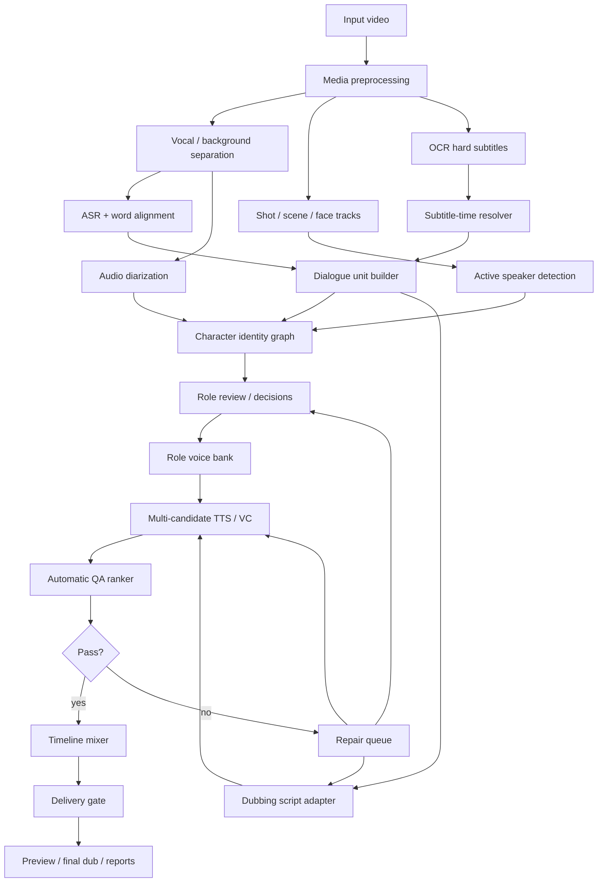

# 中国影视剧配音工作流产品与技术迭代路线图

> 日期：2026-04-29  
> 适用项目：`video-voice-separate / translip`  
> 目标场景：中国电影、电视剧、动画、网剧、短剧的中译英/多语种配音制作  
> 当前结论：后续不应继续围绕“ASR segment speaker 聚类 + 单 TTS 后端”小修；应重构为“角色身份图 + 音视频联合人物识别 + 多候选 TTS/VC + 自动质检修复”的影视配音工作台。

---

## 1. 背景与问题定义

### 1.1 当前链路的根本瓶颈

当前任务链路大致是：

```text
Task A ASR + speaker_label
-> Task B speaker profile / reference clip
-> Task C 翻译
-> Task D 按 speaker_id 配音生成
-> Task E 混音
-> Task G 交付
```

这条链路能验证工程流程，但它把影视剧里最关键的三个问题简化得过头：

1. `speaker_label` 不等于角色。  
   当前 `src/translip/transcription/speaker.py` 基于 ASR 段扩窗、抽 speaker embedding、聚类，再把聚类 label 回填给 ASR segment。它解决的是“这几个音频片段听起来像不像同一个人”，不是“这句台词属于哪个角色”。影视剧里离屏台词、群戏、后期配音、重叠说话、BGM、短句都会让这个假设失效。

2. ASR segment 不等于对白单元。  
   中文影视剧的硬字幕、真实发声、剪辑镜头、ASR 断句经常错位。把 ASR segment 直接当翻译和 TTS 单元，会产生短句异常、错时、字幕出现时配音已经结束、多个角色混在一个音频窗口里等问题。

3. 单 TTS 后端不可能覆盖影视场景。  
   电视剧/电影配音同时要求：像角色、说得清、情绪对、时长合适、可混音。不同模型擅长的维度不同，单模型输出失败时不能直接跳过或裁剪，必须有候选池和修复闭环。

### 1.2 从 task-20260425-023015 暴露的问题看

前序分析中的典型问题：

- Task C 有 `192` 段，Task D 只有 `186` 段，`spk_0002` 的 `6` 段未生成。
- Task E `placed=164 / skipped=22`，最终有字幕窗口没有可听英文配音。
- Task D speaker status 为 `passed=15 / review=138 / failed=33`，大部分配音候选无法确认角色音色。
- Task A speaker clustering 先产生大量 clusters，再被 cap 压缩，说明聚类结果并不是稳定角色身份。

这些不是单点 bug，而是架构问题：系统没有把“角色、对白、参考音色、候选音频、质量结果”作为可追踪对象管理。

---

## 2. 中国电影/电视剧场景特征

中国影视剧和普通会议转录、播客配音差别很大，技术方案必须显式覆盖这些 case。

| 场景 | 典型特征 | 对当前系统的破坏 | 新方案要求 |
| --- | --- | --- | --- |
| 古装 / 仙侠 / 神话 | 人名、称谓、门派、法术、诗化台词多；BGM 和混响重 | ASR 易错字，翻译直译生硬，短句 TTS 容易失真 | 术语表、角色关系表、风格化改写、情绪/混响标签 |
| 现代都市剧 | 多人快对白、插话、电话声、室内混响 | ASR segment 容易跨人，speaker 聚类被短句扰动 | 词级时间轴、重叠说话检测、角色身份图 |
| 悬疑 / 犯罪 / 谍战 | 低声、耳语、电话/广播/监控声、离屏旁白 | active speaker 可能无脸可对齐，声纹受信道影响 | 声道/效果标签，离屏角色策略，弱化脸部证据 |
| 动作 / 战争 / 武侠 | 打斗声、爆炸声、群喊、喊叫、音乐盖人声 | VAD、ASR、TTS 参考音频污染严重 | 人声分离、多模型 VAD、参考音频质量门 |
| 港片 / 粤语剧 / 地方方言 | 粤语、川渝、东北、闽南、普通话混说 | Whisper/faster-whisper 断句和词汇可能不稳 | SenseVoice/FunASR 方言能力、语言识别、方言词表 |
| 动画 / 短剧 / 奇幻角色 | 夸张音色、非自然角色声、儿童/老人/怪物声 | 直接克隆参考声可能不稳定或不适合英文 | Voice design + VC，按角色设定生成音色 |
| 后期配音 / ADR | 画面演员和原声音轨未必严格嘴型同步 | 纯 lip/face active speaker 会误判 | 音频身份优先，视觉证据只作为概率边 |
| 长剧集 | 同一角色跨集出现，服装/场景/情绪变化大 | 单集聚类无法复用，重复人工确认 | Series-level character registry 和跨集 voice bank |

关键产品判断：  
中国影视剧配音系统不能只回答“谁说了这句”，还必须回答“这句在剧情中属于哪个角色、当前是镜头内还是离屏、用哪个角色音色、应该按什么情绪和节奏说”。

---

## 3. 产品目标

### 3.1 产品形态

把当前 pipeline 升级为“影视配音工作台”：

```text
导入视频
-> 自动分析对白、字幕、人物、角色、音色
-> 角色确认
-> 配音稿审查
-> 多候选生成
-> 自动质检
-> 修复队列
-> 导出预览 / 纯配音轨 / 最终视频
```

用户不应只看到 task 成功/失败，而应看到：

- 哪些角色被识别出来。
- 哪些角色音色库可信。
- 哪些对白缺少配音。
- 哪些对白角色不确定。
- 哪些对白已经自动修复。
- 哪些对白需要人工确认。
- 当前版本是否允许交付。

### 3.2 核心产品页面

第一阶段不需要做复杂剪辑软件，但需要让用户能完成“发现问题 -> 修复问题 -> 验证导出”的闭环。

| 页面 | 目标 | 必备信息 | 关键操作 |
| --- | --- | --- | --- |
| Task Overview | 判断当前任务能不能交付 | 可听覆盖率、角色归因、候选通过率、blocked/review 数量 | 进入 review、重新跑失败阶段、导出报告 |
| Dialogue Timeline | 逐句检查对白 | 原文、OCR、ASR、配音稿、角色、时间窗、候选音频 | 试听、改稿、重生成、锁定候选 |
| Character Board | 管理角色身份 | 角色头像/face tracks、声纹簇、别名、确认状态 | 合并角色、拆分角色、指定角色名 |
| Voice Bank | 管理音色参考 | 每个角色的 reference、纯度、噪声、情绪标签 | 试听、禁用 reference、指定主参考 |
| Repair Queue | 集中处理失败项 | 失败原因、建议动作、自动尝试记录 | 批量修复、人工 override、标记 blocked |
| Delivery Gate | 交付前检查 | 硬失败、review 残留、导出版本、模型/reference 版本 | 导出 preview、导出 final、生成 manifest |

产品原则：

- `final` 导出必须比 `preview` 更严格，不能让用户误把有硬失败的版本当最终成片。
- 所有自动决策都要可解释，至少能追溯到角色证据、reference、TTS backend、QA 分数。
- 用户操作应优先围绕角色和对白，而不是围绕底层 task 文件。

### 3.3 成功指标

以下指标用于后续 benchmark 和迭代验收：

| 指标 | 当前问题表现 | 阶段性目标 | 解释 |
| --- | ---: | ---: | --- |
| 字幕窗口可听覆盖率 | 有 skipped / 静音窗口 | `>= 98%` | 有字幕且应配音的窗口必须有可听英文 |
| 配音缺段数 | Task D 有 speaker 被过滤 | `0` 自动缺段 | 缺段只能来自显式 mute/review/block |
| 角色自动归因准确率 | speaker pass 极低 | 干净镜头 `>= 85%` | 复杂片段可进入 review，不强行猜 |
| 错角色静默通过率 | 当前可进入后续阶段 | `< 2%` | 不确定时宁可 review，不错配交付 |
| 主要角色 voice bank 纯度 | reference 可能混人 | `>= 0.85` | 音频参考必须单角色、低污染 |
| TTS 候选自动通过率 | 当前 pass 很低 | M5 后 `>= 70%` | 经过候选池和修复后提升 |
| 最终需人工 review 比例 | 大量片段需查 | 首集 `< 25%`，跨集 `< 10%` | 角色库稳定后明显下降 |
| 交付状态真实性 | 可能 succeeded 但质量差 | 质量不达标不导出 final | Delivery gate 必须可信 |

这些目标是工程 benchmark 目标，不是承诺每个视频都无人工。影视剧的群戏、噪声、方言和剪辑复杂度决定了系统必须支持 review，而不是假装全自动。

---

## 4. 推荐总体架构



核心对象从 `segment` 改为四层：

1. `DialogueUnit`：一句或一组应整体处理的对白。
2. `CharacterIdentity`：角色身份，不等于临时 speaker cluster。
3. `VoiceProfile`：角色音色资产，包含多条参考音频和质量证据。
4. `DubbingCandidate`：某句台词的一个合成候选，带完整 QA 指标。

### 4.1 与现有 Task 的迁移映射

| 现有任务 | 现状 | 新模块 | 迁移判断 |
| --- | --- | --- | --- |
| Task A: speaker-attributed transcription | ASR segment + speaker_label | `MediaAnalysis` + `DialogueUnitBuilder` + `AudioDiarization` | 保留 ASR 能力，废弃“speaker_label 直接作为角色”的假设 |
| Task B: speaker registry / retrieval | 按 speaker profile 建 reference | `CharacterIdentityGraph` + `CharacterVoiceBank` | 从 speaker 资产迁移到角色资产 |
| Task C: dubbing script generation | 按 segment 翻译 | `DubbingScriptAdapter` | 从字幕翻译迁移到可表演配音稿 |
| Task D: voice cloning | 单 speaker / 单 backend 生成 | `CandidateSynthesis` + `TTSBackendRegistry` | 从单输出迁移到多候选竞争 |
| Task E: timeline fitting / mixing | 放置已生成 wav，跳过失败片段 | `TimelineMixer` + `CandidateQA` | 从被动混音迁移到质量感知混音 |
| Task G: delivery | 导出最终文件 | `DeliveryGate` + `VersionedExport` | 从文件存在即交付迁移到质量门控交付 |

迁移方式：

- 保留现有 task 输出作为兼容读取层，先新增 v2 artifacts。
- 新链路稳定后，把旧 Task A-D 的产物降级为 fallback/debug artifacts。
- UI 和交付状态应尽快切到 v2 artifacts，避免继续把旧 speaker_label 暴露成角色真相。

---

## 5. 技术选型

### 5.1 音频预处理

| 能力 | 首选 | 备选 | 选择理由 |
| --- | --- | --- | --- |
| 人声/背景分离 | Demucs / UVR-MDX-Net | Open-Unmix | 影视剧 BGM、打斗、环境声重，分离后可提升 ASR、VAD、reference mining 稳定性 |
| VAD | Silero VAD + pyannote/NeMo VAD | WebRTC VAD | Silero 快速，pyannote/NeMo 可作为高质量复核 |
| 重叠说话检测 | pyannote overlapped speech detection | NeMo diarization logits | 多人插话和群戏中，重叠片段不能直接进入 voice bank |
| 响度/噪声分析 | pyloudnorm + ffmpeg astats | librosa | 参考音频和最终混音都需要可量化质量门 |

策略：

- diarization 不只跑分离后人声，也保留原始音轨结果；二者冲突时降低置信度。
- fight/crowd/music-heavy 场景默认不挖 reference，只允许用于对白定位。

### 5.2 ASR 与文本对齐

| 能力 | 首选 | 备选 | 选择理由 |
| --- | --- | --- | --- |
| 中文/方言 ASR | SenseVoice / FunASR Paraformer | faster-whisper large-v3 | SenseVoice 强在多语种、情绪、事件识别；FunASR 对中文生态和方言更友好 |
| 词级时间戳 | WhisperX forced alignment | FunASR timestamp / MFA | 配音窗口必须靠词级或字级时间，不能只用 segment |
| 语言识别 | SenseVoice LID | Whisper language detection | 粤语、普通话、英语夹杂时必须分语言处理 |
| 情绪/音频事件 | SenseVoice SER/AED | 独立 emotion classifier | TTS 选 reference 和 style prompt 需要情绪标签 |

决策：

- 对中国影视剧，ASR 主识别建议以 SenseVoice/FunASR 为主，WhisperX 负责 word-level alignment 和与英文/多语种的兼容。
- ASR 结果不直接成为最终对白稿，必须与 OCR、VAD、镜头信息融合成 `DialogueUnit`。
- 古装/仙侠/神话类必须启用术语表和角色表，否则翻译和回听 ASR 会系统性误判。

### 5.3 OCR 与硬字幕时间轴

| 能力 | 首选 | 备选 | 选择理由 |
| --- | --- | --- | --- |
| 中文字幕 OCR | PaddleOCR / PP-OCR | RapidOCR | 对中文硬字幕成熟，适合本地运行 |
| 字幕区域检测 | 固定底部区域 + 动态文本框检测 | 全帧 OCR | 国内剧集硬字幕多数位于底部，但电影/预告片可能有变体 |
| 时间去重 | frame-level OCR event clustering | subtitle line hashing | 同一字幕跨多帧出现，需要合并成稳定 event |

关键策略：

- OCR 文本不是只用来改字，它的 `start/end` 必须进入 `subtitle_window`。
- 当 ASR 与 OCR 时间明显错位时，`dubbing_window` 由 OCR、VAD、人声能量共同决定。
- 不能因为 ASR 起点早，就让英文配音在字幕出现前播完。

### 5.4 人物识别与角色身份

| 能力 | 首选 | 备选 | 选择理由 |
| --- | --- | --- | --- |
| 音频 diarization | NeMo Sortformer + pyannote.audio ensemble | SpeechBrain/WeSpeaker embedding clustering | Sortformer/pyannote 比当前 ASR segment 聚类更接近 diarization 任务 |
| 声纹 embedding | TitaNet / ECAPA / CAM++ | SpeechBrain ECAPA | 用于角色库、reference purity、候选评分 |
| 人脸检测/识别 | InsightFace / MediaPipe Face | RetinaFace | 电视剧角色需要跨镜头 face track |
| 镜头切分 | PySceneDetect | ffmpeg scene detect | 镜头边界是角色可见性和字幕错位的重要证据 |
| Active Speaker Detection | TalkNet-ASD | SyncNet confidence | 群戏中需要判断画面里谁正在说话 |
| 跨集角色复用 | Character Registry | 手工角色表 | 长剧集必须复用角色身份和 voice bank |

核心设计：`CharacterIdentityGraph`

```json
{
  "characters": [
    {
      "character_id": "char_0001",
      "display_name": "哪吒",
      "aliases": ["吒儿", "Ne Zha"],
      "voice_profiles": ["voice_char_0001_neutral", "voice_char_0001_angry"],
      "face_tracks": ["face_track_103", "face_track_221"],
      "speaker_clusters": ["aud_spk_004", "aud_spk_009"],
      "confidence": 0.91,
      "review_status": "confirmed"
    }
  ],
  "edges": [
    {
      "from": "unit-0038",
      "to": "char_0001",
      "evidence": ["asr_diarization", "active_speaker", "subtitle_name", "voice_similarity"],
      "confidence": 0.87
    }
  ]
}
```

角色归因原则：

- 音频 diarization、active speaker、OCR/字幕、剧情上下文都是证据，不是单点真相。
- 离屏台词、旁白、电话声、广播声允许没有 face track。
- 后期配音/ADR 场景中，嘴型证据只能作为软证据，不能压过声纹和剧情上下文。
- 低置信片段不能进入 voice bank，不能自动克隆，不能静默交付。

### 5.5 Voice Bank 与参考音频挖掘

旧方案按 speaker profile 找 reference；新方案按 `CharacterIdentity` 建 voice bank。

每个角色维护多种参考：

```json
{
  "voice_profile_id": "voice_char_0001_angry",
  "character_id": "char_0001",
  "language": "zh",
  "style_tags": ["angry", "shout", "battle"],
  "references": [
    {
      "audio_path": "voice_bank/char_0001/ref_001.wav",
      "start": 123.42,
      "end": 129.85,
      "duration": 6.43,
      "source_text": "我命由我不由天",
      "purity_score": 0.94,
      "noise_score": 0.08,
      "overlap_score": 0.01,
      "evidence": ["active_speaker_confirmed", "single_speaker_vad", "high_asr_confidence"]
    }
  ]
}
```

reference 入库规则：

- 主参考优先 `3-8s`，可补充 `8-12s` 的稳定长句。
- 必须单人、低 BGM、低混响、低重叠、ASR 文本可信。
- 同一角色至少保留 neutral / emotional / low-volume 三类候选。
- 群喊、哭喊、笑声、战斗喘息默认不作为主参考，只作为风格参考。
- 样本不足角色不强行克隆，可走 voice design 或基础配音声线。

### 5.6 翻译与配音稿适配

影视配音稿不能等同字幕翻译。需要新增 `DubbingScriptAdapter`：

输入：

- `DialogueUnit`
- 角色身份、性别/年龄/关系
- 术语表、人名表、世界观词表
- 目标语言
- 可用时间窗口
- 情绪标签

输出：

```json
{
  "unit_id": "unit-0038",
  "source_text": "我命由我不由天",
  "literal_translation": "My fate is up to me, not the heavens.",
  "dubbing_text": "My fate is mine to command.",
  "target_duration_sec": 2.4,
  "style": "defiant",
  "rewrite_level": "performable",
  "protected_terms": ["Ne Zha"]
}
```

规则：

- 一律生成“可说出口”的英文，不追求逐字字幕式翻译。
- 时间超限时优先改稿，不优先压缩音频。
- 人名、称谓、关系、术语必须走 glossary。
- 古装/仙侠可使用更凝练、有戏剧感的英文；现代剧用自然口语。
- 同一角色的语气要保持一致，例如父王、师父、少年、反派不能都用同一种中性 voice。

### 5.7 TTS / VC 候选池

不设单一默认真理模型，设候选策略。

| 模型/路线 | 用途 | 推荐角色 |
| --- | --- | --- |
| Qwen3-TTS Base | 本地 voice clone、轻量首发、批量生成 | 常规角色、开发机验证 |
| Qwen3-TTS VoiceDesign | 无可靠 reference 或动画/奇幻角色声线设计 | 样本不足角色、怪物/儿童/旁白 |
| CosyVoice2/3 | 多语种、zero-shot、cross-lingual TTS | 中文参考到英文配音 |
| IndexTTS2 | 强时长控制、情绪与音色解耦 | 需要贴字幕/嘴型的关键台词 |
| F5-TTS / E2-TTS | flow-matching zero-shot TTS | 备用候选、code-switching |
| Chatterbox | 英文自然度/表达力候选 | 先生成清晰英文，再做 VC |
| Seed-VC | zero-shot voice conversion | “清晰英文 TTS -> 角色音色” |
| OpenVoice | 跨语种 voice style / timbre transfer | VC 备选、快速实验 |

生成策略：

```text
每个 DialogueUnit:
  1. 根据角色、情绪、时长选择 2-4 个 reference。
  2. 根据目标时长选择 2-3 个 backend。
  3. 每个 backend 生成 1-3 个候选。
  4. 对候选做 ASR 回听、时长、声纹、情绪、响度、静音检测。
  5. 选分数最高且无硬失败的候选。
  6. 全部失败则进入 repair queue。
```

优先级建议：

- 常规对白：Qwen3-TTS / CosyVoice / F5-TTS 三路候选。
- 短句/严控时长：IndexTTS2 优先。
- 角色音色不像但文本清晰：走 Seed-VC / OpenVoice。
- 样本不足角色：Qwen3 VoiceDesign 或预设角色声线。
- 情绪重台词：同角色情绪 reference + IndexTTS2/CosyVoice 候选。

### 5.8 自动 QA 与候选排序

每个 `DubbingCandidate` 必须保留可解释分数：

```json
{
  "candidate_id": "cand_unit_0038_04",
  "unit_id": "unit-0038",
  "backend": "indextts2",
  "reference_id": "voice_char_0001_angry/ref_001",
  "audio_path": "task-d/candidates/unit-0038/cand-04.wav",
  "scores": {
    "asr_backcheck": 0.96,
    "duration_fit": 0.91,
    "speaker_similarity": 0.78,
    "speaker_margin": 0.24,
    "emotion_match": 0.72,
    "loudness_ok": true,
    "silence_ratio": 0.03,
    "clip_truncation": false
  },
  "status": "passed"
}
```

硬失败条件：

- 回听 ASR 与目标台词严重不符。
- 有效语音时长低于字幕窗口可听覆盖阈值。
- 截断、爆音、长静音。
- speaker similarity 低且 speaker margin 无法区分目标角色与其他角色。
- 候选与其他角色 voice bank 更像。
- 目标应有配音但最终 timeline 没有可听覆盖。

评分不应只看 speaker similarity。极短句声纹天然不稳定，短句应降低声纹权重，提高文本、时长、上下文连续性权重。

### 5.9 Repair Queue

失败不是终点，而是进入修复队列：

| 失败类型 | 自动修复策略 | 人工介入条件 |
| --- | --- | --- |
| 文本回听错误 | 换 backend / 降低语速 / 改写文本 | 关键台词连续失败 |
| 时长超限 | 生成更短 dubbing_text / IndexTTS2 控时 | 多轮改写仍不自然 |
| 音色不像 | 换 reference / 走 VC / 降低 clone 强度 | 角色 voice bank 本身不纯 |
| 角色不确定 | 请求角色确认 / 用上下文推断 | 多角色证据冲突 |
| 缺少 reference | voice design / base voice | 主要角色必须人工确认 |
| BGM 污染 | 换干净 reference / 分离增强 | 全片无干净参考 |
| 重叠说话 | 拆 unit / 多轨候选 | 双人同时说关键剧情 |

交付规则：

- `blocked_delivery`：存在应配音但无可听候选的关键窗口。
- `needs_review`：存在低置信角色或音色问题，但可导出预览。
- `preview_ready`：可听覆盖和文本正确达标，但仍有轻微音色/情绪 review。
- `final_ready`：所有硬门槛通过。

---

## 6. 产品迭代计划

### Milestone 0：Benchmark 与质量口径重建

目标：先建立可比较的指标，避免“换模型后凭听感判断”。

交付物：

- [ ] `benchmark_cases/`：至少包含 `task-20260425-023015`、哪吒预告片、1 个现代剧片段、1 个古装剧片段、1 个粤语/方言片段。
- [ ] `quality_baseline.json`：记录当前 pipeline 的覆盖率、speaker pass、TTS pass、缺段数。
- [ ] `qa_metrics.md`：定义每个指标计算方法和交付门槛。
- [ ] CLI：`translip benchmark-dubbing --task <task_id>`。

验收：

- 对同一任务重复跑 benchmark，关键指标可复现。
- 能明确输出“为什么不能 final_ready”。

### Milestone 1：DialogueUnit 与中国硬字幕时间轴

目标：把 ASR segment 升级为对白单元，解决错时、短句、硬字幕窗口配音缺失。

交付物：

- [ ] `dialogue_units.zh.json`
- [ ] `subtitle_events.zh.json`
- [ ] `timing_resolution_report.json`
- [ ] ASR/OCR/VAD 融合的 `dubbing_window`
- [ ] 短句合并和多行字幕合并规则

验收：

- 字幕窗口可听覆盖率目标 `>= 95%`。
- 小于 `1.0s` 的非强情绪短句不再默认单独合成。
- ASR 起点明显早于 OCR 的片段不再让英文提前播完。

### Milestone 2：音频侧角色身份图 v1

目标：先不用视频，也要把 speaker 聚类升级为角色候选图。

交付物：

- [ ] `audio_diarization.rttm/json`
- [ ] `speaker_turns.json`
- [ ] `character_graph.v1.json`
- [ ] `role_review_items.json`
- [ ] speaker cluster 与 DialogueUnit 的置信度映射

技术：

- NeMo Sortformer / pyannote.audio 作为 diarization 主候选。
- SpeechBrain/TitaNet/CAM++ embedding 用于声纹复核。
- 当前 ECAPA 聚类作为 fallback，不再作为主判断。

验收：

- 不再出现“低置信 speaker 被强行分配并进入 voice bank”。
- 角色不确定片段进入 review，而不是静默通过。
- 主要角色自动聚合结果可人工合并/拆分。

### Milestone 3：音视频联合角色识别

目标：把 face track、active speaker、镜头信息纳入角色判断，适配影视群戏。

交付物：

- [ ] `scene_shots.json`
- [ ] `face_tracks.json`
- [ ] `active_speaker_events.json`
- [ ] `character_graph.v2.json`
- [ ] 角色确认 UI / review JSON

技术：

- PySceneDetect 做镜头切分。
- InsightFace/MediaPipe 做人脸检测和 track。
- TalkNet-ASD 判断画面中谁在说话。
- SyncNet 作为嘴型/音频同步置信度参考。

验收：

- 干净单人镜头角色自动归因 `>= 85%`。
- 群戏、背影、离屏台词不会因无 face track 被错误丢弃。
- ADR/后期配音片段中，视觉证据不会强行覆盖音频证据。

### Milestone 4：Character Voice Bank v2

目标：按角色建立可复用音色库，避免被错误 speaker reference 污染。

交付物：

- [ ] `voice_bank.v2.json`
- [ ] `reference_candidates/`
- [ ] `reference_quality_report.json`
- [ ] 跨集 `series_character_registry.json`

验收：

- 主要角色至少有 `3` 条可用 reference，覆盖 neutral/emotional/low-volume 中至少两类。
- voice bank 入库 reference 的 purity score `>= 0.85`。
- 低置信角色不能自动入库。
- 第二集开始能复用第一集确认过的角色身份和参考音频。

### Milestone 5：多候选 TTS/VC 生成

目标：从“单模型生成”升级为“候选池竞争”。

交付物：

- [ ] `tts_backend_registry.json`
- [ ] `synthesis_candidates.json`
- [ ] `candidate_selection_report.json`
- [ ] Qwen3-TTS / CosyVoice / IndexTTS2 / F5-TTS / Seed-VC 至少接入其中三类

验收：

- 每个主要 DialogueUnit 至少生成 `3` 个候选，除非用户选择快速模式。
- 自动候选通过率 `>= 70%`。
- 时长硬失败较当前 Task D 明显下降。
- 所有 skipped 必须有明确原因和 repair action。

### Milestone 6：自动质检与修复闭环

目标：让系统能自动发现并修复“音色错、文本错、时长错、缺配音”。

交付物：

- [ ] `candidate_qa_report.json`
- [ ] `repair_queue.json`
- [ ] `repair_attempts.json`
- [ ] `delivery_gate_report.json`
- [ ] UI 中展示每条失败原因、候选试听、修复建议

验收：

- final 导出前强制检查可听覆盖率、ASR 回听、speaker margin。
- 失败片段至少自动尝试两类修复：改稿/换模型/换 reference/VC。
- 交付状态不能在硬失败存在时显示 succeeded。

### Milestone 7：长剧集生产模式

目标：支持一整集、一季剧的连续处理。

交付物：

- [ ] `series_registry/`
- [ ] 跨集角色合并 UI
- [ ] 角色 glossary 和关系表
- [ ] 批量任务 dashboard
- [ ] 成片版本管理：`draft / review / final`

验收：

- 跨集复用角色后，人工 review 比例降到 `< 10%`。
- 同一角色在多集中的英文声线一致。
- 可以追踪每次导出的模型、reference、脚本版本和 QA 指标。

---

## 7. 数据协议草案

### 7.1 DialogueUnit

```json
{
  "unit_id": "unit-0038",
  "source_language": "zh",
  "target_language": "en",
  "source_text": "我命由我不由天",
  "source_text_variants": {
    "asr": "我命由我不由天",
    "ocr": "我命由我不由天"
  },
  "speech_window": {"start": 123.10, "end": 125.30, "confidence": 0.86},
  "subtitle_window": {"start": 123.40, "end": 125.60, "confidence": 0.98},
  "dubbing_window": {"start": 123.15, "end": 125.80, "policy": "speech_ocr_fused"},
  "character_id": "char_0001",
  "character_confidence": 0.89,
  "style_tags": ["defiant", "shout"],
  "unit_warnings": []
}
```

### 7.2 DubbingScript

```json
{
  "unit_id": "unit-0038",
  "literal_translation": "My fate is up to me, not the heavens.",
  "dubbing_text": "My fate is mine to command.",
  "target_duration_sec": 2.4,
  "max_duration_sec": 2.65,
  "glossary_hits": ["fate", "heavens"],
  "rewrite_reason": "duration_and_performance"
}
```

### 7.3 DubbingCandidate

```json
{
  "candidate_id": "cand_unit_0038_04",
  "unit_id": "unit-0038",
  "backend": "indextts2",
  "voice_profile_id": "voice_char_0001_angry",
  "audio_path": "task-d/candidates/unit-0038/cand-04.wav",
  "duration_sec": 2.52,
  "scores": {
    "text_match": 0.96,
    "duration_fit": 0.91,
    "speaker_similarity": 0.78,
    "speaker_margin": 0.24,
    "emotion_match": 0.72,
    "audible_coverage": 1.0
  },
  "status": "passed"
}
```

### 7.4 DeliveryGateReport

```json
{
  "status": "preview_ready",
  "hard_failures": [],
  "review_items": [
    {
      "unit_id": "unit-0042",
      "reason": "character_confidence_low",
      "severity": "medium"
    }
  ],
  "metrics": {
    "audible_coverage": 0.992,
    "missing_required_units": 0,
    "candidate_pass_rate": 0.78,
    "role_review_ratio": 0.18
  }
}
```

---

## 8. 本地运行策略

### 8.1 Mac 本地开发档

适合：快速调试、UI、数据协议、轻量 benchmark。

建议：

- ASR：SenseVoice-Small / faster-whisper。
- OCR：PaddleOCR/RapidOCR CPU。
- diarization：pyannote CPU 或现有 ECAPA fallback。
- TTS：Qwen3-TTS 0.6B、F5-TTS 小模型、OpenVoice/Seed-VC 小规模测试。
- 视频：低帧率抽样 face/ASD，只用于 review，不做全片高精度。

限制：

- NeMo Sortformer、IndexTTS2、大规模 CosyVoice、全片 ASD 可能很慢。
- Mac 档主要保证功能闭环，不作为最终质量/速度 benchmark。

### 8.2 单机 NVIDIA GPU 制作档

适合：高质量本地处理和模型评测。

建议：

- GPU：24GB VRAM 优先。
- diarization：NeMo Sortformer + pyannote ensemble。
- TTS：CosyVoice / IndexTTS2 / Qwen3-TTS / F5-TTS 并行 benchmark。
- VC：Seed-VC / OpenVoice。
- 视频：TalkNet-ASD 全片或关键片段运行。

### 8.3 离线优先原则

用户要求“本地能运行”，因此默认设计不依赖云服务。后续可以接入商用 TTS/API 作为可选 backend，但不能作为核心链路必需条件。

---

## 9. 风险与应对

| 风险 | 影响 | 应对 |
| --- | --- | --- |
| 角色身份图复杂度高 | 工程量显著上升 | 先做 audio-only v1，再接视频证据 |
| ASD 在 ADR 场景误判 | 画面嘴动与配音不一致 | 视觉证据只做软边，不强行覆盖音频 |
| TTS 模型许可证/依赖复杂 | 难以作为默认内置 | backend registry 记录 license、hardware、status |
| 方言/古装术语 ASR 错 | 翻译和配音稿错误 | glossary、角色表、OCR 融合、人工术语确认 |
| Voice clone 涉及授权 | 法务/伦理风险 | 仅处理有授权素材，导出 manifest 记录来源 |
| 多候选成本高 | 处理速度变慢 | 提供 fast / balanced / quality 三档策略 |
| 自动评分误杀好候选 | 可用音频被拒 | 保留候选试听和人工 override |

---

## 10. 执行优先级

推荐先做这四件事：

1. Benchmark 与质量口径。  
   没有稳定指标，后续模型选择都会变成主观听感争论。

2. DialogueUnit + Timing Resolver。  
   这是解决“语音丢失/字幕窗口静音”的最短路径，收益最高。

3. CharacterIdentityGraph audio-only。  
   先把 speaker_label 升级为角色候选，避免 reference 污染继续传导到 TTS。

4. 多候选 TTS/VC + QA ranker。  
   不再让单个模型失败直接导致缺配音或错音色交付。

音视频联合 ASD 和长剧集 registry 很重要，但应排在这四件事之后，否则会在基础数据协议没稳定前引入过多变量。

---

## 11. 预期收益

在 `task-20260425-023015` 这类任务上，按以上路线落地后的阶段性收益预估：

| 问题 | 当前表现 | M1-M2 后 | M5-M6 后 |
| --- | ---: | ---: | ---: |
| 应配音窗口静音/缺失 | 明显存在 | 降到低频异常 | 目标 `0` 硬缺段 |
| Task E skipped | `22` 段级别 | 大部分转为 repair item | final 前必须清零或显式 blocked |
| speaker pass | `15/186` | 角色不确定可被拦截 | 主要角色候选显著提升 |
| reference 污染 | 高风险 | 低置信不入库 | 主要角色 voice bank 稳定 |
| 短句 TTS 异常 | 高频 | 通过 unit 合并降低 | 通过候选池/改稿进一步降低 |
| 人工排查方式 | 听全片找问题 | 看 review queue | 只审高风险片段 |

更重要的收益是系统状态会变真实：  
失败会变成可定位、可重试、可复核的 repair item，而不是混在最终视频里让用户靠听感发现。

---

## 12. 参考资料

- [WhisperX: Automatic Speech Recognition with Word-level Timestamps and Speaker Diarization](https://github.com/m-bain/whisperX)
- [pyannote.audio](https://github.com/pyannote/pyannote-audio)
- [NVIDIA NeMo Speaker Diarization Models / Sortformer](https://docs.nvidia.com/nemo-framework/user-guide/latest/nemotoolkit/asr/speaker_diarization/models.html)
- [Sortformer paper](https://arxiv.org/abs/2409.06656)
- [SenseVoice](https://github.com/FunAudioLLM/SenseVoice)
- [FunASR](https://github.com/modelscope/FunASR)
- [AISHELL-4 Mandarin multi-speaker dataset](https://arxiv.org/abs/2104.03603)
- [CN-Celeb Chinese speaker recognition dataset](https://cnceleb.org/)
- [MISP 2022 Audio-Visual Diarization and Recognition](https://arxiv.org/abs/2303.06326)
- [AVA Active Speaker Dataset](https://research.google/pubs/ava-active-speaker-an-audio-visual-dataset-for-active-speaker-detection/)
- [TalkNet-ASD](https://github.com/TaoRuijie/TalkNet-ASD)
- [Demucs](https://github.com/facebookresearch/demucs)
- [F5-TTS](https://github.com/SWivid/F5-TTS)
- [CosyVoice](https://github.com/FunAudioLLM/CosyVoice)
- [IndexTTS2 paper](https://arxiv.org/abs/2506.21619)
- [Qwen3-TTS](https://github.com/QwenLM/Qwen3-TTS)
- [Seed-VC](https://github.com/Plachtaa/seed-vc)
- [OpenVoice](https://github.com/myshell-ai/OpenVoice)

---

## 13. 下一步拆分建议

这份文档适合作为产品和技术路线图。真正进入开发前，建议拆成四份可执行 implementation plan：

1. `DialogueUnit + Timing Resolver` 实施计划。
2. `CharacterIdentityGraph audio-only` 实施计划。
3. `Voice Bank v2 + Candidate QA` 实施计划。
4. `Multi-backend TTS/VC registry + repair loop` 实施计划。

每份计划都应包含明确文件改动、测试样例、验收命令和回归 benchmark。
