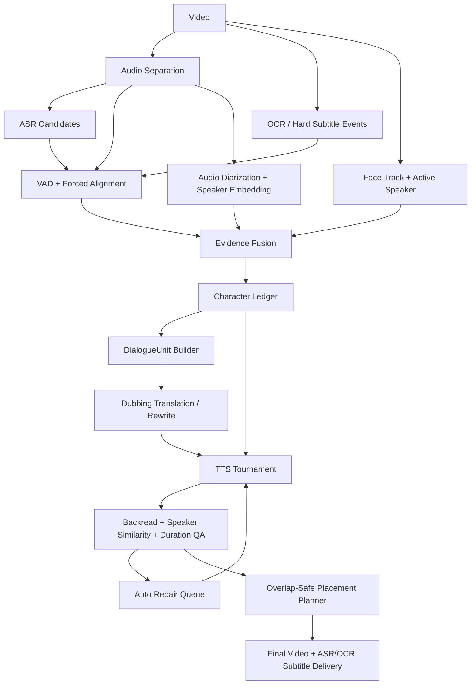

# 电视剧/电影配音：角色账本、TTS/VC Tournament 与自动返修技术方案

> 日期：2026-04-30
> 测试样片：`/Users/masamiyui/OpenSoureProjects/Forks/video-voice-separate/test_video/我在迪拜等你.mp4`
> 目标：降低“字幕有但没声音”、降低男女/角色音色串台、提高角色级音色稳定性，并让每次全流程都能产出可直接试听的视频。

## 1. 结论

当前问题不是单纯“换一个 TTS 模型”能解决的。影视配音里，字幕、ASR、说话人聚类、画面角色和 TTS 参考音频都可能错；任意一环直接决定最终配音，都会放大错误。

本轮方案采用三层闭环：

1. **时间轴闭环**：ASR/OCR 只提供候选，最终字幕/配音时间必须经过人声活动、forced alignment、字幕窗口覆盖率检查。
2. **角色闭环**：把 `speaker_id` 升级为 `character_id`，用音频 diarization、声纹、脸轨/主动说话人、台词线索共同决定配音音色。
3. **生成闭环**：TTS 不再“一次生成即上线”，而是 `backend x reference x rewrite x style` 多候选 tournament，失败段自动返修，Task E 只消费通过质量门的候选；无法通过的段落进入人工 review。

## 2. 当前链路的关键缺陷

### 2.1 字幕有但没有声音

已观察到的原因：

- ASR segment 时间窗过长，字幕文本出现在静音/空镜段。
- OCR 校正文案后，仍沿用粗 ASR 时间窗，没有重新 forced align 到人声。
- Task E 当前遇到 overlap 会跳过较弱片段，导致某些字幕窗口 `subtitle_coverage_ratio=0`。
- Task D 失败段虽有音频文件，但 `overall_status=failed` 的段在 overlap 竞争中更容易被替换。
- OCR-only/字幕补齐段只进入字幕，不一定进入 TTS 配音单元。

短期要先修 Task E：**不能让有字幕窗口的段落因为 overlap 被静音丢掉**。如果两个短对白重叠，优先选择低增益叠放并记录 `placed_overlap`，而不是直接 `skipped_overlap`。

### 2.2 音色来源与人物识别关系

当前音色来源：

```text
Task A speaker_label
  -> Task B speaker profile / reference_clips
  -> speaker_id
  -> Task D reference_path
  -> TTS voice clone
```

因此音色和人物识别强相关。Task A/Task B 把两个真实角色聚成同一个 speaker，Task D 就只能用同一个参考音频生成同一种音色；如果参考音频里混入另一个角色，克隆会直接串台。

### 2.3 男声变女声、多人同音色

根因分三类：

- **speaker cluster 塌缩**：多个真实角色被合进同一个 `speaker_id`。
- **reference 污染**：参考片段含多人、背景音乐、电话声、旁白、低信噪比或错误文本。
- **TTS drift**：zero-shot TTS 对短句、强情绪、跨语言配音不稳定；同一个 reference 也可能生成性别/年龄偏移。

## 3. vNext 架构



## 4. 模块设计

### 4.1 Transcript Resolver

目标：解决“ASR 字幕有，但人没说话”。

输入：

- 原始 ASR。
- OCR/硬字幕事件。
- 分离人声轨上的 VAD/能量。
- 可选 forced alignment word timestamps。

输出：

- `dialogue_segments.corrected.json`
- 每段包含 `subtitle_window`、`dubbing_window`、`active_speech_ratio`、`timing_confidence`。

规则：

- ASR 负责“听到了什么”，不直接决定最终字幕时间。
- OCR 负责“屏幕文字是什么”，不直接决定配音音频。
- `active_speech_ratio < 0.35` 的长窗口标记为 `timing_untrusted`。
- 超长 ASR 段按 VAD/forced alignment 拆分，不允许直接作为 TTS 窗口。

推荐技术：

- WhisperX：成熟的 VAD cut/merge + forced alignment word timestamps，适合作为本地稳定基线。
- Qwen3-ASR / Qwen3-ForcedAligner：后续作为中文影视口语和方言增强路线。

### 4.2 Character Ledger

目标：把 `speaker_id` 升级为角色级 `character_id`。

数据结构：

```json
{
  "character_id": "char_0003",
  "display_name": "奶奶",
  "audio_speaker_ids": ["spk_0001", "spk_0003"],
  "face_track_ids": ["face_0012"],
  "gender_hint": "female",
  "age_hint": "elder",
  "reference_clips": [".../clip_0003.wav"],
  "voice_prompt_path": ".../voice_prompt.pt",
  "confidence": 0.86,
  "risk_flags": []
}
```

融合证据：

- 音频 diarization：pyannote/CAM++/现有 ECAPA embedding。
- 视觉主动说话人：脸轨、口型、可见性、镜头切换。
- 文本线索：称谓、人物名、说话习惯、上下文对话轮次。
- 人工修正：合并/拆分 speaker、锁定角色性别和参考音频。

硬规则：

- 同一个 `character_id` 全片复用稳定 voice prompt，不逐段漂移。
- 高置信角色参考音频必须是单人、清晰、3-12 秒、文本可信。
- `gender_hint` 与 TTS 回读声纹/音高特征强冲突时，不自动通过。

### 4.3 DialogueUnit Builder

目标：让翻译和 TTS 面向“配音单元”，而不是孤立 ASR 行。

合并规则：

- 同角色、间隔小于 0.8 秒、语义连续的短句合并。
- 称谓、语气词、半句优先并入相邻对白。
- 多人抢话保留 overlap 标记，不合并成同一句。
- 长 ASR 段按 forced alignment 和停顿重新切分。

输出：

```json
{
  "unit_id": "du_0042",
  "character_id": "char_0003",
  "source_segment_ids": ["seg-0073", "seg-0074"],
  "source_text": "早安。你怎么来了？",
  "dub_text_candidates": ["Morning. What brings you here?", "Morning. Why are you here?"],
  "start": 192.37,
  "end": 195.45,
  "overlap_policy": "allow_low_gain_layer"
}
```

### 4.4 TTS / VC Tournament

目标：减少不和谐、不像、男女串台。

候选生成：

```text
candidate = backend x reference_clip x rewrite_variant x style_prompt
score = intelligibility + speaker_similarity + duration_fit + gender_consistency + naturalness_proxy
```

短期后端：

- `moss-tts-nano-onnx`：快速基线和回归测试。
- `qwen3tts`：已有本地接入，支持 `icl/xvec` 两种 clone mode；`xvec` 内容更稳，`icl` 音色可能更像但更需要 backread gate。

中期候选：

- IndexTTS2：重点看 duration control、emotion/speaker disentanglement，适合影视配音。
- F5-TTS：flow matching + DiT，适合作为 zero-shot TTS 对照。
- CosyVoice2：自然度和流式合成强，适合多语言 TTS 候选。
- Seed-VC / OpenVoice：用于“两阶段方案”：先用稳定 TTS 说对内容，再用 VC 转到角色音色。

自动通过门槛：

- `text_similarity >= 0.75`，否则认为说错/漏词。
- `speaker_similarity >= 0.35` 进入 review，`>= 0.45` 自动通过。
- `0.55 <= duration_ratio <= 1.65` 最低可 review；超出则优先 rewrite，而不是强行压缩。
- gender/character 冲突的候选不能自动通过。

### 4.5 Auto Repair Queue

目标：让失败段闭环返修，而不是只写报告。

输入：

- Task D reports。
- Task E mix report。
- Character Ledger。
- Voice Bank。

失败分类：

- `missing_audio`：字幕窗口有文本但最终 dub voice 静音。
- `skipped_overlap`：被相邻段替换或跳过。
- `speaker_mismatch`：声纹低或角色性别冲突。
- `bad_backread`：回读文本低。
- `bad_duration`：过长/过短。
- `bad_reference`：参考音频评分低。

动作：

- `rewrite_for_dubbing`
- `switch_reference_audio`
- `switch_tts_backend`
- `merge_short_segments`
- `layer_overlap`
- `manual_review`

短期落地：

- Task D 后自动生成 `task-d/voice/repair-plan`。
- 对最高优先级失败段跑 `repair-run`。
- Task E 读取 `selected_segments.en.json`，优先使用通过质量门的返修音频。
- Task E overlap 由“跳过”改为“可控叠放”，避免字幕窗口静音。

### 4.6 Placement Planner

目标：最终混音不丢段。

规则：

- 小 overlap：优先压缩/裁尾。
- 字幕窗口内仍会被静音的短 overlap：允许 `placed_overlap`，低增益叠放。
- 大 overlap 且质量差：保留更高质量候选，低质量候选进入 repair。
- 每个 subtitle window 必须写出 `subtitle_coverage_ratio`。

## 5. 第一轮执行范围

本轮先做能直接收益的两件事：

1. **自动返修接入 Pipeline**：Task D 完成后，Task E 前自动 plan/run repair，并把 `selected_segments` 传给 Task E。
2. **Overlap-safe mixing**：有字幕窗口或短对白的 overlap 不再默认 skip，改为 `placed_overlap`，降低“字幕有但没声音”。

暂不在本轮直接切默认模型到 IndexTTS2/F5/CosyVoice2，因为需要独立安装、显存/速度评估和模型许可验证；但文档和接口按 tournament 设计，后续可接入。

## 6. 验收标准

对 Dubai 样片每次必须跑：

- Python 单元测试。
- 前端构建或相关测试。
- Playwright 创建完整任务，生成 ASR 字幕 + 配音成品。
- 检查 `task-e/voice/mix_report.en.json`：
  - `audible_coverage.failed_count` 下降。
  - `skipped_overlap` 下降。
  - `selected_segments_path` 被 Task E 消费。
  - 最终 `task-g/final-preview/final_preview.en.mp4` 存在且可播放。

## 7. 参考来源

- [IndexTTS official GitHub](https://github.com/index-tts/index-tts)
- [F5-TTS arXiv](https://arxiv.org/abs/2410.06885)
- [CosyVoice2 arXiv](https://arxiv.org/abs/2412.10117)
- [Seed-VC official GitHub](https://github.com/Plachtaa/seed-vc)
- [pyannote.audio official GitHub](https://github.com/pyannote/pyannote-audio)
- [AVA-ActiveSpeaker Google Research](https://research.google/pubs/ava-activespeaker-an-audio-visual-dataset-for-active-speaker-detection/)
- [WhisperX paper](https://www.robots.ox.ac.uk/~vgg/publications/2023/Bain23/bain23.pdf)
