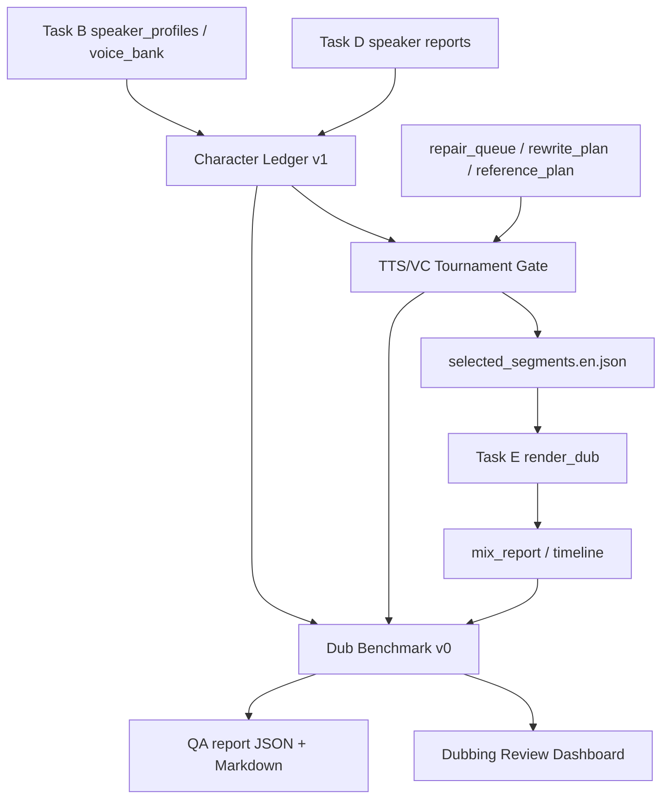

# 配音 Benchmark、角色账本与 TTS/VC Tournament 技术方案

> 日期：2026-04-30
> 测试样片：`/Users/masamiyui/OpenSoureProjects/Forks/video-voice-separate/test_video/我在迪拜等你.mp4`
> 目标：继续降低影视配音里“男角色变女声、多人同音色、音色漂移、候选不可比”的问题，并形成可持续评测闭环。

## 1. 总体判断

上一轮已经把 Dubai 样片的 `audible_coverage.failed_count` 从 8 降到 0，说明“字幕窗口有但没声音”已经阶段性解决。下一阶段的主矛盾变成角色一致性和音色选择：

- `speaker_id` 不是稳定角色身份，影视场景中容易被聚类、短句、离屏声和背景声污染。
- 单一 TTS backend 和单一 reference 不足以稳定解决音色像、文本对、时长准这三个目标。
- 没有固定 benchmark 时，换模型和改策略只能靠主观试听，无法持续判断收益。

因此下一步采用三件事并行落地：

1. **Benchmark v0 + QA Dashboard**：让每次流水线产出可比较的质量报告。
2. **Character Ledger v1**：把 speaker 级别信息整理成可审查的角色账本。
3. **TTS/VC Tournament v1**：让 repair 候选按 backend、reference、rewrite、voice consistency 做统一评分。

## 2. 架构



## 3. Benchmark v0 + QA Dashboard

### 3.1 输入

- `task-e/voice/mix_report.<lang>.json`
- `task-e/voice/timeline.<lang>.json`
- `task-d/voice/character-ledger/character_ledger.<lang>.json`
- `task-d/voice/repair-run/repair-run-manifest.json`
- `task-d/voice/repair-run/repair_attempts.<lang>.json`
- `task-d/voice/repair-run/selected_segments.<lang>.json`

### 3.2 输出

路径：

- `benchmark/voice/dub_benchmark.<lang>.json`
- `benchmark/voice/dub_benchmark_report.<lang>.md`
- `benchmark/voice/dub-benchmark-manifest.json`

核心指标：

| 类别 | 指标 |
| --- | --- |
| 覆盖 | `coverage_ratio`, `audible_failed_count`, `skipped_count`, `placed_overlap_count` |
| 角色 | `character_count`, `character_review_count`, `voice_mismatch_count`, `speaker_failed_ratio` |
| 候选 | `repair_attempt_count`, `repair_selected_count`, `manual_required_count`, `backend_attempt_counts` |
| 内容 | `failed_ratio`, `intelligibility_failed_ratio`, `duration_failed_count` |
| 总分 | `score_100`, `status=deliverable/review_required/blocked` |

### 3.3 质量门

- `blocked`：有字幕窗口无声，或 `coverage_ratio < 0.98`。
- `review_required`：角色音色/声纹/候选存在风险，但最终可试听。
- `deliverable_candidate`：覆盖通过，角色风险低，候选质量稳定。

### 3.4 Dashboard

先复用现有 `DubbingReviewDrawer`：

- 顶部显示 QA 状态、分数、覆盖失败数、角色风险数。
- 新增一个“质量总览”tab，展示 benchmark summary、角色风险、candidate 统计。
- 后续再独立拆出更完整的 benchmark 页面。

## 4. Character Ledger v1

### 4.1 设计目标

把 `speaker_id` 的中间产物升级为可审查的 `character_id`：

```json
{
  "character_id": "char_0001",
  "display_name": "SPEAKER_01",
  "speaker_ids": ["spk_0001"],
  "reference_path": ".../clip_0001.wav",
  "voice_signature": {
    "pitch_hz": 184.2,
    "pitch_class": "mid",
    "rms": 0.08
  },
  "stats": {
    "segment_count": 32,
    "speaker_failed_count": 5,
    "voice_mismatch_count": 3
  },
  "risk_flags": ["speaker_similarity_failed", "pitch_class_drift"],
  "review_status": "review"
}
```

### 4.2 v1 能力边界

本轮不做复杂人脸识别和主动说话人视觉模型，先做可本地稳定运行的角色账本：

- 一名 speaker 初始映射为一个 character。
- 从 Task B profile/reference 和 Task D generated audio 抽取声音签名。
- 用 pitch class、声纹失败率、reference 质量做风险标记。
- 输出角色级 JSON/Markdown，供 benchmark 和 review UI 使用。

### 4.3 声音签名

使用本地可解释的轻量估计：

- 读取 mono waveform。
- 分帧做 autocorrelation，估计 70-320Hz 的主基频。
- 输出 `pitch_hz`、`pitch_class=low/mid/high/unknown`、`rms`、`duration_sec`。

这不是完整性别识别模型，但对“男角色输出明显女声/高音色”这类粗错有价值。后续可替换成专门的 speaker/gender classifier。

## 5. TTS/VC Tournament v1

### 5.1 设计目标

把 repair 从“跑几个候选，按 speaker/text/duration 选”升级为：

```text
candidate = backend x reference x rewrite x clone_mode
score = text + duration + speaker_similarity + voice_consistency + backend_prior
```

### 5.2 本轮落地

在现有 `run_dub_repair` 内增加 tournament scoring：

- `RepairRunRequest.character_ledger_path`
- 每个 attempt 增加 `voice_consistency` 指标：
  - expected pitch class
  - generated pitch class
  - `passed/review/failed`
- `_select_attempt` 不选 `voice_consistency=failed` 的候选。
- `_attempt_score` 加入 voice consistency 权重。
- `selected_segments` 保留 voice consistency 字段，Task E/timeline 可追踪来源。

### 5.3 模型策略

短期：

- MOSS-TTS-Nano ONNX：快，适合作为 baseline。
- Qwen3TTS `icl/xvec`：保留为 tournament 候选，不直接全局替换。

中期：

- IndexTTS2：重点验证 duration control 和 emotion/speaker disentanglement。
- F5-TTS/F5R-TTS：作为 flow matching zero-shot 候选。
- CosyVoice2：作为自然度和多语言候选。
- Seed-VC/OpenVoice：做两阶段 TTS + VC，先保证文本，再转角色音色。

## 6. 流水线接入点

### 6.1 Task E 前

1. 读取 Task B profiles 与 Task D reports。
2. 生成 Character Ledger。
3. repair run 使用 Character Ledger 做 voice consistency gate。

### 6.2 Task E 后

1. 读取 mix report、timeline、ledger、repair manifest。
2. 生成 Benchmark JSON/Markdown。
3. Dubbing Review API 返回 `quality_benchmark` 与 `characters`。

## 7. 验收标准

对 Dubai 样片必须满足：

- Playwright 全流程生成 ASR 字幕 + 配音成品。
- `benchmark/voice/dub_benchmark.en.json` 存在。
- `task-d/voice/character-ledger/character_ledger.en.json` 存在。
- Dubbing Review API 返回 benchmark summary 和 characters。
- 不回退上一轮核心指标：`audible_coverage.failed_count` 必须保持 0。
- 如果 `speaker_failed_ratio` 仍高，报告必须明确标记为 `review_required`，不能假装自动交付。

## 8. 参考来源

- [IndexTTS2 arXiv](https://arxiv.org/abs/2506.21619)
- [IndexTTS project](https://github.com/index-tts/index-tts)
- [F5-TTS arXiv](https://arxiv.org/abs/2410.06885)
- [F5R-TTS arXiv](https://arxiv.org/abs/2504.02407)
- [CosyVoice2 arXiv](https://arxiv.org/abs/2412.10117)
- [Seed-VC GitHub](https://github.com/Plachtaa/seed-vc)
- [pyannote.audio GitHub](https://github.com/pyannote/pyannote-audio)
- [WhisperX paper](https://huggingface.co/papers/2303.00747)
- [AVA-ActiveSpeaker Google Research](https://research.google/pubs/ava-activespeaker-an-audio-visual-dataset-for-active-speaker-detection/)
