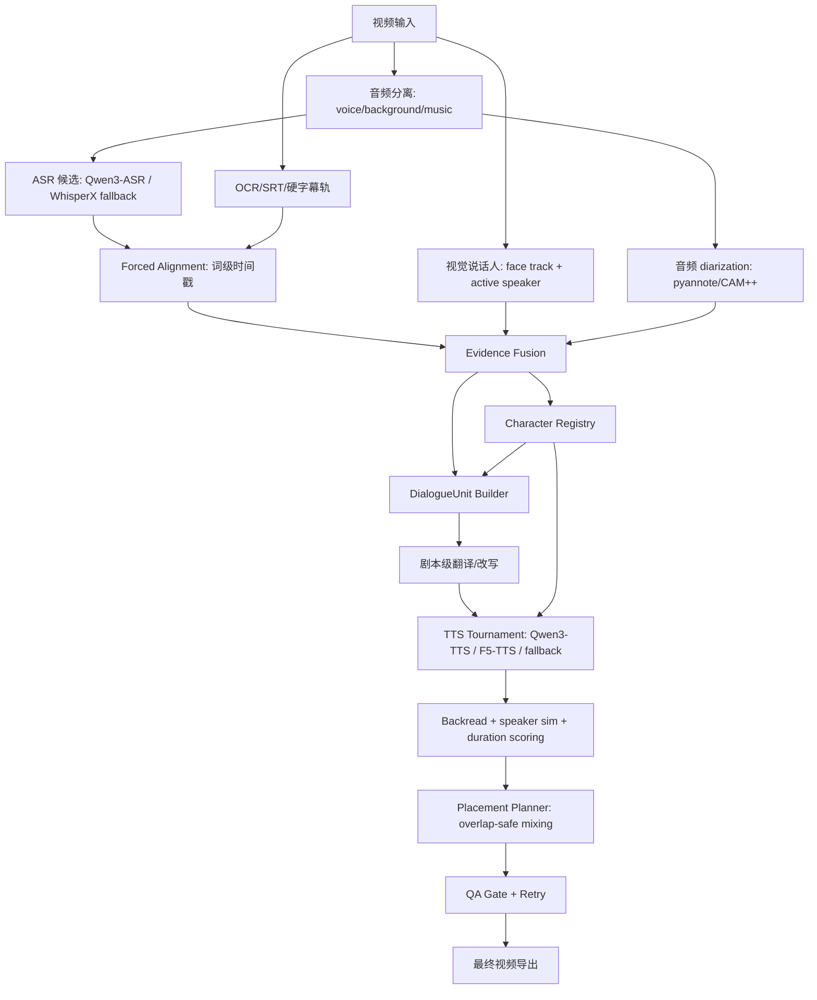

# 电影/电视剧配音 vNext 技术方案

> 日期：2026-04-30  
> 目标场景：中文电影/电视剧/短剧片段自动英文配音  
> 当前问题来源：`task-20260429-165133`、`tmp/dubai-rerun-v3`、`tmp/dubai-srt-v2`、`tmp/dubai-vnext-windowed`

## 1. 背景与结论

电影/电视剧配音不能把“ASR segment + speaker diarization + 单 TTS 后端”直接当成最终链路。这个场景里有硬字幕、背景音乐、电话声、旁白、多人抢话、反打镜头、离屏说话、短促语气词和角色名。当前系统的问题不是某一个模型差，而是数据结构不对：ASR segment、SRT 行、说话人聚类和 TTS 生成片段都不是稳定的“配音单元”。

新方案的核心是把管线改成 **多证据对齐 + 角色注册表 + DialogueUnit + 多候选 TTS tournament + 质量门控回退**。任何单一来源都不能直接控制最终视频：ASR、OCR/SRT、音频说话人、视觉说话人、TTS 候选都必须进入统一评分器。

## 2. 已定位的问题

### 2.1 ASR 字幕存在但人没说话

在 `task-20260429-165133` 中，最终导出使用了 `subtitle_source=asr`。ASR 时间轴里有很多长窗口只包含少量真实人声：

| segment | 时间 | 时长 | 活跃人声占比 | 文本 |
| --- | --- | ---: | ---: | --- |
| `seg-0018` | 37.22-70.74 | 33.5s | 23% | 是世界上最大的迪拜 |
| `seg-0075` | 197.55-217.40 | 19.8s | 18% | 早安 |
| `seg-0088` | 257.69-270.38 | 12.7s | 11% | 我现在在迪拜天地酒店 |
| `seg-0084` | 242.75-251.69 | 8.9s | 8% | 一会儿带你去吃 |

根因：

- Whisper small + VAD 只能给粗 segment，不能保证影视字幕级边界。
- OCR/SRT correction 会修正文案，但如果不做 forced alignment，会继续沿用坏窗口。
- 预览字幕使用 ASR source，字幕会覆盖静音区。
- 影视剧中常有短对白 + 长空镜/反应镜头，ASR 容易把上下文粘在一起。

### 2.2 配音音色来源与人物识别

当前音色来源是 Task B 从分离人声中截取的参考音频：

```text
Task A speaker_label
  -> Task B speaker profile / reference_clips/profile_xxxx/clip_xxxx.wav
  -> speaker_id
  -> Task D reference_path
  -> TTS voice clone
```

所以音色和语音转写里的说话人识别强相关。Task A 分错人，Task B 的参考音频就会混入其他角色，Task D 会克隆错误或混杂音色。

### 2.3 不同人说话但音色一样

`task-20260429-165133` 的说话人聚类明显塌缩：

- `SPEAKER_03`: 90 段
- `SPEAKER_01`: 62 段
- 其他 speaker 很少，部分只有 1 段

这说明大量真实角色被压进少数 speaker cluster。后面 TTS 再强，也只能复用同一个 `speaker_id` 的 reference。并且本次任务使用 `moss-tts-nano-onnx`，Task E 统计里 `speaker passed=5`、`speaker failed=59`、平均 `speaker_similarity=0.2861`，音色克隆本身也不够。

## 3. vNext 总体架构



## 4. 模块设计

### 4.1 Transcript Resolver

职责：解决“字幕有但人没说话”和错时间轴。

输入：

- ASR 文本和粗时间轴。
- OCR/SRT 文本和字幕时间轴。
- 分离人声短窗能量/VAD。

策略：

1. ASR 只负责“听到了什么”，不直接决定最终字幕/配音时间。
2. OCR/SRT 负责“屏幕上/剧本上应该是什么”，但不直接逐行 TTS。
3. Forced aligner 对最终文本重新对齐到人声轨，输出 word-level timing。
4. 若字幕窗口内人声活跃占比低于阈值，则标记为 `timing_untrusted`，禁止用它作为长配音窗口。

推荐模型：

- Qwen3-ASR 0.6B/1.7B + Qwen3-ForcedAligner。Qwen3-ASR 报告说明其支持 52 种语言/方言，Qwen3-ForcedAligner 支持 11 种语言文本-语音对齐，适合本地实验。
- WhisperX 作为 fallback，用于 word-level timestamps 和成熟的 forced alignment。

### 4.2 Character Registry

职责：把 `speaker_id` 升级成影视角色级 `character_id`。

数据结构：

```json
{
  "character_id": "char_grandma",
  "display_name": "奶奶",
  "audio_speaker_ids": ["spk_0001", "spk_0003"],
  "face_track_ids": ["face_0004"],
  "reference_clips": [".../clip_0001.wav"],
  "cloneable": true,
  "confidence": 0.86
}
```

融合证据：

- 音频 diarization：说话人嵌入、说话区间、重叠语音。
- 视觉 active speaker：脸轨、口型运动、镜头可见性。
- 剧本文本线索：称谓、角色名、说话习惯。
- 人工修正接口：允许把多个 speaker 合并/拆分为角色。

关键规则：

- 不能只按音频 speaker cluster 生成音色。
- 参考音频必须来自同一 `character_id` 的高置信片段。
- 如果一个 speaker cluster 混入多个角色，必须拆成多个 character candidate，不允许直接克隆。

### 4.3 DialogueUnit Builder

职责：把 ASR/SRT 行变成适合翻译和 TTS 的配音单元。

合并规则：

- 同 character、间隔小于 0.8s、语义连续时合并。
- 极短句、称谓、语气词默认向前/向后合并。
- 多人抢话不能合并；保留 overlap 标记。
- 长 ASR 段按 forced alignment 和停顿重新切分。

输出示例：

```json
{
  "unit_id": "du_0008",
  "character_id": "char_lele",
  "source_segment_ids": ["srt-0001", "srt-0002", "seg-0001"],
  "source_text": "乐乐，你在哪呢？奶奶你知道哈利法塔吗？",
  "start": 16.52,
  "end": 20.98,
  "mode": "dialogue",
  "risk_flags": []
}
```

### 4.4 Translation / Adaptation

职责：影视口语化翻译，不是逐句机器翻译。

规则：

- unit-level 翻译，保留上下文。
- 人名、地名、称谓进入 glossary：`乐乐` 不得翻成 `pleasure`，`小丽` 不得随意变成 `Little Lily`。
- 输出 `literal_translation`、`dub_text`、`short_dub_text` 三个候选。
- 估算英文 TTS 时长，超预算时先改写文本，不能只靠压缩音频。

### 4.5 TTS Tournament

职责：解决音色不稳定和同音色问题。

候选后端：

- Qwen3-TTS voice clone：支持 reference audio + transcript，并支持缓存 reusable voice clone prompt。本地已验证两种模式：
  - `icl`：音色可能更像，但内容稳定性不足，必须经过 backread gate。
  - `xvec`：内容更稳，音色依赖 reference 质量；当前通过 `QWEN_TTS_CLONE_MODE=xvec` 启用。
- F5-TTS：作为第二候选，适合 zero-shot voice cloning 对照。
- MOSS-TTS-Nano：只作为快速预览 fallback，不作为电影级默认。

每个 DialogueUnit 生成多候选：

```text
candidate = backend x reference_clip x rewrite_variant
score = speaker_similarity + backread_text_similarity + duration_fit + naturalness_penalty
```

保留规则：

- `speaker_similarity < 0.35`：不允许自动通过。
- `backread_text_similarity < 0.75`：不允许自动通过。
- `duration_ratio > 1.35`：优先重写文本，不直接硬压缩。
- 同 character 全片必须复用同一个 voice prompt，减少漂移。
- 参考音频默认不能只取排序第一条；高质量模式使用 `TRANSLIP_REFERENCE_TOURNAMENT=1`，至少试 3 条 reference 再择优。

### 4.6 Placement Planner

职责：避免配音丢失和 overlap skip。

规则：

- DialogueUnit 内部允许局部 overlap、ducking 和微调。
- 不再因为相邻 segment overlap 直接 skip。
- 对短语气词可选择合并、静音保留、低音量叠加或跳过。
- 最终输出 `placement_plan.json`，每个 unit 都有可解释状态。

### 4.7 QA Gate

每次导出前必须生成报告：

- ASR/SRT 窗口可听覆盖。
- active speech ratio 异常长窗口。
- character/speaker 映射置信度。
- TTS speaker similarity / backread similarity。
- subtitle/audio mismatch。
- skipped/failed segment 明细。

## 5. 本地执行分阶段

### Phase 0：Movie-safe Export

立即落地，不等大模型下载：

- 不再用 `subtitle_source=asr` 导出预览。
- 用当前最佳 `tmp/dubai-vnext-windowed` 作为 Dubai 临时交付版本。
- 对 `task-20260429-165133` 生成问题报告，明确 ASR 空字幕和 MOSS 音色失败。

### Phase 1：DialogueUnit v1

- 基于 SRT/OCR + ASR + VAD 构建 DialogueUnit。
- 先不重跑 TTS，只验证时间轴和字幕覆盖。

### Phase 2：TTS Tournament v1

- Qwen3-TTS 作为默认 clone 后端。
- MOSS 仅 fallback。
- 对主角色批量生成，并缓存 voice prompt。

### Phase 3：Character Registry v1

- 引入人脸轨迹和 active speaker。
- 支持人工把错误 speaker 合并/拆分。

### Phase 4：全链路自动 retry

- 低分 unit 自动重写、换参考音频、换 TTS 后端。
- 达不到门槛时不导出“成功”状态。

## 6. 参考资料

- Qwen3-ASR Technical Report: https://arxiv.org/abs/2601.21337
- Qwen3-TTS Technical Report: https://arxiv.org/abs/2601.15621
- Qwen3-TTS official repo: https://github.com/QwenLM/Qwen3-TTS
- pyannote speaker diarization 3.1: https://huggingface.co/pyannote/speaker-diarization-3.1
- WhisperX: https://arxiv.org/abs/2303.00747
