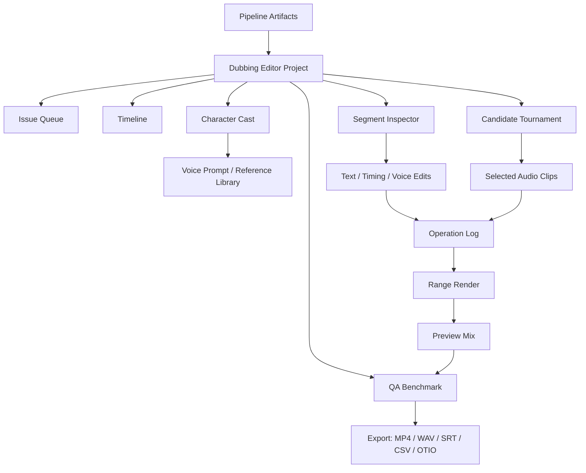
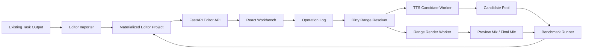

# 专业影视配音编辑台：产品、技术与 UI 设计方案

> 日期：2026-04-30
> 当前基线：`task-20260430-083427` 已能完整生成 ASR 字幕 + 配音成片，但 Benchmark 仍为 `review_required`
> 目标：在自动配音流水线之后，提供一个面向电视剧/电影场景的专业配音编辑台，让配音导演、审听、后期编辑能够把 AI 生成结果收敛到可交付质量。

## 1. 结论

当前系统不应该继续只靠“小修小改”或单纯更换 TTS 模型来追求自动完美。上一轮 Dubai 样片已经证明：

- “字幕有但无声”的硬阻断可以被工程质量门压住：`audible_failed_count=0`、`coverage_ratio=1.0`。
- 角色/音色问题仍然存在：Benchmark `score=54.84`，状态是 `review_required`，主要原因包括 `speaker_similarity_failed`、`character_voice_review_required`、`repair_manual_required`。
- 自动返修候选在综合文本、时长、声纹指标上没有达到自动替换标准：`manual_required_count=12`、`selected_count=0`。

因此下一阶段最有收益的方向是 **AI 自动生成 + 专业配音编辑台 + Benchmark 闭环**。模型仍要持续升级，但最终交付质量需要把人物、音色、台词、时间轴和局部重渲染变成人能高效控制的工作台。

## 2. 参考调研

### 2.1 商业产品参考

| 产品 | 可借鉴点 | 对本项目的启发 |
| --- | --- | --- |
| ElevenLabs Dubbing Studio | 提供可编辑 transcript/translation、speaker card、timeline、clip length 调整、单段 regenerate、split/merge、reassign speaker、track/clip 级 voice setting、clip history、Manual Dub CSV、AAF/SRT/CSV 等导出。 | 专业配音编辑必须有“角色轨道 + 片段卡片 + 时间轴 + 候选历史 + 导出”的统一工作台。音色设置要支持角色级默认和片段级覆盖。 |
| Rask AI | 支持手动改 transcript、timestamp、speaker、speaker voice，并且只对修改/新增片段计入 redub。 | 需要把“局部返修/局部计费/局部重渲染”作为核心能力，不能每次全量跑完整流水线。 |
| HeyGen Proofread | 翻译视频后进入 proofread，用户可编辑脚本、替换 voice、创建 voice clone、下载脚本/SRT，并可启用 dynamic duration/lip sync。 | 影视配音需要“先审稿、再生成、再审听”的分段审核，不应把生成结果直接视为最终结果。 |
| Descript | 以 transcript 作为媒体编辑入口，speaker label 与 AI Speaker 绑定，Regenerate 可替换/修复片段，AI speech 转普通 audio 后可进行 timeline 编辑。 | 文本编辑与音频时间线必须双向联动；AI 片段一旦进入精修阶段，应转换成可剪辑、可淡入淡出、可定位的音频 clip。 |

### 2.2 开源/专业工具参考

| 工具 | 可借鉴点 | 对本项目的启发 |
| --- | --- | --- |
| Aegisub | 成熟的字幕 timing 工作流，音频 waveform/spectrum、start/end marker、lead-in/lead-out、快捷键、逐行 commit。 | 配音编辑台要继承字幕/配音行业的“波形 + 时间轴 + 快捷键 + 当前行循环播放”工作习惯。 |
| Subtitle Edit | 免费开源字幕编辑器，支持 300+ 格式、Whisper STT、TTS、OCR、waveform/spectrogram、visual sync、point sync。 | 字幕、ASR、TTS、OCR、同步工具需要放在同一个生产界面，而不是分散成多个 pipeline artifact。 |
| Adobe Audition | 波形、频谱、多轨编辑和音频修复是专业音频工作流的基本形态。 | 对“噪声、爆音、无声、音量异常、口水音”等问题，必须能通过波形/频谱证据定位，不能只显示 JSON 指标。 |
| wavesurfer.js | Web 端 waveform、regions、timeline、record、spectrogram 插件成熟；官方也提示大文件需要预计算 peaks。 | MVP 可用 wavesurfer.js 快速落地波形和 region，长视频必须后端生成 peaks JSON，避免浏览器解码大音频卡死。 |
| OpenTimelineIO | 提供 timeline/track/clip/schema/adapters，用于和专业剪辑后期流程互通。 | 后续导出不应只给 MP4/SRT，还要支持 OTIO/AAF/CSV/分轨音频，方便进入专业后期软件。 |

## 3. 产品定位

### 3.1 一句话定位

专业配音编辑台是自动配音流水线之后的 **人工可控收敛层**：它把 ASR、OCR、角色账本、TTS 候选、Benchmark 问题和最终视频时间轴放到一个界面里，让专业人员用最短路径修正错误人物、错误音色、无声片段、错时和不自然配音。

### 3.2 目标用户

| 用户 | 关注点 | 核心操作 |
| --- | --- | --- |
| 配音导演/审听 | 角色是否对、音色是否稳定、情绪是否合适、是否可交付 | 审听问题队列、锁定角色音色、批准/退回片段 |
| 配音编辑/后期 | 时间轴、音量、节奏、重叠对白、局部重渲染 | 拖动 clip、剪切/合并、淡入淡出、局部导出 |
| 翻译/本地化编辑 | 文本准确性、口语化、角色口吻、字幕长度 | 修改原文/译文、控制时长、标注发音 |
| AI 流水线工程师 | 模型效果、失败原因、Benchmark 趋势 | 查看候选评分、回溯模型/参考音频、跑局部 benchmark |
| 客户/制片方审片 | 快速确认问题点和交付版本 | 播放审片版、评论、导出问题清单 |

### 3.3 核心原则

1. **人物优先于 speaker**：`speaker_id` 是算法中间结果，专业界面必须呈现 `character_id`、角色名、性别/年龄提示、参考音频和锁定状态。
2. **自动化给建议，人做最终锁定**：自动 pipeline 可以生成候选、排序和告警，但角色归属、最终音色、关键台词要能被人锁定。
3. **所有错误都可定位到时间轴**：任何 Benchmark 问题必须能一键跳到视频时间、对白 unit、角色、候选音频。
4. **局部改、局部听、局部渲染**：修改一个片段不应该重新跑全片；要支持 range render 和 changed segments render。
5. **可回滚、可比较、可审计**：每次文本、音色、时间、候选选择都进入 operation log，支持 A/B/C 候选试听和恢复。
6. **专业工具密度，不做营销页**：第一屏就是工作台，不做 hero page；界面要高信息密度、低装饰、适合反复审听。

## 4. 中国电视剧/电影场景的特殊需求

### 4.1 内容特征

- 对白密集，短句、抢话、插话、离屏声很多。
- 角色关系强，称谓、语气词和身份线索对人物判断非常重要，例如“妈”“姐”“老板”“师傅”“奶奶”。
- 一些片段有硬字幕，ASR/OCR 可能相互冲突。
- 背景音乐、环境声、混响、电话声、旁白会污染 voice clone reference。
- 中英配音时长差异明显，英文需要压缩表达或动态时长，不然会导致语速异常。
- 剧情片对情绪、年龄、性别、社会身份的音色一致性要求高，单纯文本正确不够。

### 4.2 当前痛点到功能映射

| 当前问题 | 编辑台功能 |
| --- | --- |
| ASR 字幕有，但实际没人说话 | 时间轴显示 VAD/原声波形/生成音频波形；问题队列标记 `silent_with_subtitle`；支持“改时间窗 / 仅保留字幕 / 生成旁白 / 删除配音单元”。 |
| 男角色变女声 | Character Ledger 显示角色性别/音高/参考音频；候选生成前做角色 voice lock；生成后做 gender/pitch/speaker similarity gate；错误片段进入 `voice_gender_mismatch` 队列。 |
| 不同说话人同音色 | 角色 casting 面板支持 split speaker、merge speaker、reassign segment、给不同角色绑定不同 voice prompt。 |
| 音色不像、不和谐 | TTS Candidate Tournament 支持多模型、多 reference、多 style、人工试听选择；低分候选不自动替换。 |
| 局部修完需要全量重跑 | Edit Operation Log 记录脏片段；Render Worker 只重生成受影响 dialogue unit 和附近 crossfade 范围。 |
| 审听结论无法沉淀 | 每段有 `approved / needs_repair / locked / ignored` 状态；Benchmark 和人工决策写入同一项目快照。 |

## 5. 信息架构



### 5.1 一级页面

新增独立路由：

```text
/tasks/:id/dubbing-editor
```

任务详情页只保留入口和质量摘要：

- “打开专业配音编辑台”
- Benchmark 状态
- 风险角色数
- 人工返修段数
- 最近编辑版本

### 5.2 工作台视图

| 视图 | 用途 |
| --- | --- |
| `Review Queue` | 按问题严重度审听，最适合快速修前 20% 高风险问题。 |
| `Timeline` | 精修时间、重叠、clip、音量、淡入淡出。 |
| `Character Cast` | 处理人物识别、speaker 合并/拆分、角色音色、reference。 |
| `Candidates` | 多模型候选试听、评分、选择、回滚。 |
| `Benchmark` | 对比自动结果、当前编辑结果、历史版本。 |
| `Export` | 输出成片、审片版、分轨、字幕、编辑交换格式。 |

## 6. UI 设计方案

### 6.1 总体布局

桌面端是主目标，建议最低有效宽度 1440px；窄屏只保证审听和轻编辑，不承担完整多轨后期。

```text
┌──────────────────────────────────────────────────────────────────────────────┐
│ Top Bar: Task / Version / Benchmark / Save / Run QA / Render Range / Export │
├───────────────┬───────────────────────────────────────────┬──────────────────┤
│ Issue Queue   │ Video Preview + Transcript Strip          │ Inspector        │
│ Filters       │                                           │ Segment / Cast   │
│ Character     ├───────────────────────────────────────────┤ Candidates       │
│ Risk Groups   │ Timeline Tracks                            │ Metrics / Notes  │
│               │  - original dialogue waveform              │                  │
│               │  - generated dub waveform                  │                  │
│               │  - background/music                        │                  │
│               │  - subtitles / dialogue units              │                  │
└───────────────┴───────────────────────────────────────────┴──────────────────┘
```

推荐尺寸：

| 区域 | 宽高建议 | 设计要点 |
| --- | --- | --- |
| Top Bar | 高 52px | 显示版本、脏状态、QA 分数、主操作按钮。 |
| 左侧 Issue Queue | 300-340px | 以问题队列为核心，不做冗长说明；支持过滤、排序、角色分组。 |
| 中央视频区 | 高 280-360px | 视频预览、当前字幕、原文/译文、A/B 音轨切换。 |
| 中央 Timeline | 剩余高度 | 多轨波形、region、clip handles、speaker color、问题 marker。 |
| 右侧 Inspector | 360-440px | 当前片段/角色/候选的所有可编辑属性。 |

### 6.2 顶部栏

元素：

- 任务名与目标语言。
- 版本选择：`Auto v1`、`Edit v3`、`Approved cut`。
- Benchmark badge：`Blocked / Review Required / Deliverable Candidate / Approved`。
- 保存状态：`Saved / Unsaved / Rendering / Conflict`。
- 主按钮：
  - `Run QA`
  - `Render Range`
  - `Render Changed`
  - `Export`
  - `Open Final Preview`

设计要求：

- 颜色使用克制的状态色：红色表示阻断，橙色表示待审，绿色表示已批准，蓝色表示正在生成。
- 顶部栏不放说明性长文案，所有复杂说明进入 tooltip 或右侧 Inspector。

### 6.3 左侧 Issue Queue

问题类型：

| 类型 | 严重级别 | 一键操作 |
| --- | --- | --- |
| `silent_with_subtitle` | P0 | 跳转、试听原声、重定时、标记非对白、生成配音 |
| `voice_gender_mismatch` | P0 | 打开角色 casting、换 reference、重生候选 |
| `wrong_character` | P0 | reassign character、split speaker、merge character |
| `speaker_similarity_failed` | P1 | 查看 reference、试听候选、锁定角色 voice |
| `duration_overrun` | P1 | 缩写译文、dynamic generation、time stretch |
| `overlap_conflict` | P1 | 调整增益、允许低增益叠放、移动 clip |
| `translation_untrusted` | P2 | 打开文本编辑、添加术语、重译 |
| `pronunciation_issue` | P2 | phoneme hint、重生候选、手动录音 |

队列条目结构：

```text
[P0] 00:03:18.240  spk_0002 -> char_母亲
男声/女声冲突 · 2 个候选失败 · 当前使用 moss.nano
```

过滤器：

- 严重级别：P0/P1/P2。
- 状态：未处理、已修、已批准、已忽略。
- 角色：按 `character_id`。
- 来源：Benchmark、人工评论、模型回读、时间轴规则。
- 时间范围：当前镜头、当前 5 分钟、全片。

### 6.4 中央视频与字幕带

功能：

- 原视频播放。
- 原声/配音/混音/候选音轨 A/B/C 切换。
- 当前 dialogue unit 高亮。
- 显示源语言、目标语言和当前角色。
- 可选择“只循环当前段”“前后各 500ms”“从上一个镜头开始”。

播放控制：

- `Space` 播放/暂停。
- `J/K/L` 后退/暂停/前进。
- `I/O` 标记入点/出点。
- `Shift + Space` 循环当前片段。
- `A/B` 切换自动版与编辑版。

### 6.5 Timeline

轨道设计：

| 轨道 | 内容 | 交互 |
| --- | --- | --- |
| Video Keyframes | 镜头切点、当前帧、可选人脸轨 | 点击跳转、吸附 start/end。 |
| Original Dialogue | 分离人声波形、VAD、ASR word boundary | 作为 timing 证据，不可直接改写。 |
| Generated Dub | 当前配音 clip 波形 | 拖动、裁剪、淡入淡出、mute、solo、candidate replace。 |
| Background/Music | 背景音轨、ducking envelope | 调整 ducking、查看遮蔽风险。 |
| Subtitles | 源字幕、目标字幕、OCR/ASR 来源 | 改 timing、合并/拆分、标记非对白。 |
| Issue Markers | Benchmark 和人工评论 | 点击定位到问题队列。 |

交互：

- region 左右 handle 调整 start/end。
- 拖动 clip 到其他角色轨道即 reassign character。
- 选中多个相邻 clip 可 merge。
- 在 playhead 处 split。
- clip 上显示状态角标：`stale`、`needs QA`、`locked`、`manual audio`。
- 所有拖动默认吸附：VAD 边界、字幕边界、镜头切点、相邻 clip。
- 对于重叠对白，允许生成 parallel layer，不再为了避免 overlap 直接丢段。

性能策略：

- 不让浏览器解码整部视频的人声音轨。
- 后端为每条长音频生成 peaks JSON，前端只加载当前 viewport 附近的 peaks。
- 片段列表和 region 采用虚拟滚动。
- MVP 可用 wavesurfer.js `Regions` + `Timeline` 插件；如果 60 分钟电视剧时间轴性能不足，再升级自研 Canvas/WebGL timeline。

### 6.6 右侧 Inspector

右侧面板根据选择对象切换。

#### Segment Inspector

字段：

- `unit_id`
- `character_id`
- `speaker_id`
- start/end/duration。
- source text、target text。
- text length、estimated speech duration、duration fit。
- current audio path、model、reference、candidate id。
- quality metrics：speaker similarity、gender consistency、text backread similarity、LUFS、clip peak、overlap risk。
- 状态：`needs_review / repaired / approved / locked / ignored`。

操作：

- 修改译文。
- 缩短/扩写为配音稿。
- 选择 generation mode：`fixed duration / dynamic duration / natural then fit`。
- 选择 voice：继承角色、片段覆盖、人工上传、现场录音。
- 生成候选。
- 批准当前候选。
- 标记“这不是对白，只保留字幕”。

#### Character Inspector

字段：

- 角色名、别名、演员/人物描述。
- `speaker_ids` 和 `face_track_ids`。
- 性别、年龄段、口音、情绪风格。
- 当前 voice prompt/reference。
- reference 候选列表：SNR、单人置信度、时长、文本可信度、是否锁定。
- 角色问题统计：错配数、speaker failed ratio、人工退回数。

操作：

- 合并角色。
- 拆分 speaker。
- 把当前片段移动到另一个角色。
- 锁定角色 voice。
- 为全角色批量重生候选。
- 上传/录制专业配音参考。

#### Candidate Inspector

每个候选卡片显示：

```text
Candidate 3
backend: qwen3tts_icl
reference: char_0002_ref_03.wav
mode: dynamic duration
score: 0.82
duration: 2.41s / target 2.50s
speaker similarity: pass
gender consistency: pass
backread text: pass
```

操作：

- 试听候选。
- 与当前版本 A/B。
- 选择为当前 clip。
- 加入角色默认候选策略。
- 标记为失败并选择原因。

### 6.7 Character Cast 视图

这是解决“男的发女声、多人同音色”的主入口。

表格列：

| 列 | 内容 |
| --- | --- |
| Character | 角色名、颜色、锁定状态 |
| Evidence | speaker ids、face tracks、文本线索、置信度 |
| Voice | 当前 voice prompt、reference、model preference |
| Risk | gender mismatch、speaker failed、reference polluted |
| Actions | split、merge、rename、lock voice、regenerate character |

角色详情里需要一个“证据时间轴”：

- 哪些片段被算法分给该角色。
- 哪些片段可能属于另一个角色。
- 哪些 reference 被用作克隆源。
- 当前角色所有高风险片段分布。

关键能力：

- `speaker_id` 可以拆成多个 `character_id`。
- 多个 `speaker_id` 可以合并为一个 `character_id`。
- 单个片段可以 override 到另一个角色。
- 角色 voice lock 之后，后续自动生成不得随意换 reference。

### 6.8 Benchmark / Compare 视图

对比维度：

| 维度 | Auto Baseline | Current Edit | Delta |
| --- | --- | --- | --- |
| audible coverage | 1.0 | 1.0 | 保持 |
| P0 issue count | 例如 4 | 0 | 改善 |
| speaker similarity failed | 例如 40 | 18 | 改善 |
| manual required | 12 | 3 | 改善 |
| approved segments | 0 | 160 | 增加 |
| locked characters | 0 | 8 | 增加 |

视觉设计：

- 上方显示总览分数和状态。
- 中间显示问题趋势。
- 下方显示“还不能交付的原因”，每条可跳转。
- 支持 A/B 播放自动版和当前编辑版。

## 7. 技术架构

### 7.1 总体架构



设计取舍：

- **不直接改 pipeline 原始 artifact**：编辑台读入现有产物，生成独立 editor project。
- **append-only operation log**：用户所有操作记录为 operation，后端 materialize 成当前视图。
- **局部渲染优先**：只有导出时才全量 render，平时只 render changed range。
- **保留现有 FastAPI + React/Vite 技术栈**：本地运行成本最低；时间轴和音频预览引入专用组件。

### 7.2 后端模块

新增 Python 包：

```text
src/translip/dubbing_editor/
  importer.py
  project.py
  operations.py
  materializer.py
  waveform.py
  candidate_worker.py
  range_renderer.py
  benchmark_adapter.py
  export.py

src/translip/server/routes/dubbing_editor.py
```

职责：

| 模块 | 职责 |
| --- | --- |
| `importer.py` | 从 Task A/B/C/D/E/G artifact 构建 editor project 初始快照。 |
| `project.py` | 定义 project、character、dialogue unit、clip、candidate、issue schema。 |
| `operations.py` | 定义 edit operation 和校验逻辑。 |
| `materializer.py` | 从初始快照 + operations 生成当前可读状态。 |
| `waveform.py` | 生成和缓存 waveform peaks、VAD segments、spectrogram proxy。 |
| `candidate_worker.py` | 调用现有 TTS/VC backends，为指定 unit 生成候选。 |
| `range_renderer.py` | 局部渲染音频 range，应用 clip、gain、fade、ducking。 |
| `benchmark_adapter.py` | 对当前编辑状态运行已有 Dub Benchmark。 |
| `export.py` | 导出 MP4/WAV/SRT/CSV/OTIO/分轨。 |

### 7.3 文件结构

每个任务输出目录新增：

```text
dubbing-editor/
  editor_project.json
  initial_snapshot.json
  operations.jsonl
  materialized.current.json
  waveform/
    original_dialogue.peaks.json
    generated_dub.peaks.json
    background.peaks.json
  candidates/
    {unit_id}/
      candidate_manifest.json
      cand_0001.wav
      cand_0002.wav
  previews/
    ranges/
      000180.000-000210.000.wav
    current_preview_mix.wav
  qa/
    benchmark.current.json
    benchmark.current.md
  exports/
    final_approved.en.mp4
    final_approved.en.wav
    subtitles.en.srt
    timeline.otio
```

### 7.4 核心数据模型

#### Editor Project

```json
{
  "task_id": "task-20260430-083427",
  "target_lang": "en",
  "source_video_path": ".../source.mp4",
  "frame_rate": 25,
  "duration_sec": 612.4,
  "current_version": "edit_v003",
  "baseline_artifacts": {
    "translation": "task-c/voice/translation.en.json",
    "timeline": "task-e/voice/timeline.en.json",
    "mix_report": "task-e/voice/mix_report.en.json",
    "benchmark": "benchmark/voice/dub_benchmark.en.json"
  }
}
```

#### Character

```json
{
  "character_id": "char_0002",
  "display_name": "母亲",
  "speaker_ids": ["spk_0002"],
  "gender_hint": "female",
  "age_hint": "middle",
  "accent_hint": "mandarin",
  "voice_lock": true,
  "default_voice": {
    "mode": "track_clone",
    "backend": "qwen3tts_icl",
    "reference_path": "task-b/voice/references/spk_0002_ref_03.wav"
  },
  "risk_flags": ["speaker_similarity_failed"],
  "review_status": "needs_review"
}
```

#### Dialogue Unit

```json
{
  "unit_id": "du_0042",
  "source_segment_ids": ["seg-0073", "seg-0074"],
  "character_id": "char_0002",
  "start": 192.37,
  "end": 195.45,
  "source_text": "你怎么来了？",
  "target_text": "What are you doing here?",
  "timing_confidence": 0.74,
  "active_speech_ratio": 0.82,
  "overlap_policy": "allow_low_gain_layer",
  "status": "needs_review",
  "issue_ids": ["issue_0017"]
}
```

#### Audio Clip

```json
{
  "clip_id": "clip_du_0042_current",
  "unit_id": "du_0042",
  "candidate_id": "cand_0042_0003",
  "track": "dub",
  "timeline_start": 192.37,
  "source_in": 0.0,
  "duration": 2.91,
  "gain_db": -1.5,
  "fade_in_ms": 20,
  "fade_out_ms": 40,
  "locked": false,
  "stale": false
}
```

#### Operation Log

```json
{
  "op_id": "op_20260430_0012",
  "type": "segment.assign_character",
  "target_id": "du_0042",
  "payload": {
    "from_character_id": "char_0004",
    "to_character_id": "char_0002"
  },
  "author": "local_user",
  "created_at": "2026-04-30T18:40:00+08:00"
}
```

操作类型：

| 类型 | 说明 |
| --- | --- |
| `segment.update_text` | 修改源文/译文/配音稿。 |
| `segment.update_timing` | 修改 start/end 或 dubbing window。 |
| `segment.assign_character` | 片段改角色。 |
| `segment.split` / `segment.merge` | 分裂/合并 dialogue unit。 |
| `character.rename` | 修改角色名。 |
| `character.merge` / `character.split` | 角色合并/拆分。 |
| `character.set_voice` | 设置角色默认 voice/reference/backend。 |
| `candidate.generate` | 生成候选。 |
| `candidate.select` | 选择候选为当前 clip。 |
| `audio.upload_manual` | 上传人工音频。 |
| `audio.record_take` | 浏览器录音。 |
| `clip.update_mix` | 改 gain/fade/ducking。 |
| `review.set_status` | 审批、退回、锁定、忽略。 |

### 7.5 API 设计

| Method | Path | 说明 |
| --- | --- | --- |
| `GET` | `/api/tasks/{task_id}/dubbing-editor` | 获取当前 materialized editor project。 |
| `POST` | `/api/tasks/{task_id}/dubbing-editor/import` | 从现有 artifact 初始化或重建 editor project。 |
| `GET` | `/api/tasks/{task_id}/dubbing-editor/waveforms/{track}` | 获取 peaks/VAD/region 数据。 |
| `POST` | `/api/tasks/{task_id}/dubbing-editor/operations` | 写入一个或多个 edit operations。 |
| `POST` | `/api/tasks/{task_id}/dubbing-editor/candidates` | 为指定 dialogue units 生成 TTS/VC 候选。 |
| `POST` | `/api/tasks/{task_id}/dubbing-editor/render-range` | 渲染当前 range 的预览混音。 |
| `POST` | `/api/tasks/{task_id}/dubbing-editor/benchmark` | 对当前编辑状态运行 Benchmark。 |
| `POST` | `/api/tasks/{task_id}/dubbing-editor/export` | 导出最终成片/音频/字幕/OTIO。 |
| `GET` | `/api/tasks/{task_id}/dubbing-editor/versions` | 查看版本和历史快照。 |

`operations` 示例：

```json
{
  "operations": [
    {
      "type": "segment.update_text",
      "target_id": "du_0042",
      "payload": {
        "target_text": "Why are you here?"
      }
    },
    {
      "type": "candidate.generate",
      "target_id": "du_0042",
      "payload": {
        "backend": "qwen3tts_icl",
        "mode": "dynamic_duration",
        "reference_policy": "character_locked"
      }
    }
  ]
}
```

### 7.6 前端技术选型

保持当前前端基线：

- React 19 + TypeScript。
- Vite。
- Tailwind CSS。
- React Query 管理服务端状态。
- Zustand 管理播放器、时间轴、选择态、热键等本地状态。
- lucide-react 作为操作按钮图标。

新增依赖建议：

| 依赖 | 用途 | 采用阶段 |
| --- | --- | --- |
| `wavesurfer.js` | waveform、regions、timeline、record 插件 | MVP |
| `@tanstack/react-virtual` | issue queue、segments、candidates 大列表虚拟化 | MVP |
| `use-resize-observer` 或自研 ResizeObserver hook | 复杂 panel 自适应布局 | MVP |
| `zod` | 前端 operation payload 校验 | 可选 |
| 自研 Canvas timeline | 长视频、多轨、复杂 clip 操作 | v2 |

前端目录：

```text
frontend/src/pages/DubbingEditorPage.tsx
frontend/src/api/dubbing-editor.ts
frontend/src/components/dubbing-editor/
  DubbingEditorShell.tsx
  EditorTopBar.tsx
  IssueQueue.tsx
  VideoPreviewPane.tsx
  TimelinePane.tsx
  SegmentInspector.tsx
  CharacterInspector.tsx
  CandidatePanel.tsx
  BenchmarkComparePanel.tsx
  ExportPanel.tsx
frontend/src/stores/dubbingEditorPlaybackStore.ts
frontend/src/stores/dubbingEditorSelectionStore.ts
```

### 7.7 音频与局部渲染

#### 预览策略

前端播放分三层：

1. 视频原始画面。
2. 当前配音预览音频。
3. 当前候选 clip 临时叠加音频。

为避免浏览器同步复杂度过高，MVP 可以采用：

- 视频静音播放。
- 后端生成 range preview mix WAV。
- 前端播放 range preview mix，与视频时间码同步 seek。
- 单个候选试听时只播放候选 WAV，不立即参与全片混音。

#### Range Render

输入：

- range start/end。
- 当前 materialized clips。
- background audio。
- generated dub clips。
- manual uploads。
- gain/fade/ducking 配置。

输出：

- `previews/ranges/{start}-{end}.wav`
- 可选 `previews/ranges/{start}-{end}.mp4`

规则：

- 修改片段前后各扩展 0.5-1.0 秒作为安全 crossfade range。
- 对重叠对白允许多层混音，但自动降低次要层增益。
- 所有生成音频写入 LUFS/peak 检测结果。
- 如果 clip 无音频但字幕存在，Range Render 必须失败并写入 `silent_with_subtitle`，不能静默跳过。

### 7.8 TTS/VC 候选策略

候选生成维度：

```text
candidate = backend x reference x text_variant x generation_mode x style_prompt
```

后端候选：

- 当前已有：MOSS-TTS-Nano、QwenTTS。
- 后续增强：IndexTTS2、CosyVoice2、F5-TTS/F5R-TTS、TTS + Seed-VC/OpenVoice 两阶段。

生成模式：

| 模式 | 用途 |
| --- | --- |
| `fixed_duration` | 强同步，适合口型/字幕窗口严格的短句，但可能语速异常。 |
| `dynamic_duration` | 自然优先，适合长句或旁白，但可能挤压下个 clip。 |
| `natural_then_fit` | 先自然生成，再做轻量 time-stretch，适合编辑台默认策略。 |
| `manual_audio` | 人工上传或录音，质量优先。 |

候选评分：

```text
score =
  0.25 * text_backread_similarity +
  0.20 * duration_fit +
  0.20 * speaker_similarity +
  0.15 * gender_or_pitch_consistency +
  0.10 * loudness_quality +
  0.10 * naturalness_proxy
```

硬门：

- `silent_audio` 必 fail。
- `gender_or_pitch_consistency=failed` 默认不自动入选。
- `text_backread_similarity < 0.75` 默认不自动入选。
- `duration_fit` 超过目标窗口 25% 且无法 time-stretch 时进入人工队列。
- 已锁定角色不得自动切换 reference。

### 7.9 Benchmark 接入

编辑台不替代 Benchmark，而是把 Benchmark 变成工作台的一等公民。

新增 Benchmark 输入：

- 当前 materialized editor timeline。
- 当前 selected candidates。
- 当前 manual audio。
- 当前 review status。
- 当前 character cast。

新增指标：

| 指标 | 说明 |
| --- | --- |
| `p0_issue_count` | 无声、人物错、男女错等阻断问题。 |
| `approved_segment_ratio` | 已人工批准片段比例。 |
| `locked_character_ratio` | 已锁定角色音色比例。 |
| `changed_segment_count` | 本次编辑改动数。 |
| `stale_clip_count` | 文本/时间/voice 改了但未重生的 clip 数。 |
| `range_render_passed` | 当前 range 是否可播放且无 silent。 |
| `export_blockers` | 最终导出阻断原因。 |

质量状态：

- `blocked`：有 P0 未解决，或 stale clip，或无声片段。
- `review_required`：没有 P0，但仍有 P1/P2 未审。
- `deliverable_candidate`：Benchmark 通过，人工批准率达到阈值。
- `approved`：配音导演或最终审听人锁定版本。

## 8. 权限、合规与版权

语音克隆必须显式处理授权问题：

- 每个 voice prompt/reference 要记录来源。
- 人工上传参考音频需要记录使用范围和授权备注。
- 角色 voice clone 的生成历史可追溯。
- 禁止把未授权真人声音保存为可复用全局 voice library。
- 导出报告里记录 AI voice 使用情况，便于制片/发行合规审查。

工程上：

- 默认 reference 只在当前 task/project 内复用。
- 如需跨项目复用，必须手动标记 `licensed_reusable=true`。
- 每个导出版本记录 voice lineage。

## 9. 实施路线图

### Phase 0：设计与数据探针

目标：不改渲染链路，先确认编辑台需要的数据都能从现有产物读到。

交付：

- Editor project schema。
- Importer 原型。
- 生成 `materialized.current.json`。
- 输出 issues、characters、dialogue units、clips 的统计。

验收：

- 能从 `task-20260430-083427` 产物导入。
- 每个 Benchmark issue 都能映射到 `unit_id` 和 timecode。

### Phase 1：只读专业工作台

目标：先解决“看不清、找不到、无法快速审听”的问题。

交付：

- `/tasks/:id/dubbing-editor` 路由。
- Top Bar、Issue Queue、Video Preview、Timeline、Inspector。
- waveform peaks API。
- 点击问题跳转并循环播放当前片段。

验收：

- 能打开 Dubai 样片完整时间轴。
- 能显示 original dialogue/dub/subtitle 三类轨道。
- 能按 P0/P1/P2 快速定位问题。

### Phase 2：文本、人物、音色编辑

目标：处理男声女声、同音色、文本不自然。

交付：

- operation log。
- 修改译文/配音稿。
- segment assign character。
- character rename/merge/split。
- character voice lock。
- candidate generate/select。

验收：

- 可以把错误角色的片段移动到正确角色。
- 可以锁定角色 voice 并批量重生该角色片段。
- 所有操作可刷新后恢复。

### Phase 3：局部渲染与 A/B 审听

目标：编辑一段就能立即听到成品上下文。

交付：

- Render Range API。
- Render Changed API。
- range preview mix。
- A/B 对比自动版和编辑版。
- stale clip 检测。

验收：

- 修改一个片段后，不跑全片即可生成 5-20 秒预览。
- 如果字幕有但音频为空，range render 必须失败并生成 P0 issue。

### Phase 4：人工录音/上传与专业导出

目标：让专业配音演员或编辑能接管最难片段。

交付：

- 浏览器录音。
- 上传人工配音 WAV。
- clip trim/fade/gain。
- 导出 MP4/WAV/SRT/CSV。
- 初版 OTIO。

验收：

- 一段 AI 无法修好的对白，可以上传人工音频并纳入最终混音。
- 导出文件可在本地播放器和后期工具中使用。

### Phase 5：协作与审片

目标：支持多人审听和客户反馈。

交付：

- 评论和批注。
- 片段 assign reviewer。
- 版本 diff。
- 审片导出链接。
- 批量 approve/lock。

验收：

- 配音导演能只看未批准片段。
- 客户反馈可以回到准确 timecode 和 dialogue unit。

## 10. 预期收益

### 10.1 对当前三类问题的收益

| 问题 | 现状 | 编辑台收益 |
| --- | --- | --- |
| ASR 字幕有但无声 | Benchmark 能发现，但修复路径分散。 | P0 队列一键定位；Range Render 强制拦截；可选择重定时/仅字幕/生成配音/人工上传。 |
| 音色不像、不和谐 | 当前模型候选很多会转人工，但人工没有高效工具选择和锁定。 | 候选试听、A/B、角色 voice lock、reference 管理、人工上传，能把模型失败转成可控返修。 |
| 男声变女声、多人同音色 | 由 speaker 聚类和 reference 污染引起，自动模型难以完全保证。 | Character Cast 让人直接拆/合角色、移动片段、绑定 voice，彻底打断错误 speaker 到错误音色的传导链。 |

### 10.2 量化目标

以 10-20 分钟电视剧片段为目标：

| 指标 | 当前 | Phase 3 目标 | Phase 5 目标 |
| --- | --- | --- | --- |
| 定位 P0 问题时间 | 依赖人工整片听 | 1 分钟内从队列定位 | 30 秒内定位并分配 |
| 单段返修验证周期 | 往往需要重跑 pipeline 或手工找文件 | 10-60 秒 range preview | 5-30 秒 range preview |
| 男/女声错配漏出率 | 依赖审听发现 | Benchmark + Character Cast 阻断大部分 | P0 必须归零后才能 approved |
| 多人同音色修复 | 手工理解 JSON/音频来源 | UI split/merge + voice lock | 可批量应用到整集 |
| 无声片段漏出 | 已由 Benchmark 阶段性压到 0 | 编辑态继续强门控 | 导出态强门控 |
| 最终交付状态 | `review_required` | `deliverable_candidate` | `approved` |

### 10.3 为什么收益大于继续只换模型

模型升级仍然必要，但影视配音的主要失败并不总是“生成模型不够强”：

- 人物识别错时，最强 TTS 也会生成错角色的声音。
- reference 被污染时，模型越像 reference，越会放大错误。
- ASR/OCR 时间窗错时，TTS 生成再自然也可能放在无人说话的片段。
- 多人抢话、离屏声、短句等影视场景，本来就需要人工判断剧情和画面上下文。

编辑台把这些问题从“黑盒自动失败”变成“可定位、可比较、可修复、可审计”的生产流程，收益会比继续小修 pipeline 更稳定。

## 11. 风险与应对

| 风险 | 影响 | 应对 |
| --- | --- | --- |
| 浏览器时间轴性能不足 | 长剧集卡顿 | 后端 peaks、虚拟列表、viewport 加载；必要时升级 Canvas/WebGL。 |
| operation log 和 materialized 状态不一致 | 编辑结果丢失或错乱 | 所有 operation 做 schema 校验；每次保存后 materialize；增加 snapshot 和回滚。 |
| 局部渲染和最终渲染不一致 | 审听通过但导出变差 | 预览和最终导出复用同一个 mixer/range renderer。 |
| 手动编辑绕过质量门 | 坏片段被导出 | Export 前必须跑 Benchmark；P0 blocker 不允许 approved export。 |
| 语音克隆版权风险 | 法务/交付风险 | voice lineage、授权字段、项目级 reference、不默认跨项目复用。 |
| UI 太复杂 | 非专业用户学习成本高 | 默认进入 Review Queue，专家再切 Timeline/Cast；所有高级面板可折叠。 |

## 12. MVP 验收清单

第一版专业配音编辑台做到以下程度就有明显收益：

- 能从现有任务产物导入 editor project。
- 能展示视频、原声波形、配音波形、字幕/对白 region。
- 能打开问题队列并一键跳转。
- 能修改 dialogue unit 的文本、时间、角色。
- 能对单段生成多个候选并试听。
- 能选择候选并局部渲染 range preview。
- 能锁定角色 voice，避免后续生成继续漂移。
- 能导出当前编辑版预览。
- 导出前强制运行 Benchmark，P0 问题未清零时不允许标记 approved。

## 13. 建议的第一轮执行计划

1. 新建后端 `dubbing_editor` schema/importer/materializer。
2. 新增 `/api/tasks/{task_id}/dubbing-editor` 只读 API。
3. 为现有 `task-e/voice/timeline.en.json` 和 `task-g/final-dub/final_dub.en.mp4` 生成 timeline view model。
4. 新建前端 `DubbingEditorPage`，先做只读三栏布局。
5. 实现 waveform peaks 生成和加载。
6. 把 Benchmark issues 映射到 Issue Queue。
7. 增加 Playwright：打开 Dubai 样片任务，进入编辑台，点击第一个 P0/P1 issue，验证视频/时间轴/Inspector 联动。
8. 第二轮再加 operation log、candidate generate/select 和 range render。

## 14. 参考资料

- [ElevenLabs Dubbing Studio 文档](https://elevenlabs.io/docs/eleven-creative/products/dubbing/dubbing-studio)
- [ElevenLabs Dubbing Overview](https://elevenlabs.io/docs/dubbing/studio)
- [Rask AI：Working with speakers and voices](https://docs.api.rask.ai/workflow/speakers)
- [Rask AI：How to edit the project](https://help.rask.ai/hc/how-to-edit-the-project-in-rask-ai-rask-help-center)
- [HeyGen Proofread](https://www.heygen.com/academy/proofread)
- [HeyGen Video Translation Help](https://help.heygen.com/en/articles/10029081-how-to-get-started-with-video-translation)
- [Descript：Edit like a doc](https://help.descript.com/hc/en-us/articles/15726742913933-Edit-like-a-doc)
- [Descript：Regenerate Overview](https://help.descript.com/hc/en-us/articles/36722785524109-Regenerate-Overview)
- [Descript：Speakers](https://help.descript.com/hc/en-us/articles/10164803814285-Speakers)
- [Descript：Converting AI Speech to Editable Audio](https://help.descript.com/hc/en-us/articles/10165979298189-Converting-AI-Speech-to-Editable-Audio-in-Descript)
- [Aegisub Timing Manual](https://aegi.vmoe.info/docs/3.0/Timing/)
- [Subtitle Edit Overview](https://subtitleedit.github.io/subtitleedit/overview.html)
- [wavesurfer.js Docs](https://wavesurfer.xyz/docs/)
- [Adobe Audition：Displaying audio in the Waveform Editor](https://helpx.adobe.com/audition/using/displaying-audio-waveform-editor.html)
- [OpenTimelineIO Documentation](https://opentimelineio.readthedocs.io/en/latest/)
