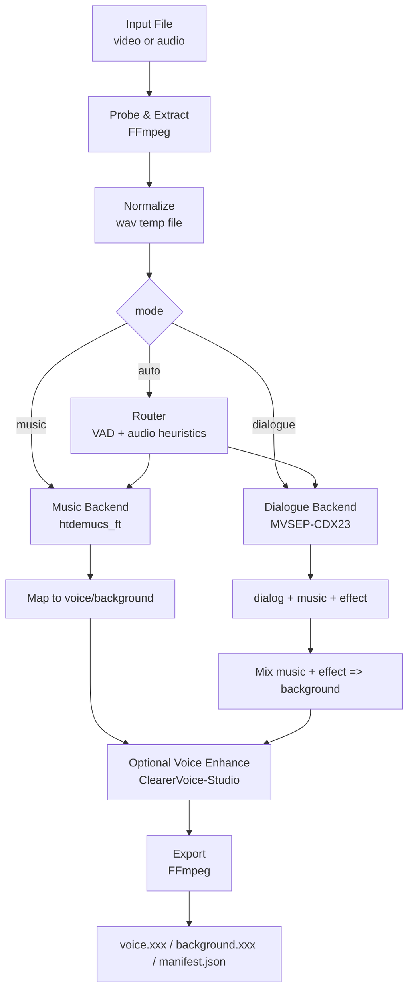

# 视频/音频人声与背景声分离技术设计文档

- 项目代号: `translip`
- 文档状态: Draft v1
- 更新日期: 2026-04-11
- 目标读者: 开发者、算法工程师、产品/项目负责人

## 1. 背景

本项目的目标是:

- 输入一个视频或音频文件
- 输出两条音轨:
  - `voice`: 人声/对白/唱声
  - `background`: 背景声，包含伴奏、配乐、音效和环境声
- 输出格式支持 `wav/mp3/flac/aac/opus` 等常见音频格式

这类需求在工程上并不是一个单一问题，而是至少包含两类不同的音频分离任务:

1. 音乐源分离
   - 典型输入: 歌曲、翻唱、MV、短视频 BGM、卡拉 OK
   - 目标: `vocals` vs `accompaniment`
2. 影视/对白分离
   - 典型输入: 访谈、口播、电影、综艺、直播回放
   - 目标: `dialogue` vs `music + effects`

如果只选一个模型覆盖所有场景，通常会在某一类场景明显退化。因此本设计选择:

- 统一输入/输出层
- 双后端分离链路
- 可选自动路由

## 2. 目标与非目标

### 2.1 目标

- 支持输入:
  - 视频: `mp4/mov/mkv/webm/avi`
  - 音频: `wav/mp3/flac/m4a/aac/ogg/opus`
- 支持输出:
  - `voice`
  - `background`
- 默认提供 CLI
- 代码结构允许后续扩展为 HTTP 服务
- 支持本地单文件处理，后续扩展批处理
- 模块化支持多模型后端切换

### 2.2 非目标

- V1 不输出带重新混音视频文件
- V1 不做实时流式分离
- V1 不做端到端训练
- V1 不做多说话人定向提取
- V1 不做歌词/字幕/ASR

## 3. 需求定义

### 3.1 功能需求

1. 用户输入视频或音频文件路径
2. 系统自动提取或读取音轨
3. 系统根据 `mode` 选择后端:
   - `music`
   - `dialogue`
   - `auto`
4. 生成两条输出:
   - `voice`
   - `background`
5. 用户可指定:
   - 输出目录
   - 输出格式
   - 输出采样率
   - 是否开启增强
6. 生成一个 `manifest.json` 记录本次处理元数据

### 3.2 非功能需求

- 能在 macOS/Linux 开发和运行
- 支持 CPU 回退，但以 GPU 为主路径
- 10 分钟以内媒体在单张消费级 GPU 上可完成处理
- 模块之间接口稳定，方便替换模型
- 对输入异常、编码异常、显存不足有明确错误信息

## 4. 技术选型

## 4.1 总体选型

- 语言: Python 3.11
- 依赖管理: `uv`
- 深度学习框架: PyTorch 2.x
- 音频 I/O 和转码: FFmpeg
- 包结构: 单仓库单包
- 首发形态: CLI
- 后续扩展: FastAPI + 后台任务队列

选择理由:

- Python + PyTorch 是现有开源分离模型最成熟的集成方式
- FFmpeg 对视频/音频容器和转码支持最好，适合作为统一入口与导出层
- 先做 CLI 可以最快跑通端到端能力，降低服务化复杂度

## 4.2 模型选型结论

### 主方案

- 音乐分离后端: `htdemucs_ft`
- 对话/影视分离后端: `MVSEP-CDX23`
- 语音增强后处理: `ClearerVoice-Studio` 可选

### 备选方案

- 高质量音乐后端: `BS-RoFormer` 或 `Mel-Band RoFormer`
- 学术扩展: `BandIt`

### 为什么这样选

`htdemucs_ft` 不是当前音乐分离指标最高的模型，但它在工程上最适合作为 V1 主后端:

- 安装和推理路径成熟
- 支持 `--two-stems=vocals`
- 官方已支持常见输入格式和 `wav/mp3` 输出
- 对歌曲、唱声、BGM 等场景泛化较稳

`MVSEP-CDX23` 适合作为对白/影视后端:

- 直接针对 cinematic demixing
- 输出 `dialog / music / effect`
- 很符合“人声 vs 背景声”的产品定义

`BS-RoFormer` 与 `Mel-Band RoFormer` 在音乐源分离上代表更高上限，但 V1 不作为默认主路径，原因是:

- 社区权重和集成方式较分散
- 运行脚本和权重管理不如 Demucs 统一
- 适合作为 V1.1 的高质量 profile，而不是第一版默认后端

## 5. 相关论文与开源依据

以下内容用于支撑选型，不等同于直接复制其实现。

### 5.1 音乐源分离

- Demucs 官方仓库提供 `--two-stems=vocals`，可将音频分为 `vocals` 与伴奏，并支持 `mp3/wav` 输出:
  - https://github.com/facebookresearch/demucs
- HTDemucs 论文:
  - https://arxiv.org/abs/2211.08553
- BS-RoFormer 论文说明其系统在 SDX23 music track 获得第 1 名:
  - https://arxiv.org/abs/2309.02612
- Mel-Band RoFormer 论文报告在若干 stem 上优于 BS-RoFormer:
  - https://arxiv.org/abs/2310.01809
- SDX23 music track 总结论文给出挑战赛背景和指标提升情况:
  - https://arxiv.org/abs/2308.06979

### 5.2 影视/对白分离

- MVSEP-CDX23 开源仓库，直接输出 `dialog / effect / music`:
  - https://github.com/ZFTurbo/MVSEP-CDX23-Cinematic-Sound-Demixing
- CDX23 任务论文:
  - https://transactions.ismir.net/articles/10.5334/tismir.172
- BandIt 仓库与论文信息:
  - https://github.com/kwatcharasupat/bandit
- 扩展到四 stem 的后续工作:
  - https://arxiv.org/abs/2408.03588

### 5.3 语音增强

- ClearerVoice-Studio:
  - https://github.com/modelscope/ClearerVoice-Studio
- 对应论文:
  - https://arxiv.org/abs/2506.19398
- MossFormer2:
  - https://arxiv.org/abs/2312.11825

### 5.4 媒体处理

- FFmpeg 官方文档:
  - https://ffmpeg.org/ffmpeg.html

## 6. 核心设计决策

### 6.1 决策一: 做双链路，不做单模型统一链路

原因:

- 歌曲和影视混音的目标定义不同
- 音乐模型擅长 `vocals/accompaniment`
- 影视模型擅长 `dialog/music/effects`
- 强行统一为一个模型会让视频对白场景或者音乐场景至少一边吃亏

### 6.2 决策二: V1 先暴露 `mode`，`auto` 作为 best effort

原因:

- 自动路由本身也是一个分类问题
- V1 先保证可控和可调试
- 当 `auto` 不稳定时，用户仍可指定 `music` 或 `dialogue`

### 6.3 决策三: 内部保留多 stem，中间结果最后再汇聚成两轨

原因:

- 对话链路天然得到 `dialog/music/effect`
- 将 `music + effect` 混成 `background` 比直接训练二分类更稳
- 后续要做“只去 BGM”或“只保留对白”时无需返工

## 7. 系统架构



## 8. 模块设计

## 8.1 输入探测与解复用模块

职责:

- 识别输入文件类型
- 用 `ffprobe` 获取:
  - 容器类型
  - 时长
  - 音轨数
  - 声道数
  - 原始采样率
- 用 `ffmpeg` 提取第一条音轨或指定音轨

实现要求:

- 视频输入统一先抽音轨为中间 `wav`
- 输入音频若不是模型所需参数，也统一转为中间 `wav`
- 中间文件放在临时工作目录，任务结束可清理

建议命令:

```bash
ffmpeg -y -i input.mp4 -vn -ac 2 -ar 44100 temp/input.wav
```

备注:

- `music` 后端以 44.1 kHz 为默认内部采样率
- 若未来某对白模型更适合 48 kHz，可在 dialogue 后端内自行重采样

## 8.2 路由模块

V1 支持三个模式:

- `music`
- `dialogue`
- `auto`

### `music`

强制走音乐分离链路。

### `dialogue`

强制走对白/影视分离链路。

### `auto`

V1 的 `auto` 采用轻量启发式，而不是额外引入一整套复杂分类模型。

建议启发式:

1. 用 `silero-vad` 估计有效语音占比
2. 计算音频的 harmonic/percussive 特征、谱通量、长时稳定性
3. 使用以下规则:
   - 若明显是连续歌唱/音乐主导，走 `music`
   - 若存在大量间歇性语音且背景复杂，走 `dialogue`
   - 若判断不稳，默认走 `dialogue`

原因:

- 误把电影音轨送到 `music` 后端，常会把音效错误折进背景
- 对“人声 vs 背景声”这个产品目标来说，`dialogue` 作为模糊场景默认值更稳

## 8.3 音乐分离模块

默认模型: `htdemucs_ft`

输入:

- `wav`

输出:

- `vocals.wav`
- `no_vocals.wav` 或通过 stem 合成出的伴奏

映射关系:

- `voice = vocals`
- `background = accompaniment`

实现方式:

- 优先使用 Python API 或稳定 CLI 包装
- 对超长音频使用分段和 overlap
- 显存不足时自动缩短 segment 或切到 CPU

建议参数:

- model: `htdemucs_ft`
- two stems: `vocals`
- segment: 根据 GPU 显存动态设置

备注:

- 若后续接入 `BS-RoFormer`，保留统一接口 `MusicSeparator`
- 调用方不感知底层模型差异

## 8.4 对话/影视分离模块

默认模型: `MVSEP-CDX23`

输入:

- `wav`

输出:

- `dialog.wav`
- `music.wav`
- `effect.wav`

映射关系:

- `voice = dialog`
- `background = music + effect`

合成要求:

- 使用同采样率、同位深混音
- 避免叠加后 clipping
- 导出前进行峰值检测与必要限幅

备注:

- 若后续验证 `BandIt` 在内部样本上更好，可替换为 `DialogueSeparator`
- V1 先优先集成推理脚本更直接的 `MVSEP-CDX23`

## 8.5 人声增强模块

默认关闭，用户可通过参数启用:

- `--enhance-voice`

V1 使用 `ClearerVoice-Studio` 作为可选后处理，只作用于最终 `voice` 轨。

适用场景:

- 视频原始收音较差
- 访谈、直播、路录
- 混响、噪声较重

不适用场景:

- 纯歌曲高保真导出
- 用户只想要原始分离结果，不希望额外处理

## 8.6 导出模块

职责:

- 将内部 `wav` 转成目标格式
- 支持:
  - `wav`
  - `mp3`
  - `flac`
  - `aac`
  - `opus`
- 支持设置:
  - 采样率
  - 比特率
  - 声道数

默认策略:

- 内部处理中间格式统一为 `wav`
- 最终输出由 FFmpeg 负责转码
- 默认输出名:
  - `voice.<ext>`
  - `background.<ext>`

示例:

```bash
ffmpeg -y -i voice.wav -codec:a libmp3lame -b:a 320k voice.mp3
ffmpeg -y -i background.wav -codec:a libmp3lame -b:a 320k background.mp3
```

## 8.7 任务目录与缓存模块

每次任务使用独立工作目录:

```text
work/
  job-<uuid>/
    input/
    temp/
    stems/
    output/
    manifest.json
```

缓存策略:

- 模型权重缓存到全局目录
- 单次任务中间结果保存在任务目录
- 任务成功后默认删除 `temp/`
- 保留 `output/` 和 `manifest.json`

## 9. 对外接口设计

## 9.1 CLI 设计

命令示例:

```bash
translip run \
  --input ./sample.mp4 \
  --mode auto \
  --output-dir ./out \
  --output-format mp3 \
  --enhance-voice
```

参数设计:

- `--input`: 输入文件路径，必填
- `--audio-stream-index`: 输入视频的音轨索引，默认 `0`
- `--mode`: `music|dialogue|auto`，默认 `auto`
- `--output-dir`: 输出目录，默认当前目录下 `./output`
- `--output-format`: `wav|mp3|flac|aac|opus`，默认 `wav`
- `--sample-rate`: 最终输出采样率，可选
- `--bitrate`: 有损编码比特率，可选
- `--enhance-voice`: 是否对人声做增强
- `--device`: `cuda|mps|cpu|auto`
- `--keep-intermediate`: 是否保留中间 stem
- `--backend-music`: 指定音乐后端，默认 `demucs`
- `--backend-dialogue`: 指定对白后端，默认 `cdx23`

返回行为:

- 成功时打印输出文件路径
- 失败时返回非零退出码和错误说明

## 9.2 Python API

```python
from translip import separate_file

result = separate_file(
    input_path="sample.mp4",
    mode="auto",
    output_dir="out",
    output_format="wav",
    enhance_voice=False,
)

print(result.voice_path)
print(result.background_path)
```

## 9.3 未来 HTTP API

V1 不实现，但预留形态:

- `POST /jobs`
- `GET /jobs/{job_id}`
- `GET /jobs/{job_id}/artifacts`

## 9.4 `manifest.json` 最小结构

建议每个任务都输出一份最小 manifest，便于后续排障、批处理和服务化。

示例:

```json
{
  "job_id": "job-3f2d5e6b",
  "input": {
    "path": "/abs/path/sample.mp4",
    "media_type": "video",
    "audio_stream_index": 0,
    "duration_sec": 123.45,
    "sample_rate": 48000,
    "channels": 2
  },
  "request": {
    "mode": "auto",
    "output_format": "mp3",
    "enhance_voice": false,
    "device": "cuda"
  },
  "resolved": {
    "route": "dialogue",
    "music_backend": "demucs",
    "dialogue_backend": "cdx23"
  },
  "artifacts": {
    "voice": "/abs/path/out/voice.mp3",
    "background": "/abs/path/out/background.mp3"
  },
  "timing": {
    "started_at": "2026-04-11T20:30:00+08:00",
    "finished_at": "2026-04-11T20:32:18+08:00",
    "elapsed_sec": 138.2
  },
  "status": "succeeded",
  "error": null
}
```

## 10. 内部接口抽象

建议抽象出以下接口:

```python
class MusicSeparator:
    def separate(self, wav_path: str, work_dir: str) -> dict: ...

class DialogueSeparator:
    def separate(self, wav_path: str, work_dir: str) -> dict: ...

class VoiceEnhancer:
    def enhance(self, voice_path: str, out_path: str) -> str: ...

class Exporter:
    def export(self, src_path: str, dst_path: str, fmt: str, **kwargs) -> str: ...
```

这样做的好处:

- 业务流程不依赖具体模型
- 后续替换 `Demucs -> BS-RoFormer` 成本低
- 便于单元测试和 mock

## 11. 建议目录结构

```text
translip/
  docs/
    technical-design.md
  src/
    translip/
      __init__.py
      cli.py
      config.py
      models/
        base.py
        demucs_music.py
        cdx23_dialogue.py
        clearervoice.py
      pipeline/
        ingest.py
        route.py
        mixdown.py
        export.py
        manifest.py
      utils/
        ffmpeg.py
        audio.py
        files.py
        logging.py
  tests/
    test_cli.py
    test_route.py
    test_export.py
    test_pipeline_smoke.py
  pyproject.toml
  README.md
```

## 12. 配置设计

建议使用 TOML/YAML 做默认配置，命令行参数覆盖默认值。

示例:

```toml
[runtime]
device = "auto"
keep_intermediate = false

[music]
backend = "demucs"
model = "htdemucs_ft"
segment = 7.8

[dialogue]
backend = "cdx23"
high_quality = false

[export]
format = "wav"
sample_rate = 44100
```

## 13. 错误处理

需要覆盖以下错误类型:

- 输入文件不存在
- 不支持的媒体格式
- `ffmpeg`/`ffprobe` 不可用
- 模型权重下载失败
- GPU 显存不足
- 中间文件损坏
- 导出编码器不可用

错误处理策略:

- 抛出结构化异常
- CLI 输出简明错误信息
- `manifest.json` 中记录失败阶段和错误码

## 14. 性能与资源预估

### 推荐运行环境

- CPU: 8 核及以上
- 内存: 16 GB 及以上
- GPU: 8 GB 显存及以上优先

### 预期性能

- `htdemucs_ft` 质量更高，但速度慢于默认 `htdemucs`
- `MVSEP-CDX23` 在高质量模式下更慢
- CPU 可跑通，但不作为主要目标体验

### 资源控制策略

- 长音频按 chunk 处理
- 可调 `segment` 和 `overlap`
- 允许通过参数强制走 CPU

## 15. 评测方案

## 15.1 离线评测

评测集建议分三类:

1. 音乐类
   - 歌曲、翻唱、短视频 BGM
2. 对白类
   - 访谈、口播、播客、直播
3. 影视类
   - 电影片段、综艺片段、混合复杂背景

客观指标:

- SDR / SI-SDR
- 分离后峰值/clipping 比例
- 处理时长
- 显存占用

主观指标:

- 人声残留噪声
- 背景泄漏量
- 音效误杀
- 听感自然度

## 15.2 验收标准

V1 建议验收条件:

- 常见媒体格式可成功处理
- 对 `music` 场景能稳定输出可用 `voice/background`
- 对 `dialogue` 场景能稳定输出可用 `voice/background`
- 失败案例有明确报错
- 代码结构支持替换模型

## 16. 测试策略

### 单元测试

- 参数解析
- 文件探测
- FFmpeg 命令拼装
- 路由逻辑
- 输出命名

### 集成测试

- 音频输入 -> 输出两轨
- 视频输入 -> 抽音轨 -> 输出两轨
- 不同输出格式导出
- CPU 路径 smoke test

### 人工回归样本

至少准备:

- 3 个歌曲样本
- 3 个访谈样本
- 3 个影视样本

## 17. 许可与合规

需要分别核对:

- 代码仓库 license
- 预训练权重 license
- 是否允许商业使用
- 是否允许再分发模型文件

工程策略:

- V1 不把第三方权重直接提交进仓库
- 通过下载脚本或运行时拉取
- 在 README 和 CLI 中显式提示模型来源与许可要求

## 18. 里程碑计划

### M0: 仓库脚手架

- 初始化 `pyproject.toml`
- 建立 CLI 和基础包结构
- 封装 `ffmpeg/ffprobe`

### M1: 跑通音乐链路

- 接入 `htdemucs_ft`
- 输入音频/视频
- 输出 `voice/background`

### M2: 跑通对白链路

- 接入 `MVSEP-CDX23`
- 输出 `dialog/music/effect`
- 合成 `background`

### M3: 统一 pipeline

- 接入 `mode`
- 接入 `auto` 路由
- 接入 `manifest.json`

### M4: 增强与体验

- 可选接入 `ClearerVoice-Studio`
- 增加批处理
- 优化日志和错误提示

### M5: 高质量 profile

- 评估接入 `BS-RoFormer` 或 `Mel-Band RoFormer`
- 做 A/B 对比，决定是否作为 `--backend-music roformer`

## 19. 开发建议

建议按以下顺序实现:

1. 先做 `music` 路径，尽快形成第一条端到端链路
2. 再接 `dialogue` 路径
3. 最后做 `auto`

原因:

- `music` 路径现成度最高
- 先有可跑通版本，再做路由更容易调试
- `auto` 不是核心能力，而是体验增强

## 20. 最终推荐结论

本项目 V1 的推荐技术方案是:

- 核心语言与运行时: `Python 3.11 + PyTorch + FFmpeg`
- 依赖管理: `uv`
- 主体交付形态: `CLI`
- 音乐后端: `htdemucs_ft`
- 对白/影视后端: `MVSEP-CDX23`
- 人声增强: `ClearerVoice-Studio` 可选
- 自动路由: `silero-vad + 音频启发式`，并允许用户手动指定模式

这条路线的优点是:

- 工程复杂度可控
- 端到端可快速落地
- 对歌曲和视频两类场景都有较好覆盖
- 后续切换更强模型时不需要推翻整体架构

V1.1 的主要升级方向是:

- 把 `BS-RoFormer`/`Mel-Band RoFormer` 接成高质量音乐后端
- 视数据结果决定是否将其替换为默认音乐后端
